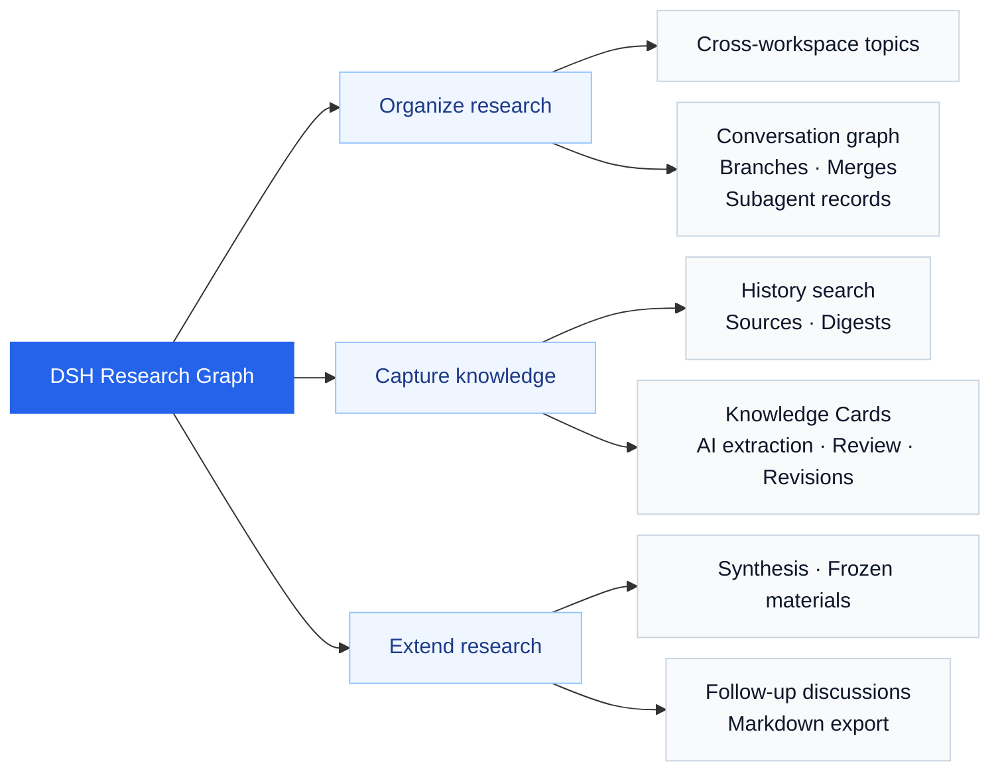

<a id="dsh-research-graph--研图"></a>

# DSH Research Graph

[](https://github.com/benz-ai-x/dsh-research-graph/actions/workflows/ci.yml) [](https://www.npmjs.com/package/@benz-ai-x/dsh-research-graph) [](LICENSE)

**English** | [简体中文](README.zh.md)

An open-source **AI research workbench** for [DeepSeek Harness (DSH)](https://github.com/deepseek-ai/deepseek-harness). Turn scattered conversations into a graph of traceable, reusable knowledge for product research, technical research, and ongoing knowledge management.

## Capability map



<details>
<summary>View the workbench screenshot (0.1.5-rc.2.8, demo data)</summary>

<p align="center">
  <a href="docs/assets/readme/research-workbench.png">
    
  </a>
</p>

Click the image for the full-resolution screenshot.

</details>

<a id="features"></a>
<a id="what-it-adds"></a>

## Key capabilities

| Capability | What you can do |
| --- | --- |
| **Research graph** | Organize discussions, inspect branches and merges; drag, collapse, and relayout |
| **Source tracing** | Search discussion text and return to the exact original turns |
| **Knowledge capture** | Save conclusions, conditions, and open questions; edit through new revisions |
| **AI analysis** | Extract selected discussion and compare 2–3 materials; review before saving |
| **Follow-up research** | Start from a historical turn or chosen card revision, retaining the materials used |
| **Tasks and delivery** | Inspect existing subagent records and export Markdown research results |

<a id="compatibility"></a>
<a id="dsh-and-agent-presets"></a>

## Key facts

| Item | Details |
| --- | --- |
| Plugin release | [0.1.5-rc.2.8](https://github.com/benz-ai-x/dsh-research-graph/releases/tag/v0.1.5-rc.2.8), npm `next` |
| Required Host | **DSH 0.1.5-rc.2 · Web**, Node.js `^22.19.0 \|\| >=24.0.0` |
| Data | Research records live on the DSH Host; working positions stay in the browser and Topic arrangements require explicit saving |
| Model calls | Browsing, manual capture, and export make no model call; AI generation and new discussions use models on demand |
| Agent boundary | DSH provides models and agent execution; this plugin includes no professional preset or Agent Team launcher |
| Stack and license | TypeScript · React · [MIT](LICENSE) |

<a id="install"></a>

## Quick start

With the matching DSH version already installed:

```sh
dsh plugin --profile web add @benz-ai-x/dsh-research-graph@0.1.5-rc.2.8
dsh web
```

Stop and restart DSH if it is already running. Open the login URL printed in the terminal, enter a **non-blank Session**, and select **Research Graph**: read a source → save knowledge → continue the discussion.

## Docs and support

[User guide](docs/user-guide.md) · [Troubleshooting](docs/user-guide.md#troubleshooting) · [Development and release](docs/development.md) · [Release acceptance](docs/reviews/release-0.1.5-rc.2.8.md) · [Report an issue](https://github.com/benz-ai-x/dsh-research-graph/issues)
