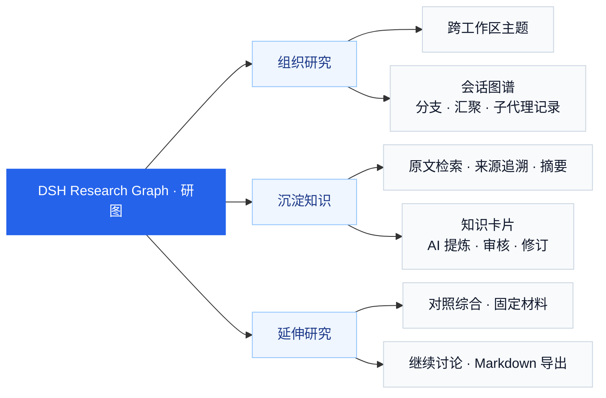
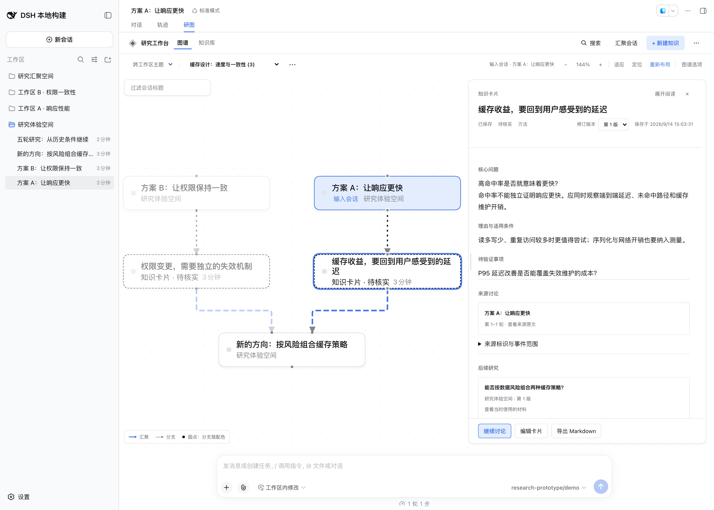

<a id="dsh-research-graph--研图"></a>

# DSH Research Graph · 研图

[](https://github.com/benz-ai-x/dsh-research-graph/actions/workflows/ci.yml) [](https://www.npmjs.com/package/@benz-ai-x/dsh-research-graph) [](LICENSE)

[English](README.md) | **简体中文**

面向 [DeepSeek Harness（DSH）](https://github.com/deepseek-ai/deepseek-harness) 的开源 **AI 研究工作台**。把分散的讨论整理成图谱，沉淀有出处、可复用的知识，适用于产品研究、技术调研与持续知识管理。

## 功能能力图谱



<details>
<summary>查看工作台截图（0.1.5-rc.2.8，演示数据）</summary>

<p align="center">
  <a href="docs/assets/readme/research-workbench.png">
    
  </a>
</p>

点击图片查看高清原图。

</details>

<a id="核心能力"></a>

## 关键能力

| 能力 | 你可以做什么 |
| --- | --- |
| **图谱组织** | 组织讨论、查看分支与汇聚，支持拖动、折叠与重排 |
| **来源追溯** | 检索讨论正文，按准确轮次回到原文 |
| **知识沉淀** | 保存结论、适用条件与待验证问题，编辑形成新修订 |
| **AI 归纳** | 提炼选定原文，对照 2–3 份材料，审核后保存 |
| **继续研究** | 从历史轮次或选定卡片版本开启新讨论，保留当时的材料 |
| **任务与交付** | 检查已有子代理记录，导出 Markdown 研究成果 |

<a id="兼容性"></a>
<a id="dsh-与-agent-预设"></a>

## 关键信息

| 项目 | 说明 |
| --- | --- |
| 当前插件 | [0.1.5-rc.2.8](https://github.com/benz-ai-x/dsh-research-graph/releases/tag/v0.1.5-rc.2.8)，npm `next` |
| 适配宿主 | **DSH 0.1.5-rc.2 · Web**，Node.js `^22.19.0 \|\| >=24.0.0` |
| 数据保存 | 研究数据保存在 DSH Host；工作位置保存在浏览器，主题排列需显式保存 |
| 模型调用 | 浏览、手工留卡、导出不调用模型；AI 生成与新讨论按需调用 |
| Agent 边界 | 模型与 Agent 执行由 DSH 提供；插件不内置专业预设或 Agent Team 启动器 |
| 技术与许可 | TypeScript · React · [MIT](LICENSE) |

<a id="安装"></a>

## 快速开始

在已安装且版本匹配的 DSH 中运行：

```sh
dsh plugin --profile web add @benz-ai-x/dsh-research-graph@0.1.5-rc.2.8
dsh web
```

若 DSH 已运行，请先停止再重启。打开终端给出的登录入口，在一个**非空会话**中选择**研图**：读原文 → 保存知识 → 继续讨论。

## 文档与支持

[使用指南](docs/user-guide.zh.md) · [故障排查](docs/user-guide.zh.md#故障排查) · [开发与发布](docs/development.zh.md) · [发布验收](docs/reviews/release-0.1.5-rc.2.8.md) · [问题反馈](https://github.com/benz-ai-x/dsh-research-graph/issues)
