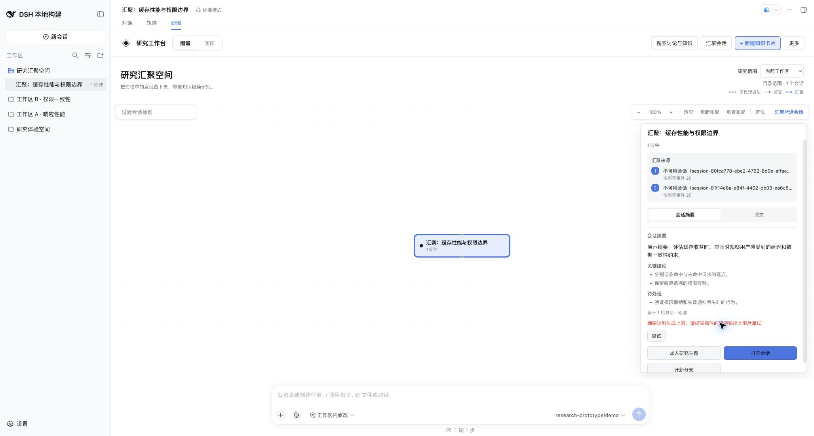

# Session Digest output budget acceptance

Issue [#27](https://github.com/benz-ai-x/dsh-research-graph/issues/27), verified on 2026-09-11.

The reported Session Digest failure returned `Session Digest model ended with max-tokens` through the real browser RPC. Its default output cap was 800 tokens. The same Session generated a complete digest after the effective profile override was increased to 4096. This establishes output truncation for that request; it does not establish the exact reasoning-token usage or guarantee that 4096 will fit every model and Session.

The package now defaults to 4096 tokens and maps `max-tokens` to the transport-safe `output-limit` code. English and Chinese instructions explain how to increase the cap before retrying. Explicit configured limits remain authoritative. Model routing, reasoning defaults, the 60-second timeout, and explicit-only generation remain unchanged. Incomplete generations are not cached as successful results; a failed refresh retains the previously displayed digest.

## Validation

| Check | Result |
| --- | --- |
| Three focused regressions before the fix | Failed for the low default, generic Remote code, and generic UI message |
| The same regressions after the fix | Passed |
| `pnpm run check` | 192 tests passed; standalone types and build passed |
| `check:harness` against official `dsh-v0.1.5-rc.2` | 263 tests passed; source and published Host/Client types passed |
| Packed-profile acceptance against that tag | Install, boot, durable operations, read-only digest/history/search, offline recovery command, and removal passed; 10 deterministic model calls |
| Chrome with the same archive in an isolated RC.2 profile | Actual model request received the default 4096 cap; complete digest, forced output-limit response, retained digest, and explicit retry all verified; no console errors |

The added Host regressions simulate reasoning that consumes the shared output budget and verify that an explicit 800-token cap remains effective. Even valid JSON followed by a `max-tokens` finish is rejected. No automatic second request is made; a subsequent explicit request can succeed and then be cached. Source events remain unchanged. The rendered-view regression also checks that private provider details are not exposed in the error tooltip.

The browser fixture uses deterministic, clearly marked demonstration content and a forced provider finish reason. It verifies integration and presentation, not real-model quality. The separate real-session recovery above ran on the user's existing RC.1 Host; official RC.2 compatibility was verified independently.

## Browser evidence

The previous complete digest remains readable above the specific output-limit explanation and retry action:

This is an unpublished local build of plugin `0.1.5-rc.2.1`, Build ID `local-e85b7727`, targeting DSH `0.1.5-rc.2`. Its validated archive SHA-256 is `f9a21462d63953917d099ad171911232eab3577f867fc770719a43bb8c17d823`. The already published npm version does not contain this source fix.
