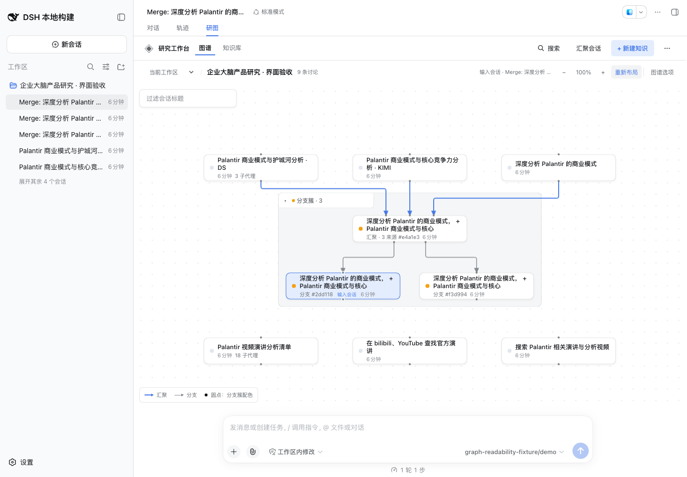
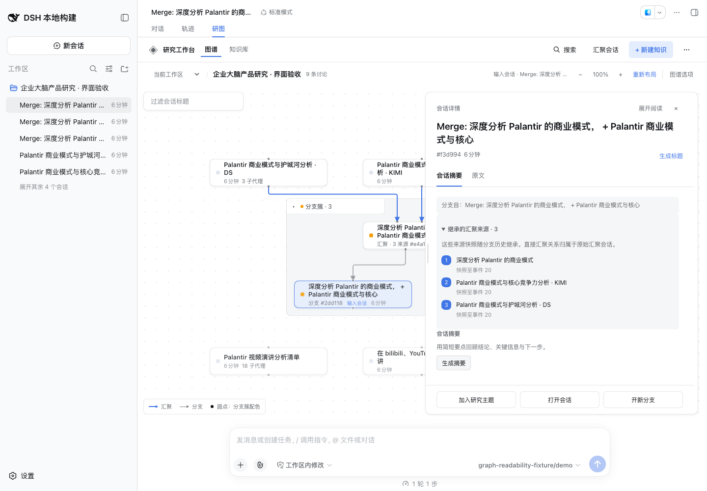
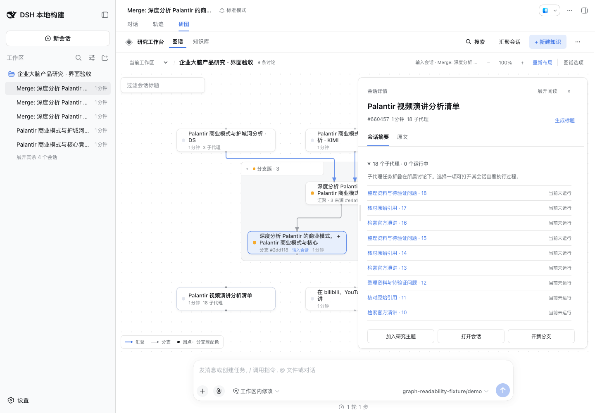
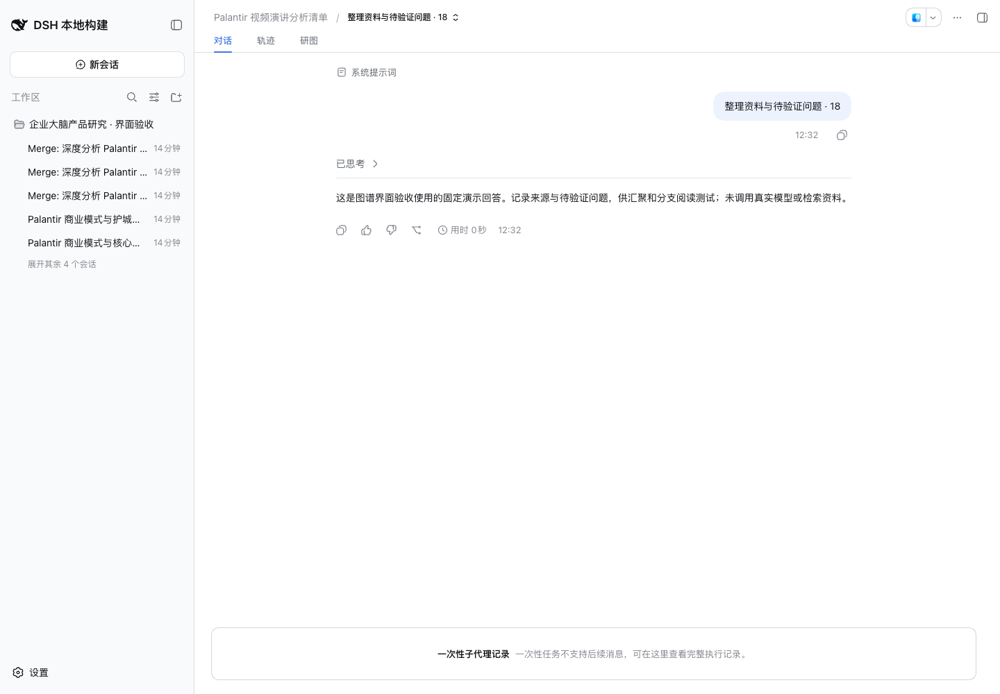

# 图谱可读性修复验收 · 2026-09-14

针对用户截图中的 9 条讨论，修复分支重复汇聚连线、簇标题迫使连线绕远、独立资料散排、同名节点难以辨认，以及子代理只有计数无法查看的问题。工作区图谱和跨工作区主题共用这些修复。本次为本地构建 **0.1.5-rc.2.7 · local-b6782883**，尚未提交或发布。

## 结果与数据边界

| 问题 | 修复后的行为 |
| --- | --- |
| 一个汇聚结果及其两个分支各画三条汇聚线 | 三条直接汇聚线只进入原始汇聚会话；两个后续分支保留两条分支线。该复现场景从 11 条可见线变成 5 条。 |
| 来源与后续分支混在一起 | 分支继承的三个来源快照仍可在详情中展开，保留捕获事件位置；依据宿主父会话信息分类，包括父会话在当前范围外的情况。 |
| 长簇标题挡住汇入路径 | 簇标题改为显示成员数的短标签，完整标题保留在悬停提示中；绘制与路由使用同一标题宽度。 |
| 独立资料散落在主关系两侧 | 自动布局将无关联的讨论集中排放，保留完整分支簇；三份来源在上，汇聚与分支在下。 |
| 三张卡片标题相同 | 区分“汇聚／分支”，相同标题附可区分的短讨论标识；画布简化生成的 Merge 前缀，原始标题不改写。 |
| 颜色和线型意义难辨 | 常驻图例解释汇聚线、分支线与簇配色；独立讨论使用中性色，运行状态在详情中单列。 |
| “18 子代理”没有后续入口 | 详情可展开任务标题与状态，通过 DSH 原生子代理地址打开执行记录；子代理仍不单独占用画布。 |
| 手动排列留下大段空白 | 工具栏直接提供“重新布局”和可用时的“撤销重新布局”；保留折叠与阅读状态。已有排列不会被升级自动覆盖。 |

没有删除、迁移或重写用户历史，没有更改 Merge／Branch 的持久关系。子代理入口会刷新其直接父会话的目录，并核对可用条目与模式；失败可重试，切换选中讨论后迟到的结果不会打开旧任务。

## 验证

- `pnpm run check`：严格类型、构建及 **227 项独立测试**通过。
- 官方 `dsh-v0.1.5-rc.2`（`fb2c4b9e69`）的 `pnpm run check:harness`：**四个真实宿主编译面、343 项 Harness 测试**通过。独立适配声明未进入 Harness 编译程序。
- 先失败再修复的回归覆盖：继承来源造成的 9 条 Merge 线、整条簇标题阻挡正向汇入、独立资料散排。新增覆盖包括范围外父会话、主题元数据尚未更新、同名标题、子代理层级边界、目录失败／重试／过期条目，以及选择切换时的取消。
- 实际打包安装到匹配 DSH 的隔离 profile，以原生创建、Merge、Fork 和持久子代理记录建立 9 条讨论、21 个子代理的固定样例。使用明确标注的固定模型回答，没有真实模型或检索调用。
- Chrome 153，**1440×1000、900×820**，工作区与主题各验证展开、拖动、折叠、再展开及窄窗口，共 **10 个几何场景**。检查实际 DOM／SVG，所有场景均无连线穿过卡片或标题、无共享直线段、无箭头与端口错位。展开时为 5 条线，折叠时为 3 条线。
- 实际拖动、重复重新布局后撤销、折叠后重新布局、主题显式保存排列、继承来源展开、原生子代理执行记录均通过。页面错误为 **0**。
- 停止并重新启动同一隔离 Host 后，两种图谱仍为 **9 节点、3 条 Merge、2 条 Branch**；子代理可重新打开完整的一次性任务记录。

## 冷启动观察与使用说明

冷启动时，一个尚未在原生视图打开的分支，在 DSH 侧栏和图谱里暂时显示工作目录名，继承来源摘要也暂缺。只读核对发现其磁盘投影缓存仍含原始标题与三个来源；通过“打开会话”进入 DSH 原生视图后，原始标题、内容和来源摘要恢复，连线数量始终正确。此现象的宿主内部根因未定位，未将它声称为本次已修复，也未用父标题或推测来源填补缺失事实。

加载这个本地构建后，已有手动排列可点击 **重新布局** 收拢，并可撤销。主题中的新排列仍需 **保存排列** 才会同步到主题。验收结果针对上述场景；任意密图或人为重叠卡片仍可能存在交叉或受阻端口。

浏览器与本轮隔离 Host 已停止，日常 DSH profile 未改。私有样例、检查日志、`browser-checks.json`、`cold-before-open.json` 和 `cold-checks.json` 保留在 `.artifacts/graph-readability/`，不得公开其中的本机登录地址或凭据。完整检查日志位于 `.artifacts/graph-readability-check.log` 与 `.artifacts/graph-readability-harness.log`。

## 修复后截图

工作区总览：

分支继承的来源仍可展开：

子代理任务与原生执行记录：

另见[主题总览](../assets/graph-readability/topic.png)、[主题来源详情](../assets/graph-readability/topic-inspector.png)、[窄窗口工作区](../assets/graph-readability/workspace-narrow.png)与[窄窗口主题](../assets/graph-readability/topic-narrow.png)。
