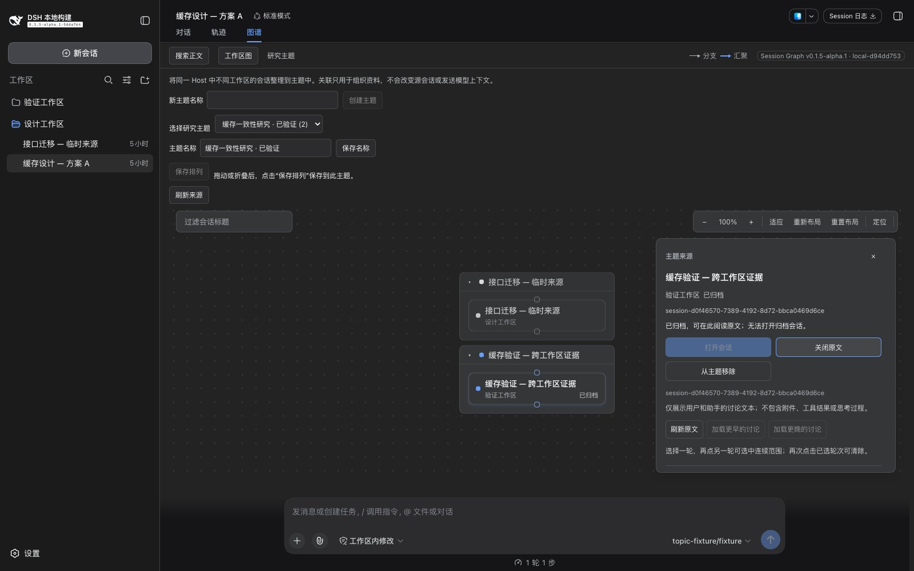

# Issue #5：研究主题验收记录

2026-09-10（Asia/Shanghai）。对应 [Issue #5](https://github.com/benz-ai-x/dsh-session-graph/issues/5)：创建、命名并持久保存跨工作区的 Session 引用，按主题保存独立排列，按需读取来源原文。

## PR #16：创建重试修复复验

对 `a785218` 的复审发现一个 P2：创建名称 A 已持久化但响应失败后，改成 B 重试会恢复 A 并清空 B。修复提交 `d127e358e73caaafb22f2932e310c3971df306f9` 继续复用同一主题身份，必要时追加显式重命名，两个请求共用忙碌和取消状态；新名称保存成功后才清空输入。未修改名称的重试保留其他客户端已保存的名称和排列。

注册 Graph UI 通过真实 Host/Gateway 和 JSON 存储复现了原失败，再由同一测试确认修复。5 个新增场景覆盖改名重试与 Host 重启、未改名时恢复其他客户端的修改、重命名保存前/保存后响应失败后再次重试，以及关闭视图后的迟到响应。保存后再次失去响应再改回 A，也能保存 A。原 Spec 审查代理独立重跑这 5 项及 2 个复现探针，确认原 P2 关闭。

| 本轮检查 | 结果 |
| --- | --- |
| `pnpm run check` | 171 项独立测试通过 |
| 匹配 Harness `check:harness` | Host/Client 源码及打包声明四组检查、204 项集成测试通过 |
| 实际安装包 smoke | 安装、启动、Gateway 主题操作、原文/搜索、Merge、Digest 与卸载通过；固定模型调用 7 次 |
| 独立增量审查 `a785218…d127e358` | Standards 0 项，Spec 0 项；各轴最高严重度均为无 |
| 插件版本 / 本轮 Build | `0.1.5-alpha.1` / `local-615115d6` |
| 本轮安装包 | 281,197 字节，SHA-256 `532db7aa8a3dba7b831c98ef1018f72525aa236f8a32808325589e5209329691` |

同一匹配 Harness 和独立 Chrome 中，用本轮安装包完成以下实际操作。故障只注入公开 Gateway 调用边界；创建先完成真实持久化，再丢弃响应。

| 操作 | 页面与持久化结果 |
| --- | --- |
| 创建“缓存一致性研究 A”，使成功响应失败；改为 B 重试，并使补充重命名失败 | Host 仅有原身份的 A；页面报错，保留 B 并恢复可重试控件。[12：保留修改后的输入](../assets/issue-5/12-amended-create-failure.jpg) |
| 再次点击创建主题 | 同一身份保存为 B，主题数量仍为 1；输入清空，已选主题名称为 B |
| 停止并重启 Host，再打开主题目录 | 仍只有同一身份的 B，页面名称正确。[13：重启后恢复修改后的名称](../assets/issue-5/13-amended-create-restarted.jpg) |

创建及失败/成功重试前后，三个来源的完整快照一致，60 条已有事件未变；固定模型调用保持 `6 → 6`。重启后这些事件仍逐字一致，新的 Host 未调用模型；重启读取的元数据额外显示 `delegationDepth: 0`，因此不将跨重启的完整快照哈希记作相同。原始日志、审计和重试复现位于忽略目录 `.artifacts/pr16-fix/`；隔离 Chrome、Host 及临时 profile 已清理。

以下保留首次功能交付记录。旧 Build、归档和 11 张截图仅证明对应版本；本次修复使用上表版本及截图 12、13。

## 首次功能交付：受测版本与环境

| 项目 | 记录 |
| --- | --- |
| 固定基点 | `b52b86adaf2ac082e9e106221da17955f07b0b60`，已合并的 PR #15 |
| 最终代码提交 | `be7def06935b6c33d8c1e992a65dbb6e6f7e45dc` |
| 插件版本 / 最终 Build ID | `0.1.5-alpha.1` / `local-d94dd753` |
| 匹配 Harness | `dsh-v0.1.5-alpha.1` / `5dda764ed3aa172535a7967b06ff95d9cbfe536a` |
| 设备 | Apple M5 Pro，18 个逻辑 CPU，48 GiB，arm64，Darwin 25.6.0 |
| 工具 | Node.js 26.4.0、pnpm 11.7.0、Google Chrome 153.0.8010.36 |
| 实际页面 | 独立 headless Chrome，1600 × 1000，中文、深色主题；连接安装了实际归档的真实 Harness Web profile |
| 最终归档 | `benz-ai-x-dsh-client-ui-session-graph-0.1.5-alpha.1.tgz`，280,614 字节 |
| 归档 SHA-256 | `c33395e74898853bc2eb81a0acd13022e6e98ba77d2e095122447cece8cc82b7` |

桌面 Computer Use 返回 `cgWindowNotFound`，本轮使用隔离的 Chrome 测试进程，未操作用户浏览器资料。模型传输使用本地固定回答；Workspace、Session、存储、Gateway、插件加载和页面均为真实匹配 Harness。只为故障验收添加临时来源隐藏、延迟和文件系统故障入口，它们不进入产品或安装包。

截图 01、02、04、05、06、08 保留首次功能流程的 `local-297a4d08`；03、07、09、10、11 已用最终 `local-d94dd753` 复验更新。最终修复包含对话框焦点处理、主题取消文案以及归档来源的导航限制，不能把早期截图视为这些修复的证据。

## 实际操作与结果

使用三个真实 Session：设计工作区中的“缓存设计 — 方案 A”和“接口迁移 — 临时来源”，以及验证工作区中的“缓存验证 — 跨工作区证据”。每个来源有一轮固定的用户/助手讨论。

| 操作 | 观察结果 / 截图 |
| --- | --- |
| 从设计来源打开图谱，创建“缓存一致性研究”，在 Selected Session 详情中加入来源 A | 主题拥有稳定身份；加入后可以返回主题图。随后从正文搜索加入另外两个来源，主题有 3 个节点、0 条虚构关系。[01：主题目录与三个来源](../assets/issue-5/01-topic-created.jpg) |
| 搜索“跨工作区证据”，范围选择当前 Host 全部会话，选择准确结果并加入主题；归档后勾选“包含归档”重复加入 | 来源仍显示验证工作区；重复加入不增加重复引用。搜索和加入没有切换 Viewed Session。[02：跨工作区选材](../assets/issue-5/02-search-source.jpg) |
| 通过真实 Workspace API 归档验证来源，保持主题打开 | 节点实时显示“已归档”，引用仍在。普通设计工作区图仍只有 A 和临时来源两个节点。最终版本禁用归档来源的打开按钮和双击导航，显示原因；阅读原文仍正常。[03：归档来源](../assets/issue-5/03-archived-original.jpg) |
| 创建“专项验证”，再次加入 A；分别拖动 A 并保存 | 第一主题曾保存 `(-280, 233)`，第二主题保存 `(170, 77)`；切换后各自恢复。两主题分别有 3、1 条引用。[04：第二主题的独立排列](../assets/issue-5/04-independent-arrangement.jpg) |
| 把第一主题名称改为“缓存一致性研究 · 已验证”，临时使实际存储目录无法写入，再保存 | 页面报错且保留新名称，Host 列表仍为旧名称。恢复存储后点击相同按钮，保存成功。[05：保存失败与保留的输入](../assets/issue-5/05-save-failure.jpg) |
| 让临时来源从公开会话查询中不可见，点击刷新来源 | 仍有 3 条引用；节点和面板标明来源不可用，打开按钮禁用。恢复来源并刷新后恢复可读状态。[06：不可用来源](../assets/issue-5/06-unavailable-source.jpg) |
| 在公开 inspect 边界延迟原文返回 6 秒，点击阅读后立即取消，并切换主题 | 显示已取消读取；新主题保持自己的节点，迟到结果不覆盖它。恢复读取速度后可重新阅读。[07：取消读取](../assets/issue-5/07-canceled-read.jpg) |
| 重置第一主题布局并保存，然后只从第一主题移除 A | 重置时仍为 3 条引用，第二主题位置不变；移除后第一主题剩 2 条，第二主题仍有 A 的 1 条引用，源会话保留。[08：仅移除主题引用](../assets/issue-5/08-reference-removed.jpg) |
| 停止 Host，用相同 profile 重启并打开最终安装包 | 名称、2/1 条引用与完整排列记录和重启前相同；第二主题 A 的位置仍为 `(170, 77)`。[09：重启后的排列](../assets/issue-5/09-restarted-arrangement.jpg) |
| 在重启后的第一主题选择归档来源并阅读、滚动原文 | 正确显示验证来源的用户文字及助手回答，标题和 Viewed Session 没有因阅读改变。[10：重启后的原文](../assets/issue-5/10-restarted-original.jpg) |
| 对未归档的“接口迁移 — 临时来源”点击打开会话 | 进入该来源的真实会话页面并显示其讨论。归档来源的双击不会执行此导航。[11：显式导航](../assets/issue-5/11-explicit-navigation.jpg) |

最终页面的归档行为：



另在实际页面验证搜索框和主题选择框的 Tab / Shift+Tab 首尾循环，以及 Escape 关闭后恢复触发按钮焦点。独立注册 UI 用例还覆盖 A→B 迟到元数据、关闭视图后的迟到返回、存储失败后的排列草稿与搜索选材。页面未发生未捕获 JavaScript 异常；Host 重启期间的连接断开是预期现象。

## 只读审计与故障回归

主题操作前后的三个完整来源快照以递归排序键后的 SHA-256 比较。包含 61 条已有事件的元数据与事件列表，在加入、重复加入、归档后阅读、重命名、保存排列、重置、移除及重启之后完全一致。模型调用计数在此阶段为 `0 → 0`；最初创建三份测试讨论的三次固定模型回答独立计数。归档状态只由显式的验收归档操作修改。

最终归档导航保护又单独比较了一次操作前后快照，全部一致，模型调用仍为 0。之后显式打开未归档的冷会话时，Harness 追加了正常的 `session/end-seed` 恢复后缀；此前事件和元数据不变，也没有模型调用。这一步是实际会话导航，不计入引用和原文读取的只读审计。

真实页面暴露并修复了一个 P2：归档来源的“打开会话”会触发 Harness 的 `clearArchivedCurrent()`，落到空白入口。现在主题面板禁用该按钮、双击也检查归档状态，并保留原文阅读；没有隐式取消归档。三个注册 UI 断言先失败，修复后 7 项主题 UI 用例全部通过，最终安装包的页面复验通过。

实际归档启动还发现 Storage Domain 尚未就绪时 Host 已开始检查所需服务。通过公开 Host 启动断言复现后，等待主题服务注入完成；打包声明也直接通过匹配 Harness 类型检查，独立 Host 声明替身未进入该编译过程。

## 自动检查与规模基线

| 检查 | 最终结果 |
| --- | --- |
| `pnpm run check` | 严格类型检查、构建、18 个文件中的 171 项独立测试通过 |
| `DSH_HARNESS_ROOT=... pnpm run check:harness` | Host、Client、Published Host、Published Client 四组实际声明检查通过；7 个文件中的 199 项测试通过，其中 6 项主题 Host 测试、7 项新增主题注册 UI 测试 |
| `pnpm pack` 后 `DSH_HARNESS_ROOT=... pnpm run smoke:harness <archive>` | 实际安装、启动、Gateway 主题读写/排列/移除、原文/搜索只读检查、Merge、Digest 与卸载全部通过；固定模型调用仍为 7 次，主题操作不增加调用 |
| 固定 1,000 引用 | 4 个工作区、200 个归档、100 个缺失来源；切换、选择、原文取消、未归档来源定位和迟到响应隔离均完成 |
| 10,000 节点 Branch 链 | 10,000 节点、9,999 边，图推导和布局完成，无栈溢出；改为迭代前已复现递归栈溢出 |

性能脚本使用同一份确定性 fixture，1 次预热、6 次测量，偶数样本取中间两个值的平均数。设备同上；数值只作为描述性基线，未定义性能门槛。

| 纯函数步骤 | 中位耗时 |
| --- | ---: |
| 1,000 引用图推导 | 0.791 ms |
| 布局 | 0.352 ms |
| 画布展示投影 | 0.358 ms |
| 分支谱系选择 | 0.046 ms |

10,000 节点链的单次图推导为 10.580 ms，布局为 5.115 ms。注册 Graph UI 在 jsdom 中记录：主题切换 251.2 ms，节点选择 89.6 ms，原文取消并改选可导航来源后定位 1,880.6 ms。最后一项包含第二次节点选择；这些数值不是 Chrome 页面交互延迟，也不是跨设备性能承诺。

复现命令：

```sh
node --experimental-strip-types scripts/benchmark-topics.mjs
DSH_HARNESS_ROOT=/path/to/deepseek-harness \
  SESSION_GRAPH_PERFORMANCE_REPORT=/tmp/session-graph-topics-ui.json \
  pnpm run test:harness tests/views.client.spec.tsx -t 'switches 1,000 references'
```

本地原始日志、性能 JSON 和私有 profile 审计位于忽略目录 `.artifacts/issue-5/`。不将 profile、鉴权地址、Playwright 工具或生成的 `lib/` 提交。

## Standards

独立审查复核了 `076b775…be7def0` 增量，并确认完整范围 `b52b86a…be7def0` 的结论。

归档来源的按钮及双击导航限制与 ADR 0006 一致，保留原文读取且不改变归档状态；中英文文档、提示和回归断言同步更新。此前 P3 焦点循环重复已通过 `retainDialogFocus` 解决。

Standards：0 项发现，硬性违反 0 项；最高严重度为无。

## Spec

独立审查确认 `b52b86a…be7def0` 无未解决的问题。归档来源导航的 P2 已修复，面板按钮和双击使用一致的限制；只读原文仍可用，并有双语说明。注册 UI 覆盖初始归档、实时归档和非归档来源导航，符合 Harness 公开规则。

缺失或部分实现 0 项，未请求的范围扩张 0 项，已实现但行为错误 0 项。持久化、跨工作区引用、独立排列、保存重试和取消边界均通过审查。最终页面复验及截图由主代理完成。

两轴遗留发现：Standards 0、Spec 0；各轴最高严重度均为无。
