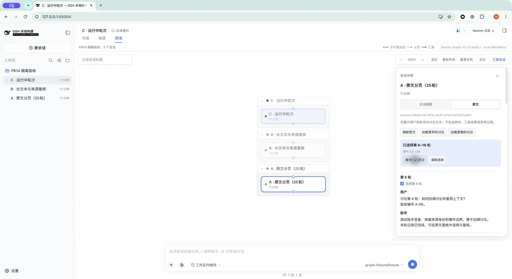
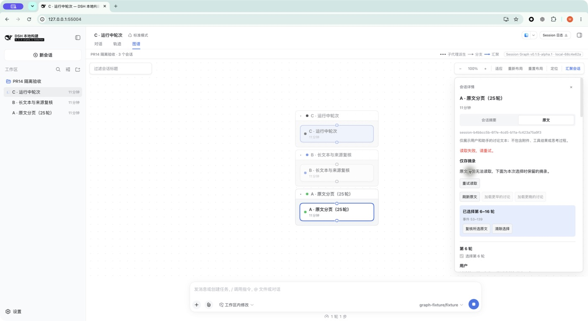

# PR #14 浏览器验收

2026-09-09（Asia/Shanghai）。[PR #14](https://github.com/benz-ai-x/dsh-session-graph/pull/14) 对应 [Issue #3](https://github.com/benz-ai-x/dsh-session-graph/issues/3)。实际浏览器操作、公开接口回归和归档验收均通过，已补齐先前缺少的 UI 交付证据。

## 受测版本与环境

| 项目 | 值 |
| --- | --- |
| 受测代码 | `da2dec495617d5c84f8ac0739a65ef8696f7019a` |
| 插件 / DSH 版本 | `0.1.5-alpha.1` |
| DSH 提交 | `5dda764ed3aa172535a7967b06ff95d9cbfe536a`（`dsh-v0.1.5-alpha.1`） |
| Graph 页头 Build ID | `local-68c4e62a` |
| 本地工具 | macOS arm64、Chrome、Node `26.4.0`、pnpm `11.7.0` |
| 受测归档 | `benz-ai-x-dsh-client-ui-session-graph-0.1.5-alpha.1.tgz`，238,899 字节 |
| 归档 SHA-256 | `ab9452d503fa9f3d311a4abad4d21b2280fe3155b1b48595f183d1ae5bc7b714` |

通过 Computer Use 操作 Chrome 的真实页面，安装的是本地打包归档。归档中的 `lib/index.js`、`lib/client.js` 与受测构建逐字节一致，页头版本和 Build ID 已在页面核对。截图保留工具返回的原始 JPEG。

测试使用独立的 `DSH_HOME`、工作目录和 web profile。通过真实 Session Controller 创建 A（25 个完成轮次）、B（两轮，含长段落及连续英文标识符）、C（一轮完成、一轮运行中）；助手内容由本地固定响应模型传输生成。来源失效在测试 profile 的公开 `inspect` 边界注入；读取延迟和连接失败在测试服务边界注入，其余请求经过真实浏览器 RPC Gateway 和归档 History 实现。没有替换产品 UI 或伪造 History 返回值。

## 实际操作与结果

起始 Viewed Session 为 C。在 Graph 中点选 A 或 B，仅改变 Inspector 的 Selected Session；最后一步才明确打开 B。

| 操作 | 观察结果 | 截图 |
| --- | --- | --- |
| 点选 A，打开「原文」 | 显示 A 的完整 Session ID、用户/助手正文及最近第 16–25 轮；更晚按钮禁用，Viewed Session 保持 C | [原文](../assets/pr-14/01-original.jpg) |
| 选择第 16 轮，加载更早讨论，再选第 6 轮并复核 | 较早页为第 6–15 轮；选区连续覆盖第 6–16 轮、事件 53–139，复核返回全部 11 轮；随后向后加载得到第 17–25 轮 | [跨页选区](../assets/pr-14/02-cross-page-selection.jpg) |
| 让 A 的来源暂时不可读，再复核选区 | 显示「仅存摘录」及说明，保留 Session 身份、事件边界和选区文本，禁用轮次选择 | [摘录](../assets/pr-14/03-excerpt.jpg) |
| 在摘录状态重试，延迟读取 | 「正在读取原文」与「仅存摘录」同时存在，保留边界与禁用选择状态 | [重试等待](../assets/pr-14/04-excerpt-retrying.jpg) |
| 让等待中的读取失败 | 显示重试入口和读取错误，同时保留「仅存摘录」、事件 53–139 及禁用选择状态 | [重试失败](../assets/pr-14/05-excerpt-failed.jpg) |
| 恢复来源及传输，再重试 | 恢复实际原文，第 6–16 轮及边界不变，摘录标签消失，轮次重新可选 | [恢复原文](../assets/pr-14/06-original-restored.jpg) |
| 延迟刷新后取消；再重试并关闭；另一次读取 B 时切换至 C | 取消后出现「已取消读取」与重试入口；关闭后 Inspector 消失；切换后显示 C 的身份与正文，没有混入 B。三次旧请求均收到真实取消信号 | [主动取消](../assets/pr-14/07-canceled.jpg) |
| 阅读运行中的 C | 第 2 轮只显示未完成状态、没有部分讨论文本，复选框禁用；第 1 轮可选 | [运行中](../assets/pr-14/08-running-turn.jpg) |
| 释放 C 的测试模型响应，再刷新并选择第 2 轮 | 第 2 轮显示用户/助手完整正文，可选择；边界为事件 21–28 | [完成后刷新](../assets/pr-14/09-completed-turn.jpg) |
| 尚无选区时打开不可读的 B | 显示「来源不可用」、B 的完整 Session ID 与重试入口；恢复后重试可读两轮正文 | [来源不可用](../assets/pr-14/10-source-unavailable.jpg) |
| 在 768 × 900 视口滚动 B 的长文本 | 中文段落及连续英文标识符在面板内换行；可滚动至正文末尾及两个操作按钮 | [窄视口长文本](../assets/pr-14/11-narrow-long-text.jpg) |
| 聚焦 Inspector 标签，依次使用 Home、End、左、右方向键 | 选中标签依次为「会话摘要」「原文」「会话摘要」「原文」，键盘焦点随标签移动 | 已核对页面 accessibility 状态 |
| 点击 B 的「打开会话」 | Host 切换到 B 的原生对话视图，侧栏选中项和会话标题均为 B | [打开来源](../assets/pr-14/12-open-source-session.jpg) |

读取审计共记录 18 个请求：12 次原文、1 次摘录、1 次来源不可用、1 次预设传输失败及 3 次主动取消。成功返回的每次读取前后，本地模型传输计数均为播种结束时的 32；没有新增模型调用。A/B 的事件快照哈希始终与播种基线一致。C 的第二轮由测试控制明确完成，其正常运行写入不计入 A/B 的只读比较。关闭、切换来源的已取消请求没有成功返回或覆盖后续内容。

完成后已关闭测试标签、停止 Host、卸载归档并清理本次创建的隔离 profiles。未安装到用户的实际 profile。Browser 插件专用连接的问题仍是独立事项；本记录验证的是 Computer Use 的真实 Chrome 操作。

## 验收发现与自动验证

旧归档在真实页面打开「原文」时立即读取失败。原因是 History Host 的末尾参数名为 `callerSignal`，匹配版本的 Gateway 源码反射只把名为 `signal` 的末尾参数识别为传输取消信号，导致 `AbortSignal.any()` 收到 `undefined`。直接调用 Host 的旧测试没有经过这个边界。

先在真实 Gateway 集成测试及旧归档 smoke 中复现失败，再将公开参数更名为 `signal`，将合并后的信号保留为 `readSignal`。新增测试验证 Gateway 原文读取、来源不变和零模型调用；packed smoke 也改为经过 Gateway。修复后完成上述全部浏览器操作。

- `pnpm run check`：类型检查、构建、18 文件 / 169 项独立测试通过。
- 匹配 checkout 的 `pnpm check:harness`：Host/Client 源码与发布声明四组类型检查、5 文件 / 139 项测试通过，其中 100 项 UI 测试。
- `pnpm pack --pack-destination .artifacts` 和匹配 checkout 的 `pnpm smoke:harness`：安装、启动、真实 Gateway History 读取、Digest 只读、Merge 持久化及卸载通过。7 次模型传输均为 smoke 的本地 fixture。
- [修复提交的 CI](https://github.com/benz-ai-x/dsh-session-graph/actions/runs/34355775601)：Node 22.19、24、26 与 Matching DSH release 四项通过。
- 重复标题/文本、空会话、真实冷历史、混合消息过滤及生命周期取消由公开 Host 和注册 UI 自动回归覆盖；本次浏览器截图的样例及范围列于上表。

## Standards

复核范围为 `git diff 1a57a028b525416d418543234e158037cd1779a7...da2dec495617d5c84f8ac0739a65ef8696f7019a`，6 个文件、1 个修复提交。独立 Standards 代理未发现规范违反或需要处理的代码异味。公开参数符合 ADR 0004 的 Gateway 契约，真实 Gateway 回归及 packed smoke 符合仓库直接覆盖宿主集成的要求；双语文档已同步。

## Spec

独立 Spec 代理未发现该修复遗漏需求、越出范围或错误实现。末尾 `signal` 参数恢复浏览器原文读取，并继续合并调用者与服务生命周期取消信号；新增测试验证内容、来源不变和零模型调用。前轮两个 P2 已在 `1a57a02` 修复，先前缺少的 UI 证据由本记录补齐。

本次复核：Standards 0 项、Spec 0 项；两轴均无新增阻塞问题。
