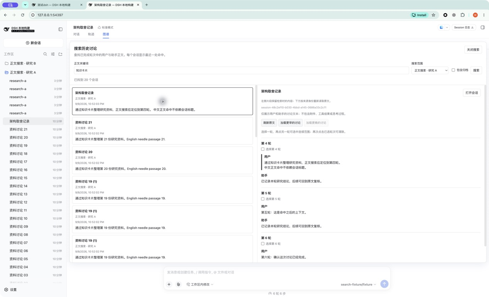
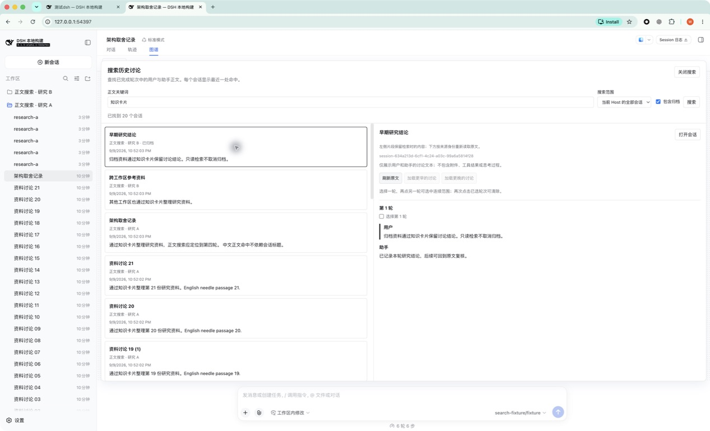

# PR #15 正文搜索验收

2026-09-09（Asia/Shanghai）。[PR #15](https://github.com/benz-ai-x/dsh-session-graph/pull/15) 对应 [Issue #4](https://github.com/benz-ai-x/dsh-session-graph/issues/4)。正文检索、原文定位、公开接口回归及打包安装验收已完成；以下记录实际浏览器操作与自动验证各自覆盖的范围。

## 受测版本与环境

| 项目 | 值 |
| --- | --- |
| 受测代码 | `83bfd67c00a43f93e41288cb1200cc5c49815548` |
| 插件 / DSH 版本 | `0.1.5-alpha.1` |
| DSH 提交 | `5dda764ed3aa172535a7967b06ff95d9cbfe536a`（`dsh-v0.1.5-alpha.1`） |
| Graph 页头 Build ID | `local-ec08c942` |
| 本地工具 | macOS arm64、Chrome、Node `26.4.0`、pnpm `11.7.0` |
| 受测归档 | `issue-4-83bfd67.tgz`，255,850 字节 |
| 归档 SHA-256 | `42d087480c67a72adaa9db98ce4f890effa562975696892804af6c9db9c723b3` |

通过 Computer Use 操作真实 Chrome 页面，安装本地打包归档。安装后的 `lib/index.js`、`lib/client.js` 与受测构建逐字节一致，最终页头版本与 Build ID 已核对。截图保留工具返回的原始 JPEG。截图 02–10 来自上述最终构建；截图 01 是此前 `local-9656acbe` 构建的索引关闭状态，最终代码的关闭状态另由真实 Host 与注册 UI 回归验证。

使用独立 `DSH_HOME`、工作目录和 web profile，通过真实 Session Controller 播种 24 个原始会话：工作区 A 的 21 个资料讨论与六轮「架构取舍记录」，以及工作区 B 的普通来源、归档来源各一个。助手文本由本地固定响应模型传输生成。「架构取舍记录」的标题不含关键词，第 4 轮用户正文含「通过知识卡片整理研究资料」，对应 `user/message` 事件 40。浏览器操作期间测试 profile 还产生了空会话及同名副本，最终 A 范围有 27 个匹配；分页验收核对范围、追加结果和保留选中原文，不把播种数量作为结果总量。

索引关闭使用真实 `openAt: never` 配置，启用使用 README 中的 `path: ':memory:'` 与 `openAt: first-search`。查询「故障」在公开 `sessionQuery.searchSessions` 边界仅失败一次，重试再走实际索引；「延迟」在该边界等待六秒后继续实际查询。其余检索与原文读取经过真实 Gateway、Harness 索引及归档中的插件实现。

## 实际操作与结果

Viewed Session 保持为 A 的「架构取舍记录」。选择搜索结果只在搜索 Inspector 中阅读来源。

| 操作 | 观察结果 | 截图 |
| --- | --- | --- |
| 索引关闭时搜索「知识卡片」 | 显示「全文索引尚未启用」、配置说明、启用步骤链接与重新搜索入口 | [索引关闭](../assets/issue-4/01-index-disabled.jpg) |
| 按配置启用索引，安装并打开最终构建 | Graph 页头显示 `0.1.5-alpha.1` / `local-ec08c942`，工作区 A 可进入正文搜索 | [版本与范围](../assets/issue-4/02-build-and-scope.jpg) |
| 在 A 范围搜索「知识卡片」，选择「架构取舍记录」 | 首页显示 20 个会话；右侧从第 4 轮开始，命中用户消息有标记，第 5、6 轮后文可读；标题本身不含关键词 | [中文与准确轮次](../assets/issue-4/03-chinese-exact-turn.jpg) |
| 滚动结果列表，加载更多 | 已找到数量从 20 增至 27；新增结果仍属 A，右侧保留第 4 轮原文 | [继续加载](../assets/issue-4/04-more-results.jpg) |
| 切换为当前 Host 全部会话并包含归档，选择 B 的「早期研究结论」 | 结果显示 B、归档标记、时间与片段；右侧可读该来源第 1 轮；Viewed Session 仍为 A 的「架构取舍记录」 | [跨工作区归档](../assets/issue-4/05-archived-cross-workspace.jpg) |
| 查询「故障」 | 显示搜索失败与重试入口，未混入先前结果 | [查询失败](../assets/issue-4/06-search-failure.jpg) |
| 点击重试 | 相同查询成功返回无结果，与失败状态区分 | [重试后无结果](../assets/issue-4/07-retry-empty.jpg) |
| 查询「延迟」 | 显示准备索引或搜索中的提示及取消入口 | [等待](../assets/issue-4/08-search-pending.jpg) |
| 在等待中取消 | 显示「搜索已取消」，可再次搜索 | [取消](../assets/issue-4/09-search-canceled.jpg) |
| 改回「知识卡片」并搜索，等待旧延迟结束 | 当前查询显示 20 个有效结果；旧查询没有覆盖新结果 | [取消后新查询](../assets/issue-4/10-new-query-after-cancel.jpg) |

另外在缩窄窗口并调高页面缩放后观察到结果与原文上下排列，输入区仍可见；本轮没有保留该状态的截图。显式「打开会话」、加载更早讨论、焦点约束、快速改范围与改归档选项的竞态由注册 UI 回归覆盖，不列为本轮已截图的浏览器操作。

## 只读审计与自动验证

最终浏览器启动时通过公开 `inspect()` 保存基线，停止 Host 后逐帧解压并校验持久化 Zstandard 日志，与该基线逐项比较。24 个原始会话的 550 条事件、会话元数据均未改变；持久化工作区中的归档集合也保持一致。此比较只覆盖这些原始来源，不把浏览器操作产生的空会话或副本算作被检索来源的变化。

浏览器 fixture 的退出回调没有刷新最终启动的模型计数，旧回调文件属于更早启动，不能用于本轮模型调用前后对比。零模型调用由下列独立的公开 Host 与 packed-profile 验收证明；没有把旧计数当作浏览器证据。

- `pnpm run check`：类型检查、构建、18 文件 / 169 项独立测试通过。
- 匹配 checkout 的 `pnpm check:harness`：Host/Client 源码及发布声明四组类型检查、6 文件 / 177 项测试通过，其中搜索 Host 26 项、注册 UI 112 项。
- `pnpm pack` 与匹配 checkout 的 `pnpm smoke:harness`：实际归档安装、启动、真实 Gateway 中文正文搜索与准确事件原文读取、Digest 只读、Merge 持久化及卸载通过。输出 `readonlySearch: true`、`readonlyHistory: true`；fixture 播种、显式 Merge 和 Digest 共调用本地模型传输 7 次，搜索与原文读取未增加调用，两个来源快照保持不变。
- [受测代码 CI](https://github.com/benz-ai-x/dsh-session-graph/actions/runs/34367369719)：Node 22.19、24、26 与 Matching DSH release 四项通过。
- 公开 Host 回归额外覆盖范围过滤先于分页、真实冷历史、未完成讨论与非讨论内容过滤、重复文本精确寻址、过期游标、并发归档变化、取消与服务销毁；注册 UI 回归覆盖翻页失败重试、保留选中原文、关闭或更换查询后的迟到响应及显式导航。

测试标签已关闭，Host 已停止，归档已从隔离 profile 卸载。本次没有升级用户实际 profile；Browser 插件专用连接仍是独立事项，这里验证的是 Computer Use 的 Chrome 操作。

## 2026-09-10：后续复核的两项 P2 修复

用户再次执行独立两轴复核后，确认两个此前测试未覆盖的问题：宿主可匹配的 `foo bar` / `foo-bar`、`cafe` / `café` 被字面校验丢弃；所选工作区被另一客户端删除后，下拉框显示剩余选项，请求仍使用已删除的工作区。修复提交为 `f7abf935fe8755c54829af922f488b693cf2bf7e` 和 `85140f17d2b4a8a1685572d9c6bec49e2e5e7b1c`；后者补齐含汉字查询中的短语匹配。

搜索仍先通过真实 Harness 索引解析候选，再从原文中提取已完成的直接讨论。使用与匹配宿主一致的 SQLite `unicode61` 分词器逐条核验提取后的文字，并以实际命中位置生成片段，避免把混在助手消息中的工具参数当作讨论命中。含汉字的查询在所选范围内保留子串匹配，同时接受短语匹配，二者共同生效。校验数据库仅存在于单次查询的内存中，成功、失败或取消后均关闭；该实现选择及成本已补充到 [ADR 0005](../adr/0005-search-scoped-discussion-through-harness.md)。没有新增依赖或持久索引。

搜索视图在选中的范围选项失效时，于绘制前取消请求、清空结果和原文面板，将范围重置为 Viewed Session 的可用范围；无范围时回到全部会话。关键词保留。目录注册为工作区、删除最后一个具名范围，也使用同一同步规则。

验证结果：

- 标点和重音两个真实 Gateway 回归先失败，修复后通过；再次复核发现含汉字的同类漏报，追加 `修复 foo bar`、`咖啡 cafe`、`知识 卡片` 三项先红后绿的回归。五种短语均先确认宿主索引有结果，再验证 Graph 保留准确的 Session、事件与轮次起点。额外混合内容回归确认最新完成轮次、长片段定位，以及工具、插件、思考过程和未完成文本排除。
- 注册 Graph UI 的删除工作区回归先失败，修复后通过；验证等待中的续页被取消、迟到响应被忽略、旧结果和原文清空、查询文字保留，以及下拉显示与后续请求一致。另覆盖目录成为工作区和范围变为不可解析的情况。
- `pnpm run check`：169 项通过；匹配 `check:harness`：四组类型检查、186 项通过（搜索 Host 32 项、注册 UI 115 项）。
- 最新 packed-profile 验收通过中文子串、`cafe`、`foo bar`、`修复 foo bar` 四种真实 Gateway 查询及准确原文事件断言。两个源会话不变，搜索与原文读取不增加模型调用，fixture 总计仍为 7 次；安装、启动与卸载均通过。新增短语曾使较长 fixture 触发正常片段截取；将 fixture 缩短到同一片段后，完整文本断言通过。
- 受测构建 `local-46b90f74`，版本仍为 `0.1.5-alpha.1`。归档 256,959 字节，SHA-256 为 `8cad73b4345563bf8b7fe177869b916951fdadb76e80746b904b027b19531a85`。
- 两轴代理独立复核修复后的固定代码提交 `85140f1`：Standards 0 项（硬性违反 0、设计异味判断项 0），Spec 0 项；各轴最高严重程度均为无。原两个 P2 均已关闭。Spec 代理另用独立探针验证含汉字短语、中文子串补偿及非讨论文本排除。

本段记录公开接口、注册 UI 和打包回归；上方十张实际 Chrome 截图仍对应表中注明的早先构建，没有作为此次修复的新增浏览器截图。

## Standards（2026-09-09 首次交付）

独立 Standards 代理从固定基点 `da2b95739f28e9026a9ca1979649e9c4e83187f7` 检查功能提交 `09bbbe4`，再复核修复提交 `83bfd67`。规范违反 0 项。首轮发现一个 P2：空会话或工作区标题会违反结果解码器的非空标签约束；现已用 Session ID 或目录作为回退标签，并通过真实 Gateway 回归。该问题已关闭。

剩余一个非阻塞 P3：搜索和原文组件各自保留少量请求生命周期逻辑。两处行为边界仍不同，当前保留明确的小实现；若后续第三个调用点出现，再评估提取公共生命周期模块。没有遗留 P1/P2 或规范阻塞项。

## Spec（2026-09-09 首次交付）

独立 Spec 代理检查同一基点及修复范围，首轮发现两个问题，均已修复并复核：

- P1：严格 Harness Host 要求显式注入 `sessionQuery`、`workspaceRegistry`。增加依赖注入后，实际归档启动与全文搜索通过。
- P2：等待来源列表或读取原文期间范围事实变化，可能让首屏或续页使用旧归档资格。现在在异步列出来源后复制工作区和归档事实，并在首屏返回前再次校验；新增并发归档回归先失败后通过。

Spec 没有遗留问题；两轴均无阻塞项。搜索仍受 README 说明的边界约束：全文索引需要启用，中文子串核验会读取所选范围的原文，首次准备及大范围查询可能较慢，可以取消或缩小范围。
