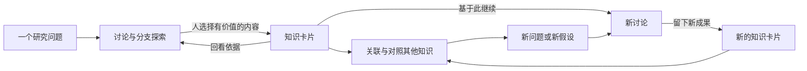

# 产品目的、能力差距与 UI/UX 评估

评估日期：2026-09-11。代码基线：`main` / `00f6382fb4baadb7d723d5df933cab8123a60b88`，已发布版本 `0.1.5-rc.2`。

依据包括当前源码、领域定义、已发布功能验收、PR #21 的浏览器截图，以及当日读取的 GitHub Issues #11–#13。RC.2 未改变 PR #21 的产品界面。本次是产品与交互评估，没有新增真实用户研究、浏览器性能测量或模型质量实验；下文的体验目标均为建议目标。

用户已确认本评估的产品结论，并要求开发接入 DSH、可人工体验的下一代插件原型。产品方向与高 UI/UX 要求作为本轮依据；具体布局通过原型体验选择，关系类型与正式实现细节继续验证。需求与执行状态以 GitHub Issues 为准，本文不替代任务清单。

## 1. 产品定位与能力主线

**研图帮助人把与 AI 的探索过程转化为可回溯、可复用、能启发下一步的知识，并通过图谱持续展开和收拢思路。**

用户明确了三个目的：可视化交互以支持发散与聚拢；留下人认为有价值的内容以便查找和复现；关联会话与知识以获得创新启发。由此可展开为六种用户能力：

| 能力 | 用户真正要完成的事 | 产品应带来的结果 |
| --- | --- | --- |
| 看清探索过程 | 看懂围绕一个问题尝试了哪些方向、走到了哪里 | 减少在多个会话之间重新建立上下文的负担 |
| 展开与收拢 | 从某个思考节点换假设、找反例，再对照不同方向 | 保留分歧、前提与取舍，形成下一步判断 |
| 留下价值 | 在看到有用内容时及时留下，必要时补充自己的理解 | 人决定什么值得留；AI 可协助起草 |
| 找回与复现 | 找回内容、来源、适用条件，以及当时为何这么想 | 既能重新理解，也能据此继续研究 |
| 发现联系 | 看到不同讨论和知识之间的支持、分歧、补充或启发 | 产生有依据的新问题与组合方案 |
| 持续积累 | 让已有成果进入新讨论，再留下新的成果 | 旧研究能够参与下一次思考，减少反复从头开始 |

最后一项是对用户目的的补充总结。还应保留有价值的失败路径、未解决问题和反例；知识可以是尚待验证的假设，保存行为本身不表示它已经正确。

会话承载探索过程，知识卡片承载人选择保留的成果，图谱展示过程、成果及后续探索的关系。研究主题界定当前围绕的问题。用户无需把“修订、冻结材料、沿用记录”都当作独立的日常管理对象。

“快速复现”暂按两层评估，优先考虑第一层：

- **恢复思考过程**：找回准确原文、所用知识版本、依据与问题，继续探索。当前已有来源范围与冻结材料基础，缺少顺畅的研究路径回看。
- **重新执行与验证**：按原材料、模型、配置、工具和环境重新执行。当前原文阅读只包含直接用户/助手文字，未覆盖附件、工具结果与完整执行环境，不能据此认定支持完整实验复现。重新执行也不以生成完全相同的模型答案作为验收目标。

## 2. 对照现状的能力差距

| 产品目的 | 已有能力 | 主要差距与影响 | 依据 |
| --- | --- | --- | --- |
| 看清探索过程 | 会话图、分支、汇聚、簇、状态、布局、摘要与原文 | 节点以标题和状态为主，缺少围绕问题、关键发现、分歧和下一步的概览；用户仍需逐个打开才能理解研究进展 | [图模型](../../src/client/graph-model.ts)、[画布](../../src/client/GraphCanvas.tsx)、[概览截图](../assets/ux-round-1/overview.jpg) |
| 展开思路 | 可从会话创建原生分支，或带选定材料开始独立讨论 | 当前分支入口只传会话身份，没有选择历史轮次切点；找反例、改变假设等探索入口未交付 | [分支接入](../../src/client/index.ts)、[#11](https://github.com/benz-ai-x/dsh-research-graph/issues/11)、[#12](https://github.com/benz-ai-x/dsh-research-graph/issues/12) |
| 聚拢思路 | 可以汇聚 2–3 个同目录会话，也可选择 1–3 项材料继续讨论 | 汇聚会话尚不能代替逐项比较观点、依据和适用条件，并保存有多源出处的综合知识 | [汇聚说明](../../README.zh.md)、[#13](https://github.com/benz-ai-x/dsh-research-graph/issues/13) |
| 留下价值 | 手工卡片、选择完整轮次、AI 提炼、来源捕获与编辑保护 | 从原文走入较重表单；手工建卡不会自动填入所选内容；AI 结果逐张展开完整编辑器。用户在收藏价值时要提前做较多整理 | [卡片编辑器](../../src/client/Knowledge.tsx)、[提炼流程](../../src/client/KnowledgeExtraction.tsx)、[建卡截图](../assets/ux-round-1/card-editor.jpg) |
| 快速找回 | 卡片可按标题和正文关键词搜索，也可查讨论原文；支持全部知识与主题范围 | 卡片检索为子串匹配，按最近保存排序；缺少匹配位置摘要、按问题/来源的发现入口与语义关联发现。大量卡片下的实际查询时延尚未测量 | [卡片查询](../../src/knowledge-host.ts)、[搜索界面](../../src/client/KnowledgeSearch.tsx) |
| 恢复与继续 | 准确原文范围、来源摘录、不可变修订、冻结沿用材料、工作位置恢复 | 已保存“用了什么”，但尚未将“为何沿这个方向、后来得到什么”整理成连续路径；从卡片加入材料后还需打开另一处操作入口 | [沿用流程](../../src/client/ResearchReuse.tsx)、[工作位置约定](../adr/0010-host-scoped-working-position.md) |
| 会话与知识关联 | 主题图中有会话到卡片的来源线；沿用有持久记录 | `GraphEdge.kind` 只有 `branch / merge / source`。卡片到新会话的沿用关系还没有绘制到画布；未加入主题的卡片也不会出现在当前主题图中 | [边类型](../../src/client/graph-model.ts)、[卡片投影](../../src/client/knowledge-graph.ts)、[主题图](../../src/client/TopicGraph.tsx) |
| 创新启发 | 人可通过空间排列与材料组合自行思考 | 没有知识之间的显式关联，也没有带原因和依据的相关内容建议；图谱尚未帮助用户识别跨讨论的可研究联系 | [图模型](../../src/client/graph-model.ts)、[卡片数据](../../src/knowledge.ts) |

最关键的结构缺口是：**会话 → 知识已有图上来源关系，知识 → 新会话已有记录但缺少图上关系，知识 ↔ 知识的意义关联尚未建立。**

当前基础值得保留：来源可追溯、旧版本不被覆盖、失败可重试、来源丢失时有摘录回退、重置图谱不删除知识。它们为长期积累提供了可靠性。对于“引用有效”和“结论正确”的区别，既有一次真实模型实验也发现了需要人工收窄的表述；该单次样例不能推导整体准确率。[模型质量记录](issues-6-10-model-quality.md)

## 3. 建议优先完成的完整体验

目标路径如下，图中包含尚未交付的关联、综合及路径呈现能力：

建议用一个具体的研究任务来验证：在两次讨论中分别得到“方案 A 适合低延迟场景”和“方案 B 适合强一致场景”；人留下两条卡片，回看各自依据，比较条件，提出“能否按场景组合两种方案”，启动新讨论，最后保存综合结果。完整路径应能在同一主题中回看。

这个任务要求展示条件差异，避免仅因结论不同就标成冲突；也要求新讨论明确使用哪版卡片。以后修改卡片，既往讨论所用内容仍应可核对。

## 4. 高 UI/UX 要求应落实到什么地方

### 入口与信息层级

当前顶部同时出现搜索、卡片库、新建卡片、材料、所用材料、研究主题等入口。它们大多按功能模块排列，用户需要自己把步骤串起来。建议把常驻入口压缩为当前主题/范围、搜索、主要创建入口；选中会话或卡片后再显示相关动作。

在当前 DSH 插件容器内，采用稳定的工作区域：主题/最近内容导航、中央图谱或列表、侧边阅读与编辑区。图谱适合看关系，列表适合快速找内容；两种视图使用同一组对象和选中状态。先验证宿主容器内的布局，独立全局首页及原生消息菜单接入另需核对 Harness 扩展能力。

### 内容阅读与上下文连续性

主题图已有简短卡片侧栏，但完整阅读、编辑、提炼、选材仍大量使用几乎铺满容器的对话层；从来源创建新卡片还会形成层叠编辑器。当前保护了草稿，却难以同时看见内容和关系。[编辑器](../../src/client/Knowledge.tsx)、[主题侧栏](../../src/client/TopicGraph.tsx)、[布局样式](../../src/client/GraphView.module.css)

建议在宽容器保留图谱和稳定侧栏；卡片、来源、历史切换保留明确返回位置。在窄容器切成单内容面板，并保留返回路径、选择和草稿。长篇编辑可显式进入专注模式。

图谱选中项与 DSH 正在输入的会话要有清晰区别。现有概览截图中宿主输入区与图谱同时可见；用户可能误以为选中节点或加入材料已经改变聊天上下文。应明确标出正在查看的对象，以及“基于此开始讨论”实际带入的内容。

### 卡片的默认体验

- 看到价值时使用“存为卡片”，自动带入所选讨论的出处，并提供可编辑的标题与内容初稿。手工创建允许没有来源。任意句子级选区需要精确地址设计；首轮可保留完整轮次边界。
- 首屏以标题和内容为主，主题可稍后归类；问题、理由、适用条件、待验证项仍可补充，保留旧卡片的结构化内容。
- 主按钮使用“保存”，版本放进“历史记录”。“已保存”和“内容待核对”分别表达持久化状态与知识状态。
- 来源默认显示讨论标题和可读轮次，可直接打开原文。内部 ID、事件序号及完整传输文本放入详细信息。
- 主要使用动作是“继续讨论”；更多材料、排序、导出和历史管理按需展开。打开继续讨论时预选这张卡片，并明确显示实际版本与目标工作区。

主任务与低频配置应分层；常用动作仍应直接可见，避免把一长张表单折叠后再增加多层导航。这与渐进披露的任务划分原则一致。[NN/g：Progressive Disclosure](https://www.nngroup.com/articles/progressive-disclosure/)

### 图谱必须让关系可理解

默认保留会话、知识两类主要节点，问题、假设等先通过卡片内容表达。选中节点时突出它的来源、相关知识和后续讨论；可切换查看全部关系。

关系分两层呈现：

- **过程关系**：实际分支、汇聚、摘取来源、已确认使用。来自可核对的记录，解释研究如何发生。
- **内容关系**：支持、分歧、补充、启发等设计候选。需要说明关联理由；人工建立与 AI 建议应能区分，AI 建议经用户选择后才进入其知识组织。

卡片缩放后应有合适的信息密度：远看主题和结构，中距离看标题与核心内容，近看依据和操作。节点类型、选中状态、关系方向应同时通过图形/文字表达。布局变化要可预测，并保留用户的空间记忆。

### 视觉完成度与操作细节

以克制、便于阅读的研究工作台为视觉方向。统一标题、正文、辅助信息层级，统一控件、间距和选中态；正文、引用、代码、长标题都用真实内容验证。品牌色优先用于主要动作和当前选择，关系颜色保持稳定且可解释。

重点检查连续操作：打开、回看、返回、保存、开始新讨论及失败恢复。焦点返回、键盘导航、拖动替代操作、窄容器布局与深浅主题都属于体验验收范围。通用控件以至少 24×24 CSS 像素的命中区域为基本检查项，并按适用例外核对；键盘聚焦的控件不得被自有浮层完全遮住。[W3C：Target Size](https://www.w3.org/WAI/WCAG22/Understanding/target-size-minimum.html)、[W3C：Focus Not Obscured](https://www.w3.org/WAI/WCAG22/Understanding/focus-not-obscured-minimum.html)

## 5. 体验验收建议

以下用于下一轮设计与实现验收，不是当前版本已达到的测量结果。

| 场景 | 建议验收目标 |
| --- | --- |
| 留下一段已选中的内容 | 常见路径最多两次主操作即可保存，文字编辑另计；不要求填写分类、状态、主题或模型参数；来源随所选材料保留 |
| 一周后找回知识 | 可通过记得的关键词或来源找到目标；结果解释匹配位置；从已打开的卡片一次操作进入准确来源 |
| 基于知识继续讨论 | 从卡片直接进入已带入该卡片的讨论准备；展示材料、问题与工作区并明确确认；无需先学习“修订加入材料”的流程 |
| 回看研究路径 | 能从一张卡片找到来源讨论，也能找到实际使用它的新讨论；可核对当时使用的版本 |
| 发散再聚拢 | 比较两个方向时保留各自前提与出处，保存新结果后在主题中形成可理解的连接 |
| 中断后继续 | 返回时恢复位置、选择与编辑内容；失败保留输入且重试不重复创建。跨视图/重启草稿恢复另需持久化实现 |
| 真实内容与规模 | 在 20、100、1,000 个混合节点样本、长中文标题、长来源、空/错误状态下检查密度和操作；实际记录交互与读取延迟，不能用纯函数测试代替浏览器性能结论 |

建议先做小规模形成性用户测试：让未参与开发的人完成“留卡、找回、继续、对照、返回”五项任务，记录停顿、误点、错误理解与求助点。再观察用户隔一段时间能否独立找回并复用自己的内容。重要结果是用户成功完成一次有价值的研究延续，而非单纯增加卡片或连线数量。

## 6. 后续工作的建议顺序与边界

**先把现有能力连成顺畅路径。** 优先验证轻量留卡、完整阅读、精确回看、直接继续讨论和沿用关系回到图谱。先围绕前述具体任务做可操作原型，再将通过体验验证的交互落实到正式实现。

**随后补充发散与聚拢能力。** [#11 历史轮次分支](https://github.com/benz-ai-x/dsh-research-graph/issues/11)、[#12 围绕卡片继续探索](https://github.com/benz-ai-x/dsh-research-graph/issues/12)、[#13 多源比较与综合](https://github.com/benz-ai-x/dsh-research-graph/issues/13) 均仍为 OPEN，与本次目的吻合。它们原文基于 DSH alpha.1；进入实现前应按 RC.2 与统一交互主线复核，不直接把每个 Issue 变成一个新的常驻入口。

**再加强知识之间的发现能力。** 先验证人能否方便地表达和理解关系，再加入带解释与依据的 AI 关联建议。按任务需要引入语义检索；让用户看到相关原因，并能忽略建议。

工作性质应明确区分：

| 工作 | 对现有模型的影响 |
| --- | --- |
| 调整文案、层级、侧栏和常用动作 | 可主要复用现有数据与服务；原有字段和历史内容需完整可访问 |
| 在图上显示知识到新讨论的沿用线 | 需要扩展查询与图投影；仅使用已确认沿用记录，并能回看历史版本 |
| 知识之间的内容关系、多源综合 | 新的领域能力；需明确关系含义、引用版本与修改规则，不能把它们冒充为已有来源关系或会话分支 |
| 跨视图/重启恢复未保存草稿 | 需要明确草稿的持久化生命周期；ADR 0010 当前仅允许浏览器保存呈现状态，不能直接把知识正文放进同一缓存 |
| 统一自动保存主题排列 | 会改变 ADR 0006 与 ADR 0010 的显式 Host 同步决定；若选择此方向，需先修订该约定并处理并发行为 |

当前的准确来源、不可变历史、明确的模型调用与发送、失败恢复继续作为新体验的基础。本评估记录产品目的、术语与差距；用户确认后的原型实施见 [Issue #23](https://github.com/benz-ai-x/dsh-research-graph/issues/23) 和[DSH 体验指南](research-workbench-prototype.md)。
