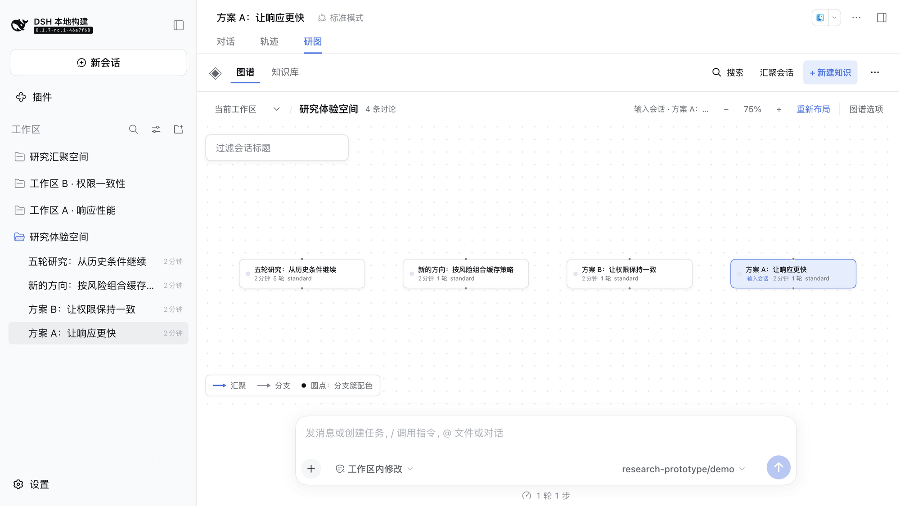
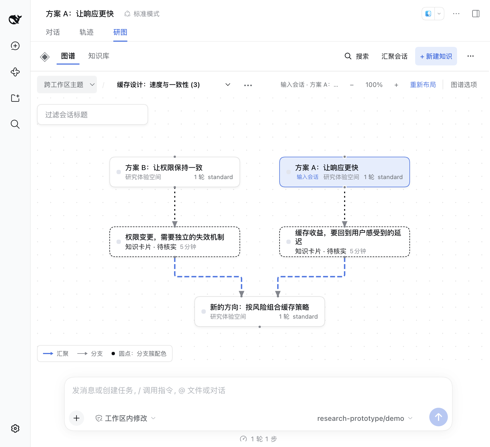

# Session projection facts acceptance

Baseline: `feat/graph-projection-facts` on main `a2aa66a` (plus the CI-only `46baebb`). Target: official DSH `dsh-v0.1.7-rc.1` (`46a7f68b09`). Decision record: [ADR 0017](../adr/0017-session-projection-facts.md).

Scope: the graph refreshes non-activating Session projections for canvas members (batched, silent on failure, Host-side single-flight). Cards gain an inline closed-turn count and a hover preview of the newest prompt; the Selected Session inspector gains a Session stats block (model route, turns/steps, wall times, cumulative tokens, context-usage text, goal with phase, todo progress, newest prompt/response previews). Cold unopened Sessions recover their durable titles in the graph without a native open.

## Validation

- `pnpm run check`: **231 tests / 26 files** passed (baseline 227, +4 graph-model cases).
- `pnpm check:harness` against `dsh-v0.1.7-rc.1`: all **four compiler faces** match, **347 tests / 23 files** passed (baseline 343, +3 view cases and +1 Host-stack spec). The new `tests/session-projections.harness.spec.ts` boots the real Session store stack and proves a cold Session's list row changes from the directory-name fallback to its durable title after `refreshProjections`, with repeat reads short-circuiting to zero RPCs.
- `git diff --check` clean.

## Browser evidence (isolated `pnpm preview:dsh` profile, fixed demo model)

Workspace graph, 1280px: every canvas card shows its turn count inline in the existing meta row; card geometry, legend, and minimap are unchanged.

Selected Session inspector: the Session stats block lists the model route, `5 轮 · 5 步 · 模型 1.3s · 工具 0ms`, cumulative tokens, and the newest prompt preview. The demo fixture model reports zero token usage, so the tokens row reads `0` — a fixture property, not a product default.

Topic graph at ~783px: source Sessions carry the same facts, source/reuse edges route cleanly, and no card or title overlap appears.

Also exercised: cold reload restores durable titles and badges through the projection pass with the saved working position intact; Relayout works with the new meta content; no page errors observed. English rendering is covered by the locale-key unit tests rather than a separate visual pass. Dark theme was not re-screenshotted; the block reuses existing semantic panel styles.

## Boundaries

- Facts arrive asynchronously; a card is fully correct before they land and simply gains them after.
- Context usage is a text percentage only (the upstream fields sample different moments); no color thresholds.
- Turn previews stay on hover/inspector, not on card faces.
- The Agent preset is folded onto the node model but not rendered: the projection reports the effective preset including the Host default, making a per-card badge uniform noise.
- The Host-side cold-list identity mismatch (directory-name fallback for unopened Branches) is routed around for graph users, not fixed upstream; the minimal reproduction lead is the stored projection identity (`formatVersion`/`createdAt`/`cwd`/`isSeeded`) versus the list header.
