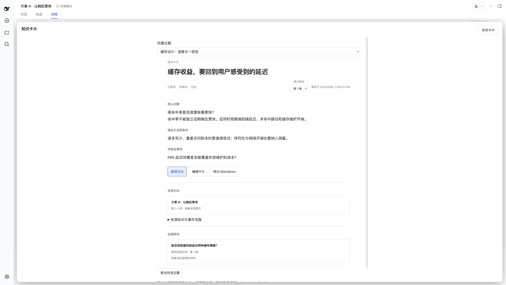
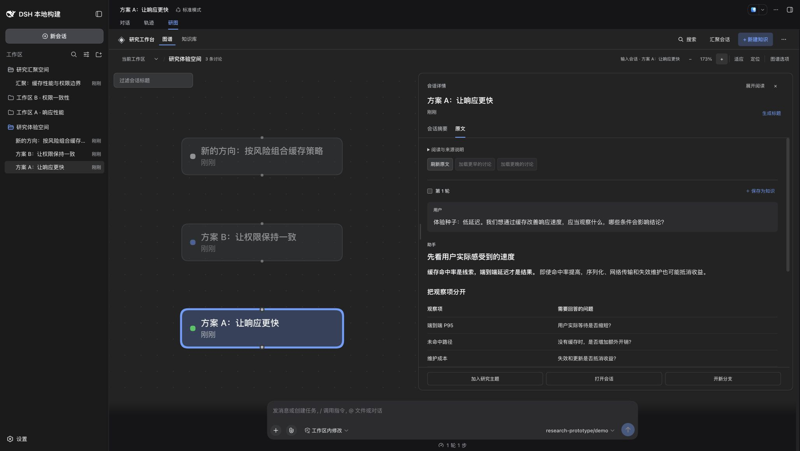
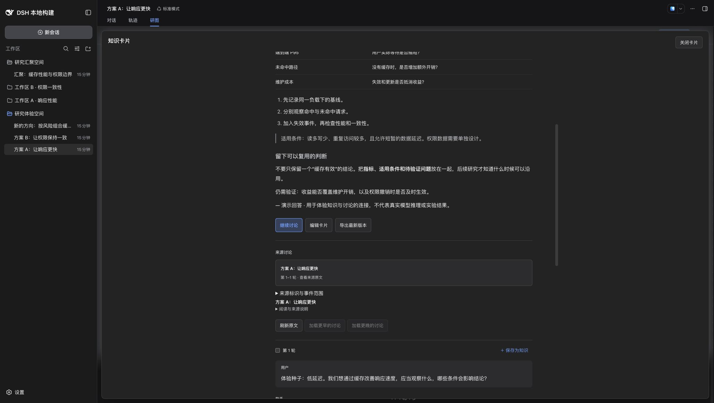
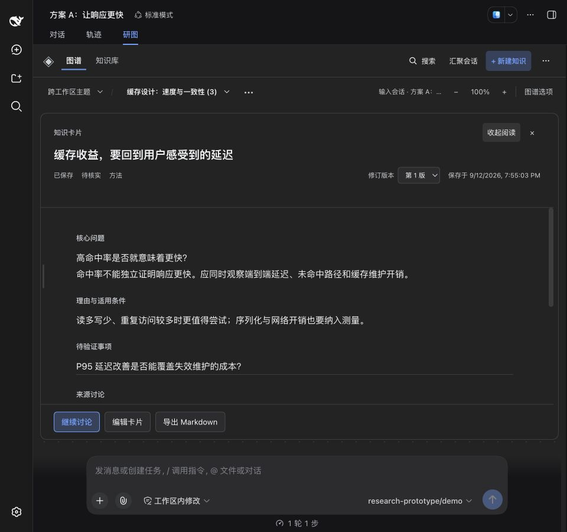
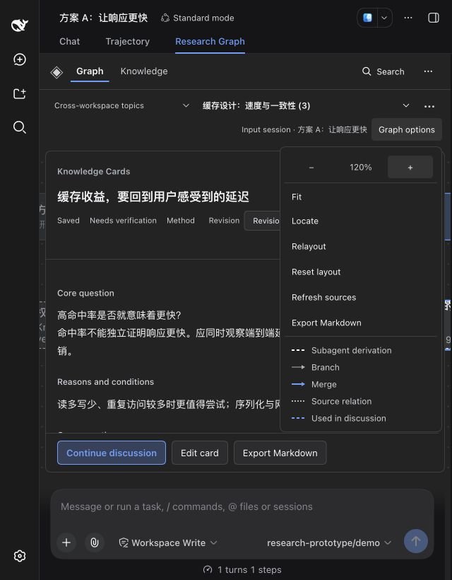

# 统一知识阅读与画布几何协同

日期：2026-09-12。对应 [#36](https://github.com/benz-ai-x/dsh-research-graph/issues/36) 与 [#37](https://github.com/benz-ai-x/dsh-research-graph/issues/37)，按用户要求在 `refactor/reading-geometry` 合为一个 PR。实现从 `976e48b` 开始，提交前已同步至包含摘要高亮 PR #38 的 main `53c3b62`。

## 知识阅读边界

搜索结果、保存提示、人工创建和提炼候选的保存结果现在都使用 `KnowledgeReader`；`KnowledgeEditor` 只负责表单、来源编辑、保存和主题归属。原先编辑器里的第二套修订、正文、来源与阅读操作已删除。

- 阅读器根据当前修订统一展示保存时间、核实状态、Markdown 正文和准确来源；继续讨论、编辑均使用所选修订。显式指定但不存在的修订显示错误并支持重试。
- 导出沿用 [ADR 0011](../adr/0011-export-fixed-knowledge-revisions.md)：在预览开始时读取最新修订。旧修订阅读明确显示“导出最新版本”，导出选择也使用最新标题。
- 后续研究显示整张卡片的已接收沿用，保留每项使用的版本。加载、失败、重试和确实为空分别展示。图谱与知识库继续提供批量关系结果；独立阅读入口按卡片加载关系。
- 原位编辑时保留阅读器挂载，放弃后恢复原修订、展开来源、滚动与焦点。真实 Chrome 验收发现原先子组件恢复焦点早于父级解除 `inert`；现推迟到该次提交完成后恢复，并通过模拟原生 `inert` 的 Harness 回归保护。
- 保存仍追加不可变修订，提炼准备与引用编辑继续由现有流程保留。来源内留卡成功后返回原文，保存提示可打开新卡片。主题归属写入不再重置正在阅读的修订。

这些实现遵循 [知识修订](../adr/0007-knowledge-card-revisions.md)、[审核提炼](../adr/0008-reviewed-knowledge-extraction.md)、[冻结材料接收](../adr/0009-frozen-material-admission.md) 和[工作位置](../adr/0010-host-scoped-working-position.md) 的既有契约。

## 几何边界

`reading-geometry.ts` 统一负责实际研究容器测量、阅读面板约束、临时拖动与已提交偏好，以及画布使用的几何信息。`InspectorFrame` 保留文档结构；`GraphCanvas` 保留图操作与纯视口计算。

| 信息 | 使用方与规则 |
| --- | --- |
| 完整画布尺寸 | 实际容器变化保持完整画布中心；忽略临时隐藏产生的零尺寸；小地图继续按完整画布计算。 |
| 命令可用区域 | 宽屏减去面板实测宽度及 24px，至少 240px；覆盖模式使用完整画布。适应、定位、工具缩放、100% 复位和小地图重定位实时读取。 |
| 预览避让 | 单独提供右侧占位；悬停预览避让阅读面板。 |

760px 决定是否覆盖画布，1000px 决定紧凑面板的默认宽度与上下限。两者以实际研究容器为准。CSS 接收同一模块计算出的模式与尺寸变量。打开、拖宽和展开只更新面板；真实画布尺寸变化才调整视口。滚轮保留指针锚点，输入框预留高度继续由原布局提供。

拖动期间不保存偏好；指针抬起后提交。Esc、pointercancel、lostpointercapture 或拖动途中进入覆盖模式均撤销临时状态。键盘调节、ARIA、默认恢复与范围隔离继续使用现有工作位置存储。

## 自动化与实包验收

在同步 main 后的实现提交 `a1373ae` 上完成：

- `pnpm run check`：类型检查、构建和 197 项独立测试通过。
- `DSH_HARNESS_ROOT=/path/to/deepseek-harness-0.1.5-rc.2 pnpm check:harness`：Host、Client、已发布 Host、已发布 Client 四个类型面及 306 项测试通过。
- 新增 11 项 Harness 回归：共享阅读入口、关系失败重试、旧修订来源与最新导出、原位编辑返回、显式修订丢失、批量关系复用及关闭后的迟到响应，以及六个响应式边界和拖动途中进入覆盖模式。既有草稿、提炼、保存重试、视口、小地图与悬停预览回归通过。
- `pnpm pack --pack-destination .artifacts` 后，`pnpm smoke:harness` 的隔离 web profile 安装、真实 Host 启动、持久读写、提炼、沿用、冻结 Markdown、标题、摘要、准确原文、搜索及移除通过。固定模型调用 11 次。

包版本保持 `0.1.5-rc.2.3`，目标 DSH `0.1.5-rc.2`；最终 Build ID 为 `local-bdeebbc6`。验收归档 448318 bytes，SHA-256 `859c111e1d7c2eaba0a6b0bdb44fe2ceda7c3efddaadcbafcae6d733769ac41d`。

## 浏览器验收

通过标准 `pnpm preview:dsh` 将实包装入独立 DSH 0.1.5-rc.2 profile，使用固定模型示例和真实 Host 数据。Chrome 自动操作并逐张检查截图，覆盖 2056×1160、960×900、640×820、中文浅色及英文深色；未记录浏览器 console error，无页面横向溢出。

| 场景 | 实测 |
| --- | --- |
| 1774px 画布，面板从 560 拖至 963px | 画布变换保持不变；适应后的相对水平中心为 393.5px；连续放大三次至 173% 后仍为 393.5px。 |
| 面板收窄至 563px | 拖动保持画布变换；下一次定位使用 593.5px 中心；展开不移动画布。 |
| 关闭面板后适应 | 恢复完整画布的 887px 中心。 |
| 640px 浏览器、582px 实际研究容器 | 覆盖模式隐藏手柄；菜单连续缩放保持完整画布的 291px 中心。 |
| 实际容器 759 / 760 / 761 / 999 / 1000 / 1001px | 依次为覆盖 / 覆盖 / 紧凑 / 紧凑 / 紧凑 / 宽屏；展开宽度依次为 743 / 744 / 737 / 975 / 976 / 880px。 |
| 从原文底部留卡 | 保存前后原文滚动均为 559.5px，保存提示可打开共享阅读器。 |
| 第 1 版编辑后确认放弃 | 保持第 1 版和展开来源；稳定阅读位置前后均为 510px，焦点回到“编辑卡片”。 |
| 从旧修订进入导出 | 提示导出最新版本，选择项显示第 2 版的新标题。 |
| 从搜索打开种子卡片 | 展示准确来源与已接收的后续讨论，附“第 1 版”标签。 |

搜索入口的完整阅读与后续研究：

拖宽原文后连续放大仍保持可用区域中心：

原位编辑返回展开来源，保留历史修订的导出提示：

紧凑容器展开阅读，以及两种小屏语言 / 外观：

此记录是实现与自动化浏览器验收证据，供 PR 审查及后续人工体验使用。截图使用隔离示例数据；私有 profile、测量 JSON 和原始日志位于工作树 `.artifacts/`。
