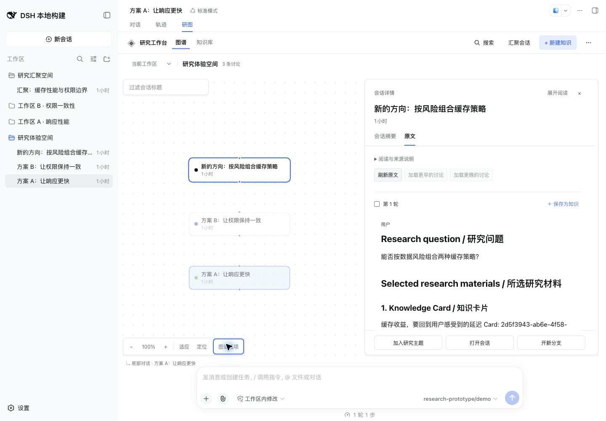
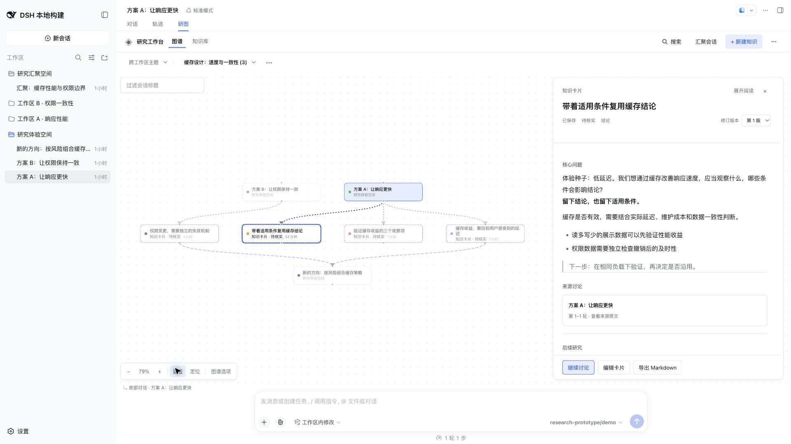
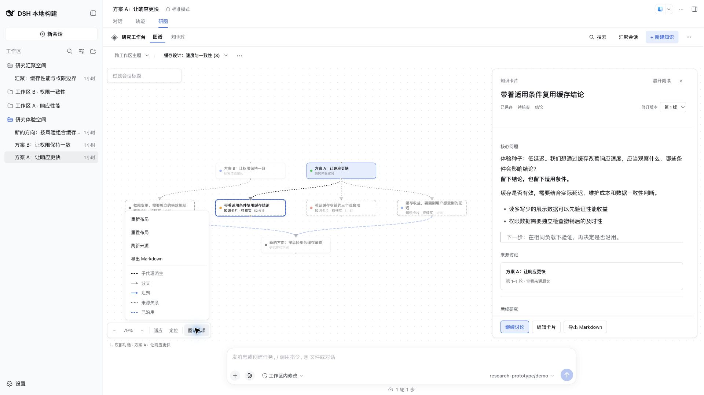
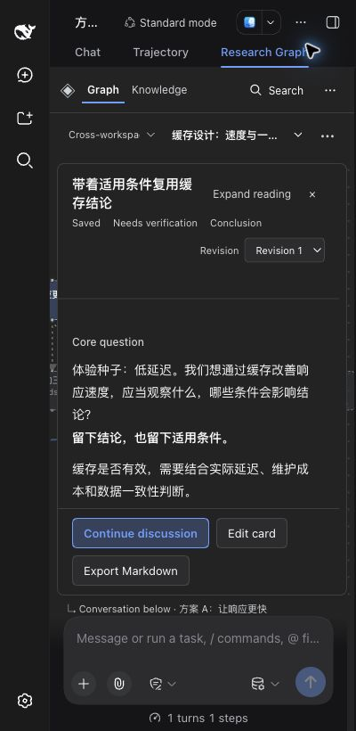
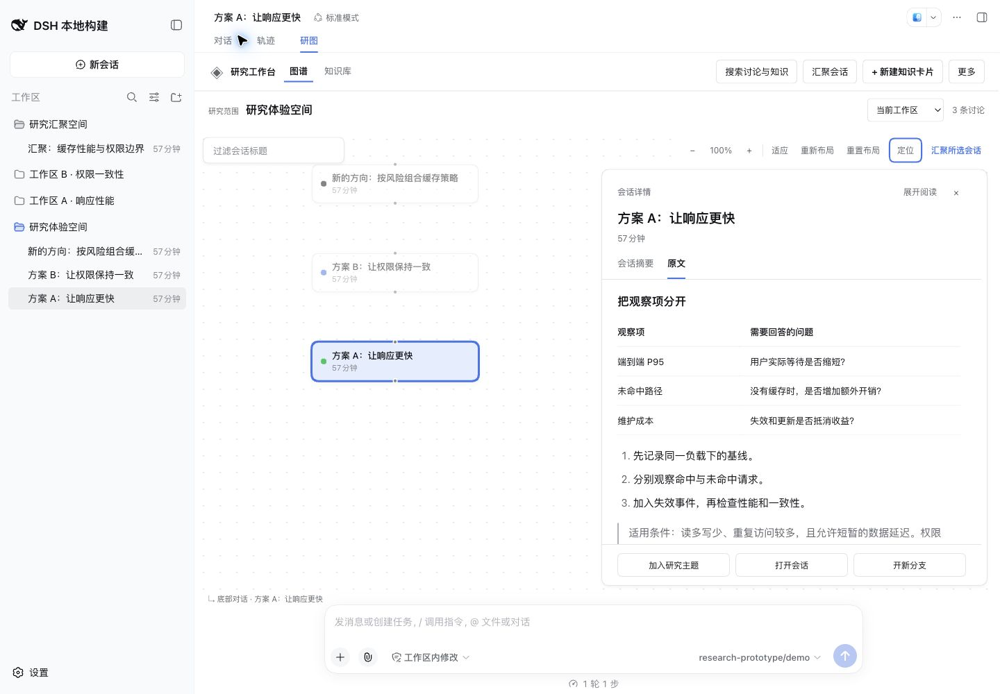
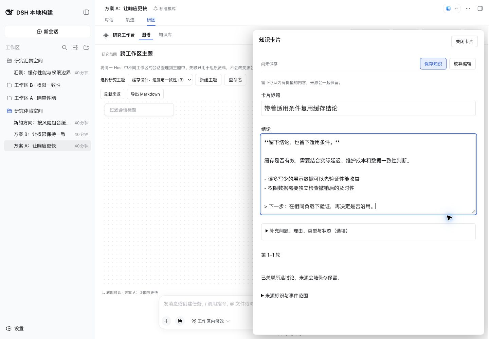
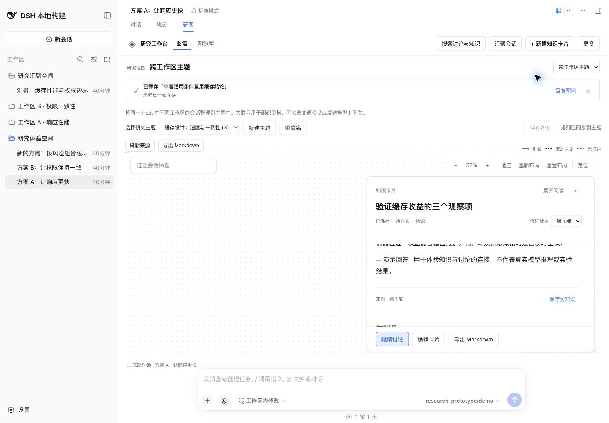
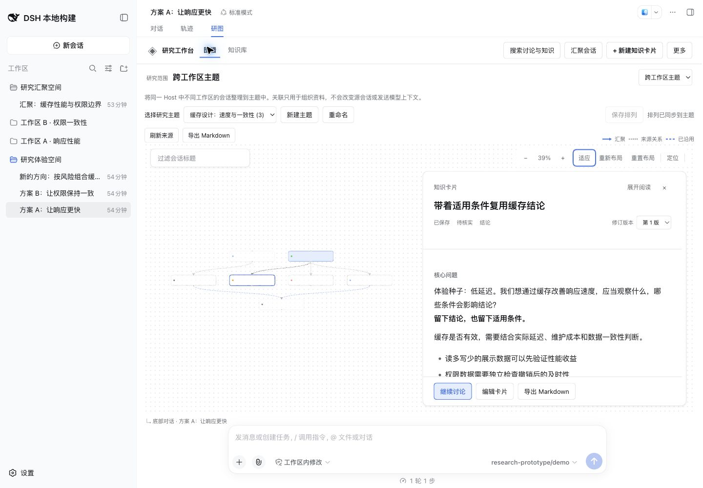
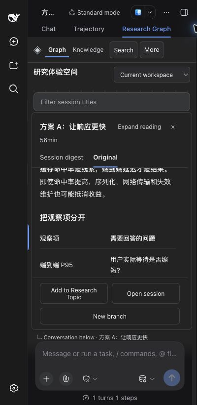
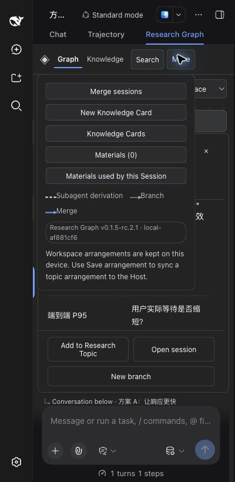

# 阅读与知识捕获体验优化

日期：2026-09-12（含人工体验后工具区追加优化）。需求与 TODO：[Issue #29](https://github.com/benz-ai-x/dsh-research-graph/issues/29)。基线为摘要修复 PR #28 的 `a46c1de`，本轮 PR 依赖 #28；尚未合并、发布或替换用户的日常 profile。

## 人工体验追加：工具区

用户标注的工作区和跨工作区主题右上区域仍叠放全局操作、范围、主题管理、排列状态与画布工具。追加修改继续纳入 PR #30：

- 两种范围共用一行上下文栏，范围与工作区 / 主题选择放在左侧；主题名旁的选项包含新建、重命名和范围说明。新建与重命名表单可取消，并返回触发按钮。
- 顶部搜索与汇聚使用轻量按钮，新建知识作为主动作；窄屏保持一行导航。
- 缩放、适应、定位放到画布左下；图谱选项收纳重新布局、重置布局、所选会话汇聚、主题来源刷新 / 导出与关系图例。
- 已同步排列不占用工具行；仅未保存时出现保存操作，保存成功收起并保留合理焦点。
- 右侧阅读面板上移；400px 小屏阅读时收起画布工具，关闭阅读后恢复。主题与图谱菜单在小屏完整可见，Esc、点击外部和选完操作可关闭；弹窗从菜单打开后，关闭返回持久的菜单触发按钮。

工作区与主题现在共享同一内容起点（1440px 宽下画布顶部 175.5px，阅读顶部 187.5px）；不再因主题管理多占几排。检查覆盖主题创建 / 重命名取消、未保存排列的失败重试和保存后焦点、图谱菜单与原有布局 / 汇聚 / 导出 / 刷新行为。192 项独立测试、267 项匹配 Harness 测试与四个编译面通过。

## 本轮结果

| TODO | 实现与验收 |
| --- | --- |
| 视觉层级 | 工作台与范围标题收紧；准确区分工作区和目录；知识导航改为“知识库”。窄容器的汇聚、新建卡片进入“更多”，搜索使用短标签并保留完整可访问名称。 |
| 稳定阅读 | 统一详情框固定身份、切换与操作，正文独立滚动；桌面可展开至 880px，窄容器完整占用可用空间。Esc 先收起再关闭，关闭后返回节点焦点。 |
| 内容排版 | 讨论与知识正文复用匹配 DSH 的公共 MarkdownText，呈现标题、强调、列表、引用、表格和代码；恢复摘要的原生文本选择。保存和来源地址保持原始内容及精确轮次。 |
| 轻量留卡 | 完成轮次的开头和末尾都能保存；保留连续轮次选择。标题、结论为主要字段，主题和补充信息折叠。迟到预填、失败草稿和同一请求重试继续受保护。 |
| 上下文归属 | 详情始终显示正在阅读的内容；底部标注 Viewed Session 的聊天目标，选择其他节点不会改变发送对象。 |
| 成果与连续性 | 保存后回到来源并显示真实卡片标题、来源保留状态和查看入口。异步关闭后再恢复焦点；主题刷新保留完整旧图直至新数据就绪。单讨论图提供起步引导。 |
| 工作位置 | 保留同一卡片的修订、展开来源和滚动位置；切换另一张卡片从开头阅读。忽略暂时隐藏导致的零尺寸测量，恢复显示时保持画布位置。 |

## 验证

- 冻结安装使用 pnpm 11.7.0；`pnpm run check`：192 项通过。
- 官方 `dsh-v0.1.5-rc.2`（`fb2c4b9e698e30edb738bca4cf0618587db7d203`）：Host / Client / 已发布 Host / 已发布 Client 四个类型面通过，`check:harness`：267 项通过。真实 Markdown 渲染仅在匹配 Harness 中验证；独立 bundle 测试核对共享模块与 manifest 的声明。
- 回归覆盖普通工作区及主题中就近捕获、准确来源和正文原值、保存后滚动 / 焦点、主题刷新期间保持阅读、未完成轮次、展开与键盘隔离、嵌套留卡和失败重试。主题刷新、零尺寸与切换卡片滚动回归均先复现失败再修复。
- 正式归档在隔离 web profile 中安装、启动、持久读写、提炼、沿用、冻结 Markdown、摘要、准确原文范围、搜索与移除均通过，固定模型调用 10 次。
- Chrome 实测中文浅色、英文深色，1440×1000、640×820 和 400×820。原文长文、表格与引用可读；小屏菜单和固定操作可访问，无页面横向溢出。验证展开、收起、定位、适应和知识库 / 图谱往返。
- 真实主题中从卡片的原文再保存“带着适用条件复用缓存结论”，保存前后滚动均为 1525，仍阅读原卡片“验证缓存收益的三个观察项”，焦点返回对应轮次保存按钮；新卡片实际入图。最终构建进一步确认：知识库前卡片滚动 1360，切换新卡片后为 0，再切入图谱仍为 0。浏览器 console error 为 0。

本轮体验构建仍使用 `0.1.5-rc.2.1`，Build ID **local-2fdf8c77**，不是 npm 上的新发布。最终验收归档 425861 bytes，SHA-256 `3c78d4aba17234136426bf93fe5ea7f994cd14445e8bad8902848e8245a21b20`。日志和隔离 profile 在工作树私有 `.artifacts/reading-ux/` 与 `.artifacts/workbench-dsh/`；令牌不进入 Git。

## 首次阅读优化截图（工具区追加前）

默认阅读宽度、真实来源与固定操作：

就近留卡，保留阅读背景：

保存后回到同一来源位置：

知识正文与来源、图谱并排：

小屏阅读与紧凑菜单：

## 人工体验与边界

在本工作树执行 `DSH_HARNESS_ROOT=/path/to/deepseek-harness-0.1.5-rc.2 pnpm preview:dsh`，使用启动器给出的本机登录入口；停止命令为 `pnpm preview:dsh --stop`。演示通过真实 DSH Host 保存、回读和刷新，模型回答为明确标注的固定示例。

本轮优化阅读与捕获闭环。目录中的纯文本节选和更丰富的节点预览仍可继续细化；知识语义关系、自动研究建议、句级来源、跨 Host 汇聚及跨重启草稿恢复未纳入。最终 UI/UX 评价由用户人工体验决定。用户原有 Host、会话、配置和其他预览服务保持原样。
