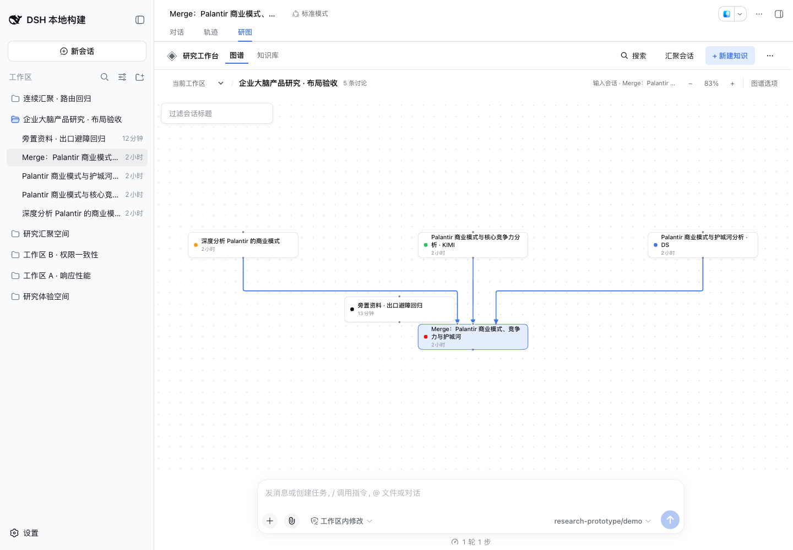
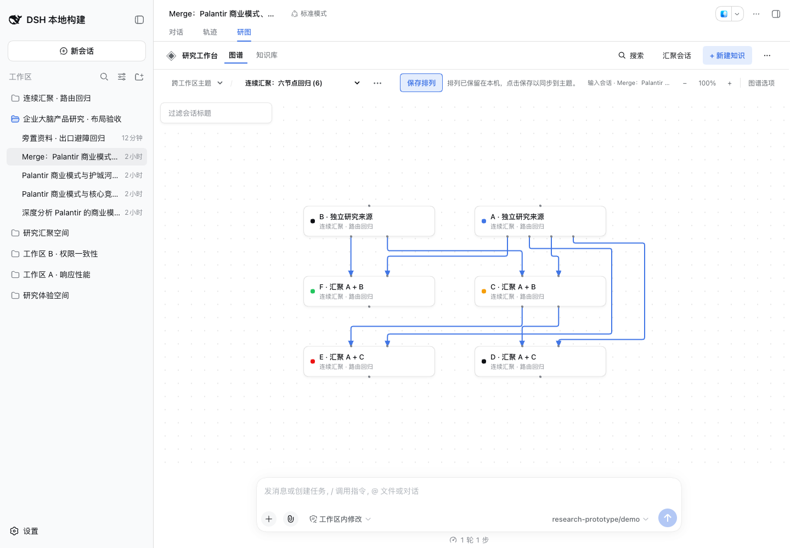

# Relayout acceptance — 2026-09-13

Both Workspace and Research Topic graphs now arrange connected sources in dependency rows, retain Branch clusters, and route relations after all manual positions, collapse choices, and cluster offsets. Arrowheads and visual terminals use the actual endpoints; Fit includes outer routes and labels. Relayout retains one undo without changing reading state or implicitly saving a topic through the Host.

The supplied three-source Merge screenshot was reproduced before implementation: three unrelated-node penetrations and three collinear edge pairs. Increasing spacing retained all six defects. Regression cases now cover that Merge, twelve sources, skip-level and feedback edges, compact Branch frames and their title bands, dense paths, label bounds, a 10,000-node Branch chain, and a very distant manually positioned member. The selected fan-in/feedback/manual-column cases have no shared collinear segments. Dense nonplanar relations can still cross; physically overlapping cards can leave a terminal unreachable until rearranged.

Validation:

- `pnpm run check`: strict types, build, 208 standalone tests.
- Matching `dsh-v0.1.5-rc.2` checkout (`fb2c4b9`), `pnpm check:harness`: four compiler faces and 337 Harness tests. Existing rendered-view regressions now also assert reading continuity, repeat-Relayout undo, invalidation after another arrangement action, and topic undo without a Host write.
- Packed-profile acceptance: actual archive install, boot, persistent topic/knowledge/Merge operations, frozen synthesis/reuse, historical Branch recovery, and removal using the fixed demo model.
- Chrome 153.0.8010.36, real isolated DSH profile, 1440×1000 and 900×820: Workspace Merge, Topic Merge, and discussion → knowledge → follow-up routes were sampled from the actual SVG curves. No card penetration or arrow-tip mismatch was found. Real pointer drags into a manual column, repeated Relayout, Undo, and reopening retained the expected positions; no browser errors occurred.
- Local geometry timings: 100 nodes / 197 edges ≈38 ms; 100 / 485 ≈69 ms; 300 / 597 ≈143 ms. These are diagnostic observations, not browser interaction guarantees.

The original user profile was not used. No runtime dependency or package version changed. The routing choice is recorded in [ADR 0016](../adr/0016-route-relations-after-arrangement.md).

Workspace Merge:

Topic Merge:

Knowledge and follow-up discussion:

## PR #44 review fixes

The review found two cases beyond the initial fixtures: a distributed terminal could move into an unrelated card after its side midpoint had passed the obstacle check, and a six-node Merge workflow retained 110px of shared polyline (102px of visible straight SVG). Final distributed terminals are now checked before routing; blocked seats move into a free interval or onto another card side. Routes that still overlap try another departure row and then a bounded local search, retaining the lower-cost clear result.

Six added regressions cover blocked input and output terminals, a narrow opening requiring another side, horizontal terminals, and the consecutive Merge workflow in both layouts. The original four review regressions failed before the fix and pass afterward. The consecutive Merge now has zero shared polyline length; the terminal cases have no card penetration and retain distinct endpoints. The routing file has 16 passing tests.

Validation on the final source:

- `pnpm run check`: strict types, build, **214 standalone tests**.
- Matching DSH `0.1.5-rc.2`, `pnpm check:harness`: **four compiler faces and 337 Harness tests**.
- The actual built archive passed isolated profile installation, boot, persistent research operations, and removal with **19 fixed demo-model calls**.
- Chrome 153.0.8010.36 in the matching isolated DSH: real pointer drags placed five non-overlapping Workspace cards around a blocked Merge input; a six-node Topic retained all eight consecutive Merge relations. Actual SVG sampling found **zero card penetrations, shared straight segments, or terminal/arrow mismatches** in these cases. Relayout/Undo, Workspace reopening, explicit Topic reopening, and a 900×820 container also passed; page errors were **0**.
- Five-sample local median routing times, previous head → fix: 100 nodes / 197 edges **24.2 → 25.4ms**; 100 / 485 **57.1 → 73.8ms**; 300 / 597 **131.8 → 132.6ms**. Candidate expansion is limited to the best detour before local search. These measurements cover the pure router, not end-to-end browser interaction.

The package version remains `0.1.5-rc.2.5`; the tested local archive has Build ID `local-8b98702b`. No runtime dependency or user profile changed. The initial screenshots above remain the original acceptance evidence; these two screenshots show the review cases:

