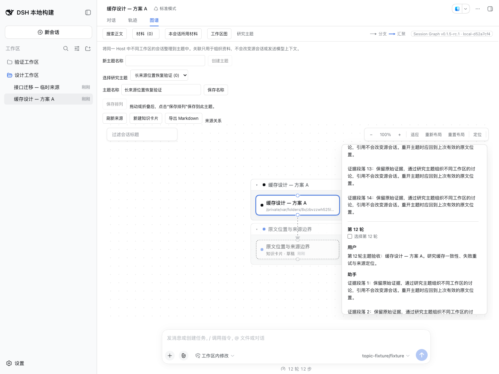

# v0.1.5-rc.1 发布验收

日期：2026-09-10。本次发布包含 PR #14–#17，目标宿主为官方 `dsh-v0.1.5-rc.1`，提交 `183f08e9c6dde7e36cd2318eaee70b0da08fb35e`。插件版本和全部直接 DSH 依赖均为 `0.1.5-rc.1`；锁文件中所有 DSH 包也统一到此版本。原有独立版本标签及 `v0.1.5-alpha.1` 保持不变。

## 检查结果

| 检查 | 结果 |
| --- | --- |
| 环境 | macOS arm64，Node 26.4.0，pnpm 11.7.0；独立匹配宿主工作区保持官方 tag 源码不变。 |
| 冻结安装 | `pnpm install --frozen-lockfile` 通过；保留精确版本例外，没有关闭依赖发布时间策略。 |
| `pnpm run check` | 类型、构建及 20 文件／175 项独立测试通过。 |
| `check:harness` | Host／Client 源码及公开声明四个编译面、13 文件／246 项集成测试通过。 |
| 实包冒烟 | 安装、启动、持久主题／Merge／知识卡片、审阅提炼、原生材料沿用、固定 Markdown、只读摘要／原文／搜索、精确范围和卸载全部通过。固定模型调用 10 次。 |
| 离线恢复 | 从归档取出 `package.json` 和恢复可执行文件，在没有 `node_modules` 的临时包目录运行 `--help` 成功；不依赖 Host 启动或宿主 peer 包。既有恢复回归纳入独立测试。 |
| 浏览器 | Chrome 153.0.8010.36，1440×1080；通过原生插件管理器安装归档，安装的 client 与构建文件逐字节一致，页面错误 0。 |

## 实际浏览器核验

版本徽标显示 **Session Graph v0.1.5-rc.1 · local-d52a7cf4**。在 RC 宿主真实会话视图打开 Graph 和研究主题，通过以下原文位置回归：普通后续页面及滚动恢复、连接失败保留摘录并可重试、卡片显式来源保持精确边界、12 轮来源及深滚动恢复、来源不可用清空失效位置并保留摘录入口。普通页面恢复到 anchor 20／scroll 550；长来源保留事件 5–106，前后 scroll 均为 14726。

三个合成来源各有 108 条事件，浏览器核验前后完整快照哈希不变；准备阶段固定模型调用 39 次，阅读阶段新增 0 次。本轮使用固定模型；真实模型定性证据沿用[批次质量评估](issues-6-10-model-quality.md)，不将其计为此次 RC 新运行结果。

## 本地验收归档

- 文件：`benz-ai-x-dsh-client-ui-session-graph-0.1.5-rc.1.tgz`，357,848 字节。
- SHA-256：`cc6012fc51c537f27326a62ebe9786c4c48dcba8126eb076733e4de309a0fc42`。
- Build ID：`local-d52a7cf4`。
- 归档包含 15 个发布文件，未携带测试、临时验收目录或交接文件。

发布工作流在不可变 tag 上重新检查、构建和打包，并通过 npm trusted publishing 发布到 `next`。上面的哈希标识本地实包验收对象；npm 的构建归档以该工作流与注册表返回的完整性信息为准。
