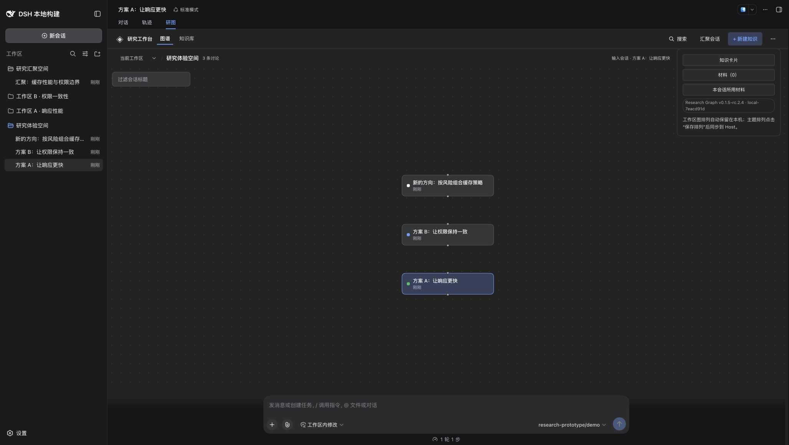
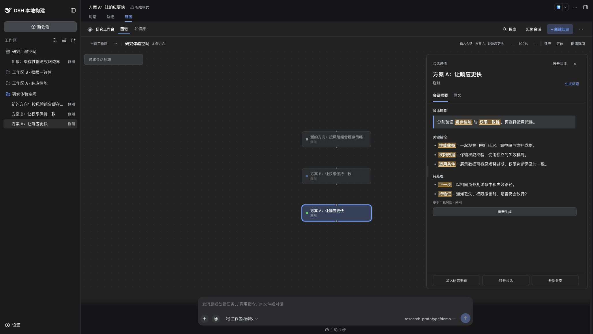
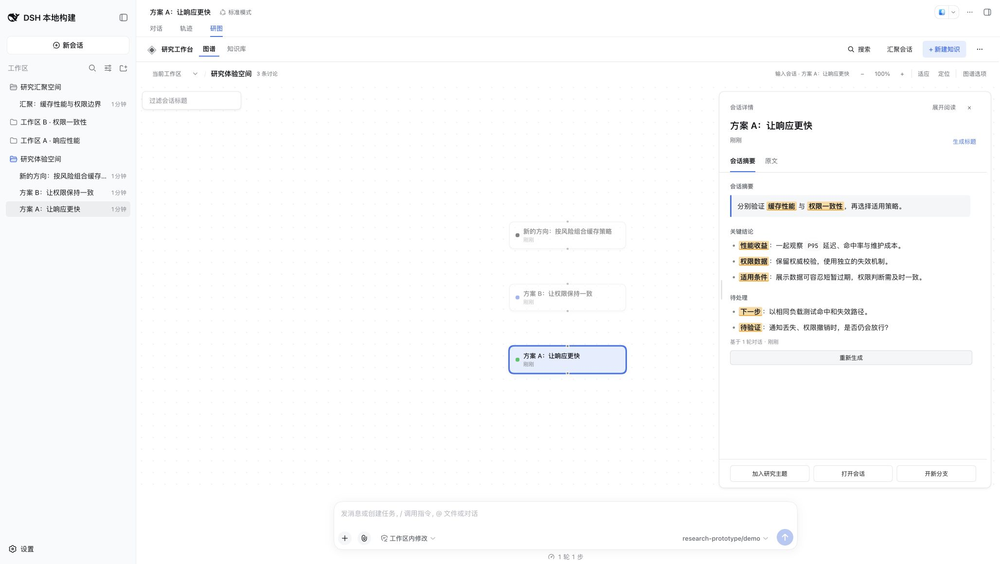

# DSH Research Graph 0.1.5-rc.2.4 release acceptance

This revision releases clearer Session Digest highlights from [PR #38](https://github.com/benz-ai-x/dsh-research-graph/pull/38), plus shared saved-knowledge reading and responsive reading geometry from [PR #39](https://github.com/benz-ai-x/dsh-research-graph/pull/39). The release baseline is main `8473c736a31ae4f899d742aedcbc84e97be7b4d9`. Release preparation changes the package version and documentation; product source and dependencies retain that reviewed baseline.

## Compatibility

- Plugin: `@benz-ai-x/dsh-research-graph@0.1.5-rc.2.4`; tag `v0.1.5-rc.2.4`; npm dist-tag `next`.
- Target: official DSH `dsh-v0.1.5-rc.2`, commit `fb2c4b9e698e30edb738bca4cf0618587db7d203`.
- The exact LLM peer pin remains the canonical target. All direct DSH dependencies stay at `0.1.5-rc.2`; the lockfile and bundled recovery dependencies are unchanged.
- Both READMEs pin installation to this revision. Previous releases and tags remain unchanged.

## Included behavior

Saved knowledge uses the same revision reader from the graph, library, search, save notices and saved extraction results. Content, sources and revision-specific actions follow the displayed revision; exports retain their explicit latest-revision contract. Follow-up research read failures remain distinct from an empty result and can be retried.

Cancelling an extraction-card edit restores the actual outer batch reading position and visible focus, including the discard-confirmation path. Source expansion, preparation and other drafts remain intact. Saving a new revision keeps the batch position. The full regression and browser evidence are in [the reading acceptance record](reading-geometry.md).

The shared geometry module owns responsive modes, panel constraints, resize observation and drag commit/cancel behavior. Canvas commands use the visible command area while viewport preservation continues to use the full graph surface. Digest emphasis now uses a warm highlight, stronger text and a visible lower edge in both color themes.

## Validation

- Frozen installation with pnpm 11.7.0 passed; local runtime was Node.js 26.4.0.
- `RELEASE_TAG=v0.1.5-rc.2.4 pnpm run check`: strict types, build and **197 tests / 23 files** passed.
- Matching official RC.2 `check:harness`: all four source/published Host/Client compiler faces and **308 tests / 18 files** passed. Standalone Host adapters remain outside those compiler programs. An initial invocation overlapped a build that recreated the declaration directory; the complete check passed when run after the build finished.
- The real archive passed isolated web-profile installation, offline recovery before Host boot, startup, durable topics/merge/knowledge, reviewed extraction, reuse, frozen export, read-only title suggestion, native title rename, digest/history/search, exact history ranges, shutdown and removal. Model transport used **11 deterministic fixture calls**.
- The package-derived Graph header integration test passed. The packed manifest, browser module and real Chrome header all show **0.1.5-rc.2.4**, Build ID **local-7eacd91d**.
- Real Chrome at 2056 × 1160 loaded the isolated profile and generated a fixture digest. Highlighted overview, conclusions and next steps were legible in both dark and light themes; all seven emphasis runs retained their background and bold weight. Browser console errors: **0**. Screenshots below are from this release candidate.
- `git diff --check` passed. The temporary browser tab was closed and the release preview was stopped; its sample data remains isolated.

The local archive `benz-ai-x-dsh-research-graph-0.1.5-rc.2.4.tgz` is **448718 bytes**, SHA-256 `c354931af8916b53f8279921c5b6d6143f63f3fa4f26fa092ff329acacad6fa1`. Local logs and metadata are retained in the release worktree's `.artifacts/release-0.1.5-rc.2.4/`. The Publish workflow rebuilds the tagged source; these local bytes are not claimed to be the later npm artifact. Published bytes are verified and smoke-tested separately before attachment to the Release.

## Acceptance boundary

The screenshot check uses the explicitly labelled fixed demo model. It confirms rendering and version identity, not real-model title/digest quality or every remaining manual scenario in [Issue #33](https://github.com/benz-ai-x/dsh-research-graph/issues/33). That issue remains open. The broader multilingual, narrow-container, saved-revision and extraction-position checks for the included product changes are documented in [reading-geometry.md](reading-geometry.md); this release-only preparation did not repeat all of them.

## Release screenshots

