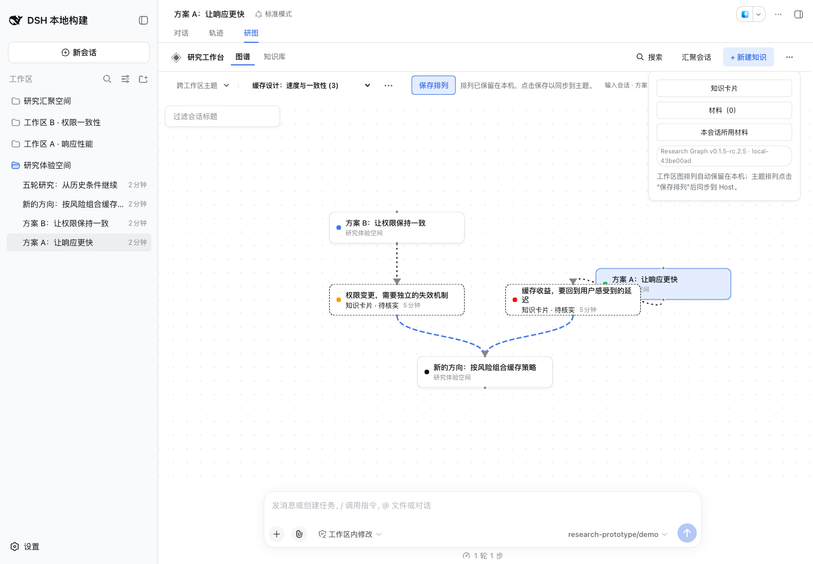

# DSH Research Graph 0.1.5-rc.2.5 release acceptance

This revision releases the graph exploration and knowledge synthesis work from [PR #41](https://github.com/benz-ai-x/dsh-research-graph/pull/41), its recovery and provenance repairs from [PR #42](https://github.com/benz-ai-x/dsh-research-graph/pull/42), and a final-drag persistence repair found during release preparation. The baseline is main `673bea877f4f9ecd05d9ea6145c434b71a482fe8`.

## Compatibility

- Plugin: `@benz-ai-x/dsh-research-graph@0.1.5-rc.2.5`; tag `v0.1.5-rc.2.5`; npm dist-tag `next`.
- Target: official DSH `dsh-v0.1.5-rc.2`, commit `fb2c4b9e698e30edb738bca4cf0618587db7d203`.
- The exact LLM peer pin remains the canonical target. All direct DSH dependencies stay at `0.1.5-rc.2`; the lockfile and bundled recovery dependencies are unchanged.
- Both READMEs pin installation to this revision. Previous releases and tags remain unchanged.

## Included behavior

Completed historical turns offer native branching with an explicit inherited prefix and editable title. A five-turn discussion can create an independent child containing only the first two turns. Preparation validates the cut; retry retains the same child identity, preserves later child discussion, and recovers workspace and topic association. An acknowledged native child remains openable when a later association step fails.

Continue discussion offers four editable prompts while protecting an existing question. The preview freezes selected materials, the actual question and card revisions. A topic and its follow-up records keep different questions recognizable. Returning to a topic restores its working position, and asynchronous member refresh preserves the original reading control and focus.

A reviewed synthesis accepts two or three saved card revisions or contiguous completed original turns, including mixed selections. It retains disagreements, conditions and valid claim references; the user edits and explicitly saves an independent card. Source relations preserve the frozen versions. Current original text is a separate inspection action, and save-receipt recovery permits a new revision of the same synthesis without overwriting source cards or duplicating the target.

These are the 17 authorized P4, P2, P1 and P3 acceptance items in [Issue #32](https://github.com/benz-ai-x/dsh-research-graph/issues/32). Its two P5 structured-direction items remain deferred and unchecked. The feature, browser and model-quality evidence remains in [the original acceptance](issue32-exploration-synthesis.md), [the review repairs](pr41-review-fixes.md) and [the separate model assessment](issue32-model-quality.md).

## Final-drag regression

The baseline's [post-merge CI](https://github.com/benz-ai-x/dsh-research-graph/actions/runs/34723573602) failed when an unsaved topic arrangement reopened at `312px` instead of `432px`. Moving the last pointer movement and release into one React event batch reproduced that exact failure five times out of five. Two smaller node/cluster cases showed the rendered movement was correct while the persisted entry was already absent, before any remount or topic restoration.

Pointer release previously persisted state refs updated only by the next React render. Each active gesture now retains its latest sample; release overlays that sample onto the committed arrangement. Cluster gestures accumulate multiple samples before rendering. Existing snapping, click suppression and cancel restoration remain covered.

The original topic case now explicitly batches movement and release. Two additional registered-view regressions verify multi-sample node and cluster gestures, the persisted payload and reopened positions. All three failed before the repair and passed afterwards; the targeted drag, cancellation and working-position run passed **21 tests**.

## Validation

- Frozen installation with pnpm **11.7.0** passed; local runtime was Node.js **26.4.0**.
- `RELEASE_TAG=v0.1.5-rc.2.5 pnpm run check`: version policy, strict types, build and **198 tests / 24 files** passed.
- Matching official RC.2 `check:harness`: all four source/published Host/Client compiler faces and **337 tests / 22 files** passed. Standalone Host adapters remain outside these compiler programs.
- The real archive passed isolated web-profile installation, offline recovery before Host boot, startup, durable topic/merge/knowledge operations, historical branching, five-to-two inherited turns, independent continuation, mixed reviewed synthesis, extraction, reuse, frozen export, title suggestion/rename, digest/history/search, exact history ranges, shutdown and removal. Model transport used **19 deterministic fixture calls**.
- The packed manifest, browser module, package-derived header integration and actual Chrome header agree on **0.1.5-rc.2.5**, Build ID **local-43be00ad**.
- Chrome **153.0.8010.36**, 1440 × 1000, loaded the package in its own matching DSH profile. A native mouse drag moved a topic node from `(392, 50)` to `(472, 100)`; switching to Chat and reopening the topic restored exactly `(472, 100)`, with its unsaved arrangement retained. Page errors: **0**. The screenshot below was inspected, then the browser and temporary preview were stopped.
- `git diff --check` passed. The daily profile was not upgraded or restarted.

The local candidate archive `benz-ai-x-dsh-research-graph-0.1.5-rc.2.5.tgz` is **488088 bytes**, SHA-256 `b4c5f1cf58fed3fd163e2a7562be75308d306e5fdd501ef0c9657509806fbe43`. Logs, reproduction probes and package metadata remain in the release worktree's private `.artifacts/release-0.1.5-rc.2.5/`. The Publish workflow rebuilds the tagged source; the actual npm archive is verified and smoke-tested separately before attachment to the Release.

## Acceptance boundary

The latest Chrome check verifies the packaged version and normal node-drag restoration. The precise batched-release schedule and cluster persistence are covered by the formal Harness regressions. The broader multilingual, narrow-window, keyboard, provenance and failure-recovery evidence is identified by its original commit in the linked acceptance records; those screenshots are not claimed to depict this release build. The deterministic model exercises the workflow and does not replace the separate real-model assessment or the remaining manual acceptance in Issue #33.

