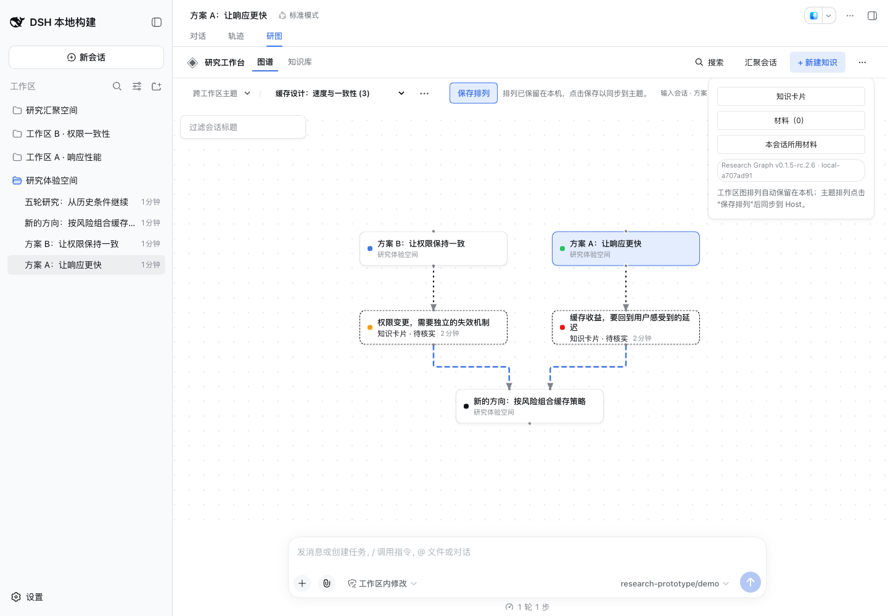

# DSH Research Graph 0.1.5-rc.2.6 release acceptance

This revision releases the Relayout and routing improvements from [PR #44](https://github.com/benz-ai-x/dsh-research-graph/pull/44), including both fixes from its first review. The baseline is main `2a86ff54f67e66f491ed1680451d45b1f05e6829`; the second review found no actionable Standards or Spec issues, and both PR and post-merge CI passed.

## Compatibility

- Plugin: `@benz-ai-x/dsh-research-graph@0.1.5-rc.2.6`; tag `v0.1.5-rc.2.6`; npm dist-tag `next`.
- Target: official DSH `dsh-v0.1.5-rc.2`, commit `fb2c4b9e698e30edb738bca4cf0618587db7d203`.
- The exact LLM peer pin remains the canonical target; all direct DSH dependencies stay at `0.1.5-rc.2`.
- Release preparation changes the package version, both READMEs and this acceptance record. Product source, lockfile and bundled offline-recovery dependencies are unchanged from the reviewed baseline.

## Included behavior

Workspace and Research Topic graphs arrange connected sources in dependency rows while preserving complete Branch clusters. Independent Merge sources remain parallel, their result appears below, and disconnected groups occupy separate space. Topic graphs apply the same placement to discussions, Knowledge Cards and follow-up discussions.

Relations are routed after manual positions, collapse choices and cluster offsets are applied. Final terminal positions are checked for obstacles, blocked terminals move into a free interval or to another side, and routes with shared segments try alternative departure rows before bounded local search. Arrowheads, terminals, labels and Fit bounds use the resulting paths.

Relayout retains one undo of its latest placement change, including after repeated Relayout. Another arrangement action or scope change expires that undo. Reading and selection remain intact; Research Topic arrangements still require an explicit Save arrangement.

## Validation

- Frozen installation with pnpm **11.7.0** passed; local runtime was Node.js **26.4.0**.
- `RELEASE_TAG=v0.1.5-rc.2.6 pnpm run check`: version policy, strict types, build and **214 tests / 25 files** passed.
- Matching official RC.2 `check:harness`: all four source/published Host/Client compiler faces and **337 tests / 22 files** passed. Standalone Host adapters remain outside these compiler programs.
- The actual archive passed isolated web-profile installation, offline recovery before Host boot, startup, durable topic/Merge/knowledge operations, historical branching, five-to-two inherited turns, independent continuation, mixed reviewed synthesis, extraction, reuse, frozen export, title suggestion/rename, digest/history/search, exact history ranges, shutdown and removal. Model transport used **19 deterministic fixture calls**.
- The packed manifest, compiled browser module and package-derived header integration agree on **0.1.5-rc.2.6**, Build ID **local-a707ad91**.
- Chrome **153.0.8010.36**, **1440 × 1000**, loaded the release build in a separate matching DSH profile. Both Workspace and Research Topic views passed real pointer drag → Relayout → repeat Relayout → Undo, restoring the exact manual positions. The topic sample had five nodes and four relations with no sampled SVG penetration of cards. The visible package badge matched the packed identity; page errors were **0**.
- `git diff --check` passed. The browser and temporary preview were stopped after screenshot inspection; the daily profile was not changed.

The local candidate archive `benz-ai-x-dsh-research-graph-0.1.5-rc.2.6.tgz` is **506106 bytes**, SHA-256 `588329c0d9248a64b0216d640a5b4e78e081a755e001645d52ed7021615c5f38`. Private logs and package metadata remain in the release worktree's `.artifacts/release-0.1.5-rc.2.6/`. The Publish workflow rebuilds the tagged source; the actual npm archive is verified and smoke-tested separately before attachment to the Release.

## Acceptance boundary

The [feature acceptance](relayout.md) contains the original browser scenarios and screenshots, including the blocked Merge terminal, consecutive Merge layers, narrow viewport, exact SVG sampling and drag/reopen checks. Those screenshots identify their original build and are not presented as this release build. The release preparation does not change those product sources.

The router reduces avoidable overlap; it cannot guarantee a crossing-free drawing for arbitrary dense graphs. Physically overlapping cards can make a terminal unreachable until rearranged. The deterministic model validates workflow behavior, not generated knowledge quality. The deferred requirements in Issue #32 and manual model-quality acceptance in Issue #33 remain open.

