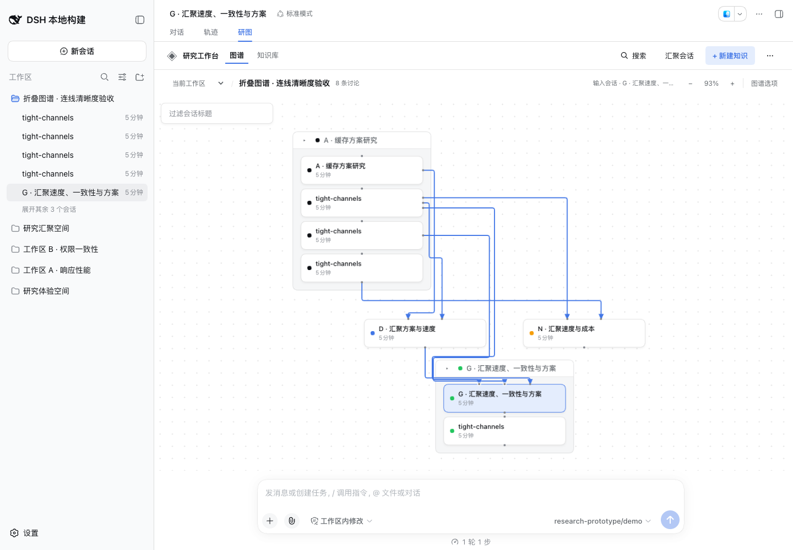
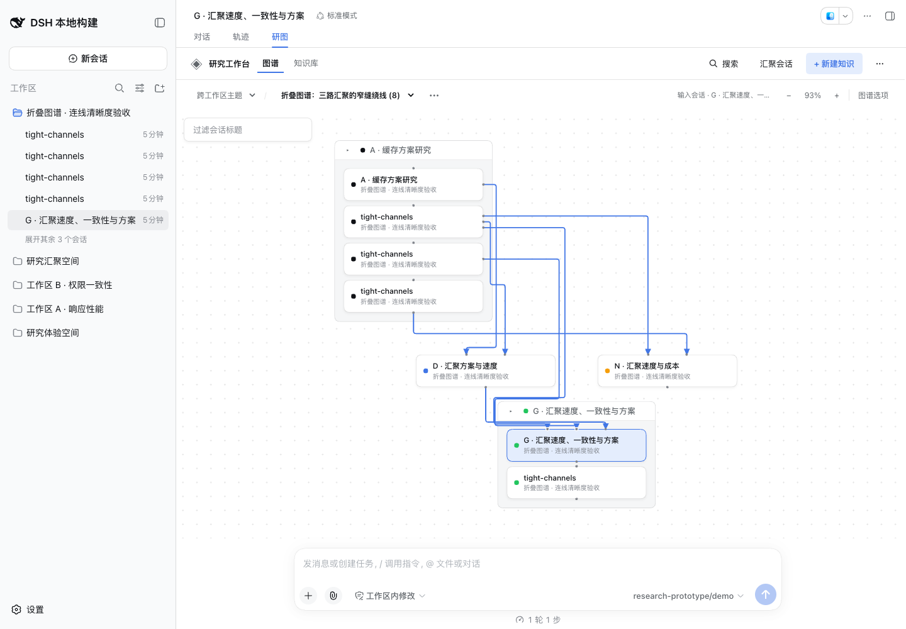
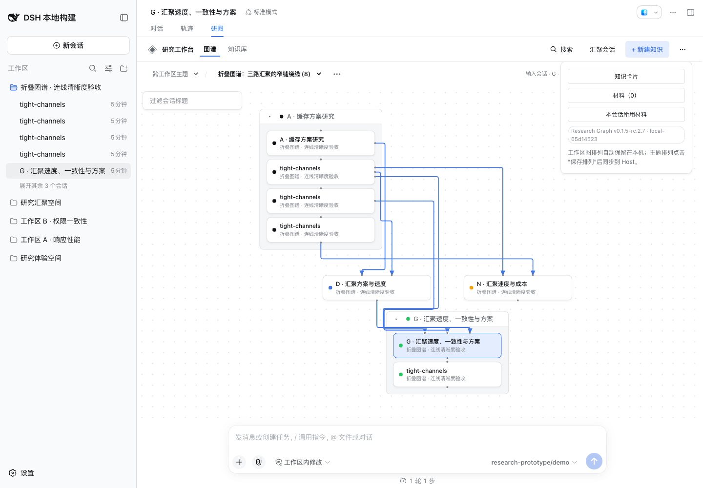

# DSH Research Graph 0.1.5-rc.2.7 release acceptance

This revision releases [PR #46](https://github.com/benz-ai-x/dsh-research-graph/pull/46): separate Merge arrivals in narrow gaps around compact Branch cluster titles, in both Workspace and Research Topic graphs. The baseline is main `cd8f6743685689501e7c8b82e7200cae344ce6b8`; its tree matches the independently reviewed `9e86bda`. Both review axes found no actionable issues and the PR's four CI checks passed.

## Compatibility and scope

- Plugin: `@benz-ai-x/dsh-research-graph@0.1.5-rc.2.7`; tag `v0.1.5-rc.2.7`; npm dist-tag `next`.
- Target: official DSH `dsh-v0.1.5-rc.2`, commit `fb2c4b9e698e30edb738bca4cf0618587db7d203`.
- The exact LLM peer pin remains the canonical target; all direct DSH dependencies remain at `0.1.5-rc.2`.
- Release preparation changes the version, both READMEs and release evidence. Product source, tests, lockfile and bundled recovery dependencies match the reviewed baseline.

The router only tries the additional narrow-gap coordinates when the usual route still has a shared segment, and retains the lower-cost valid result. Existing clear routes keep the ordinary path search. Manual positions, collapse, terminal checks, arrows, complete bounds, Relayout/Undo and explicit Topic arrangement saving retain their existing behavior.

## Validation

- Frozen pnpm **11.7.0** installation, Node.js **26.4.0**.
- `RELEASE_TAG=v0.1.5-rc.2.7 pnpm run check`: version policy, strict types, build, **216 tests / 25 files** passed.
- Matching RC.2 `pnpm check:harness`: all **four source/published Host/Client compiler faces** and **337 tests / 22 files** passed.
- Packed manifest and compiled browser identity: **0.1.5-rc.2.7 · local-65d14523**.
- The actual candidate archive passed isolated installation, offline history recovery before Host boot, startup, persistent research operations, historical Branch continuation, reviewed mixed synthesis, extraction/reuse, export, read-only insights, shutdown and removal with **19 deterministic fixture model calls**.
- Chrome **153.0.8010.36**, **1440×1000** and **900×820**, real matching DSH profile after restart: both scopes retained eight discussions and seven visible Merge routes after collapse. Replaying the previous router on the observed positions gives **44px** shared straight SVG; the release build has **0**, with no sampled card/title penetration or terminal/arrow mismatch.
- Real compact-frame drag, repeated Relayout, Undo, explicit Topic save and view reopening passed. The displayed version badge matched the packed identity; page errors were **0**.
- On the fixture's first boot, the just-created Branch from a Merge had three additional inherited source projections from Harness. All ten rendered routes were also clear; after restarting the same isolated Host there were seven, as in the original acceptance. The initial snapshot is retained separately; this release does not change projection semantics.
- `git diff --check` passed; the daily user profile was not used. Browser and preview were stopped after screenshot inspection.

The first post-merge CI run for the baseline failed one topic-reopening assertion (`312px` observed instead of the expected `432px` arrangement). A single local run and 230 repeated targeted runs did not reproduce it, and this release's complete Harness suite passed. The original failure log is retained; no product or test change was made from an unconfirmed diagnosis. The [same baseline job rerun](https://github.com/benz-ai-x/dsh-research-graph/actions/runs/34761837861/attempts/2) passed all checks before release.

The local candidate `benz-ai-x-dsh-research-graph-0.1.5-rc.2.7.tgz` is **506861 bytes**, SHA-256 `1c8c61decbf9ce541ddd83049b656945507e39f69647fab13f832549d7083fc6`. The Publish workflow rebuilds the tag, so the official npm bytes are checked and smoke-tested separately before attachment to the Release. Private evidence remains in `.artifacts/release-0.1.5-rc.2.7/` in the release worktree.

## Acceptance boundary

The [feature acceptance](tight-channels.md) records the red-before-green regression, geometric comparisons and performance tradeoff. This repair does not guarantee zero crossings or shared segments in arbitrary dense graphs. Physically overlapping cards may still require rearrangement. The two structured-direction requirements in [Issue #32](https://github.com/benz-ai-x/dsh-research-graph/issues/32) remain deferred and unchecked.

