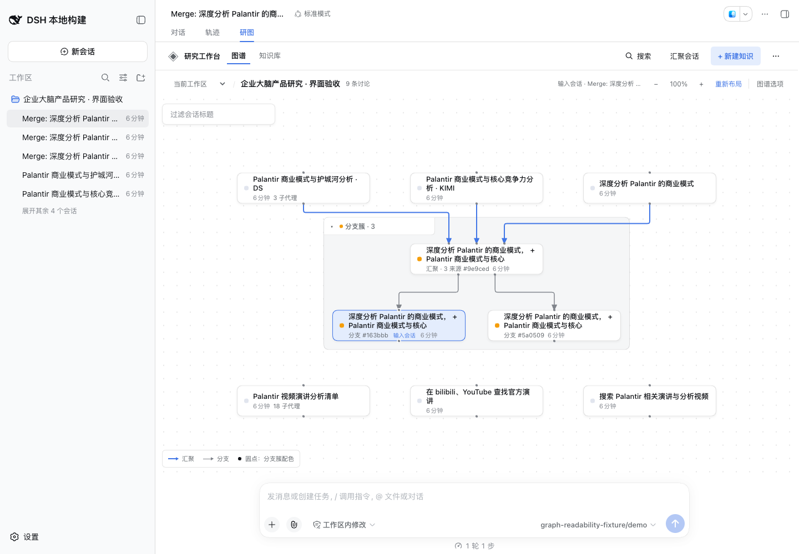
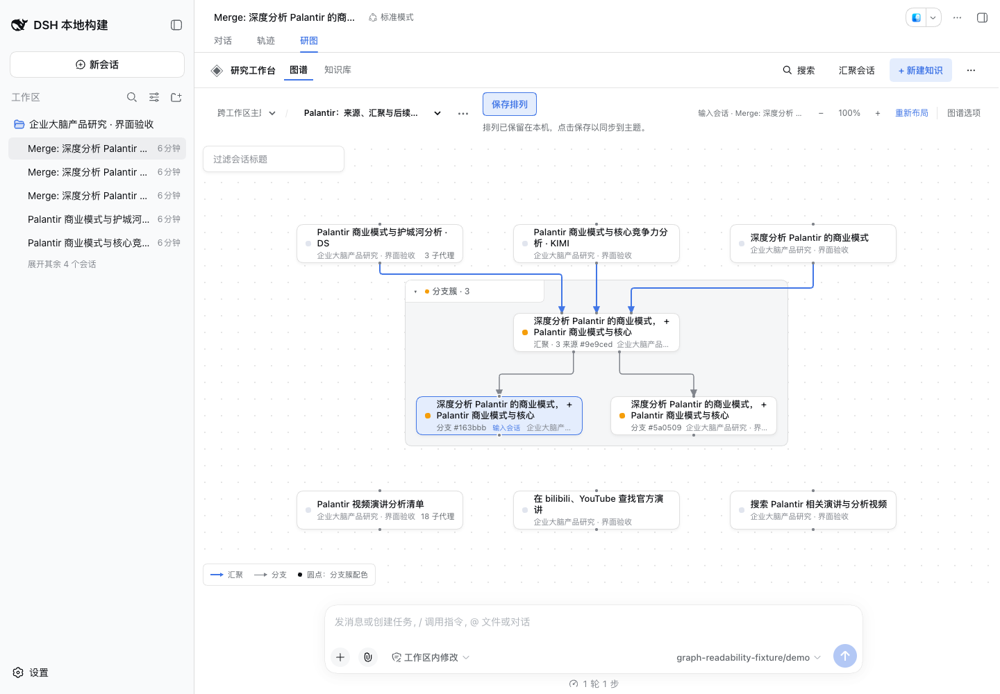
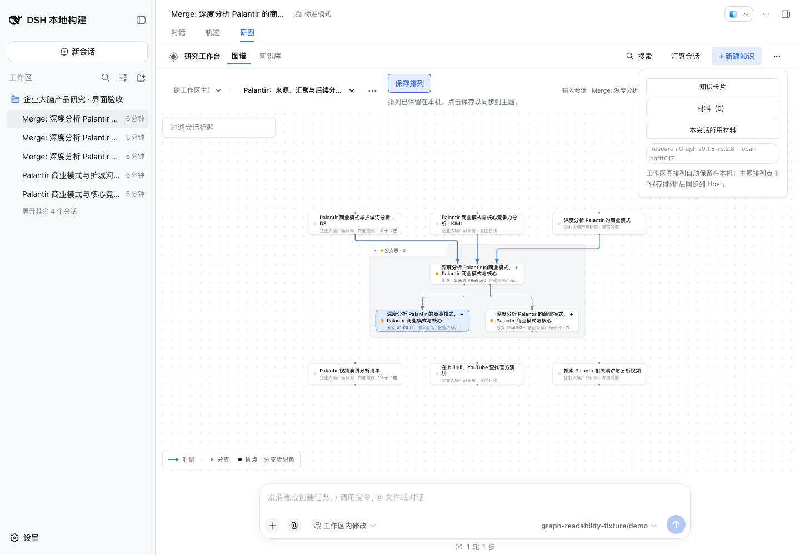
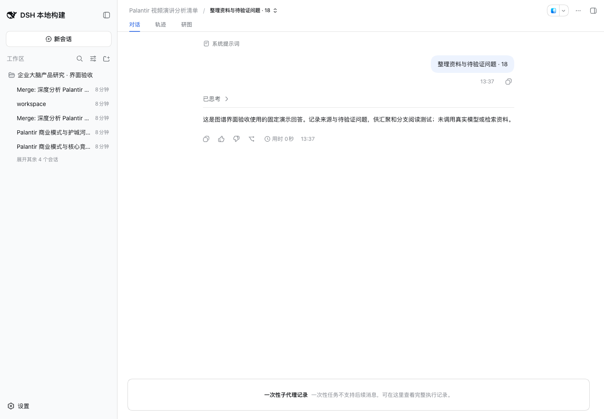

# DSH Research Graph 0.1.5-rc.2.8 release acceptance

This revision releases the [graph readability repair](graph-readability.md). A Merge followed by two Branches previously rendered inherited source snapshots as six additional direct Merge lines. The graph now retains three direct Merge relations and two Branch relations, while keeping inherited sources inspectable. Compact cluster titles, grouped independent discussions, distinct labels for equal titles, a visible legend, and native subagent history access make the same research graph easier to read.

## Compatibility and scope

- Plugin: `@benz-ai-x/dsh-research-graph@0.1.5-rc.2.8`; tag `v0.1.5-rc.2.8`; npm dist-tag `next`.
- Target: official DSH `dsh-v0.1.5-rc.2`, commit `fb2c4b9e698e30edb738bca4cf0618587db7d203`.
- The exact LLM peer and all direct DSH dependencies remain at `0.1.5-rc.2`.
- Base: main `73d4687e9a562ef9a5eb82345dc944035d946f9e`; implementation `351fd89`. Release preparation changes the package version, installation documentation and release evidence.
- The preview launcher also resolves a matching Harness beside the containing project directory, supporting the relocated workspace. It still rejects a discovered incompatible version.
- No persistence schema, bundled recovery dependency, lockfile, or daily user profile changes.

## Validation

- Frozen pnpm **11.7.0** installation, Node.js **26.4.0**.
- `RELEASE_TAG=v0.1.5-rc.2.8 pnpm run check`: version policy, strict types, build, **227 tests / 26 files** passed.
- Matching RC.2 `pnpm check:harness`: all **four source/published Host/Client compiler faces** and **343 tests / 22 files** passed. Standalone declarations are excluded from Harness compiler programs.
- Candidate manifest, compiled browser identity and actual displayed badge: **0.1.5-rc.2.8 · local-dafff617**.
- The actual candidate archive passed isolated installation, offline recovery before Host boot, startup, persistent research operations, historical Branch continuation, reviewed mixed synthesis, extraction/reuse, export, read-only insights, shutdown and removal, with **19 deterministic fixture model calls**.
- Chrome **153.0.8010.36**, **1440×1000** and **900×820**, matching native DSH: Workspace and Topic each passed expanded, dragged, collapsed, reexpanded and narrow-window scenarios. All **10 actual DOM/SVG geometric checks** had zero sampled card/title penetrations, shared straight segments, or terminal/arrow mismatches. Nine discussion cards remain; expanded graphs have five relations, compact graphs three.
- Real dragging, repeated Relayout followed by Undo, collapse preservation, explicit Topic arrangement saving, inherited-source expansion and visible controls passed. Fit is used before pointer actions after window resizing; Relayout preserves viewport scale and pan.
- After stopping and restarting the same isolated Host, both scopes retained **nine discussions, three Merge relations and two Branch relations**. The 18-task subagent summary remained available, and the native one-shot execution record opened with its complete fixed response.
- Browser page errors: **0**. `git diff --check` passed. Browser and isolated preview were stopped after verification.

The local candidate archive is **517070 bytes**, SHA-256 `0c4fc2b1a9bf72f73037bc76beec7018cdb468f55948310eaf282d9142521316`. The Publish workflow rebuilt the tag; the official npm archive was verified separately as recorded below. Private release evidence lives in `.artifacts/release-0.1.5-rc.2.8/`; browser fixtures are retained in `.artifacts/graph-readability/` in the release worktree. Local authentication addresses are not public evidence.

## Published artifact

Publication completed on **2026-09-14 at 05:59:47 UTC**. [PR #48](https://github.com/benz-ai-x/dsh-research-graph/pull/48) merged to `8f549276028d19462e29054ea73dcac0734201d4`; tag `v0.1.5-rc.2.8` points to that commit. The [GitHub prerelease](https://github.com/benz-ai-x/dsh-research-graph/releases/tag/v0.1.5-rc.2.8) and npm `next` were verified after publication.

| Official npm artifact | Verified value |
| --- | --- |
| Archive | `benz-ai-x-dsh-research-graph-0.1.5-rc.2.8.tgz` |
| Size | 516813 bytes |
| Build ID | `local-dafff617` |
| SHA-256 | `67ee1e88a9187732db14136a9cf2de9a3beebdeca983e4090fefe12defdf932f` |

The official archive passed the same isolated install, offline recovery, native Host, persistent research operations, and removal acceptance with **19 fixed model calls**. Registry SHA-1/SHA-512 and provenance metadata matched the repository, tag, commit, publish run, and artifact digest; certificate signatures were not separately cryptographically verified. The Release archive and `SHA256SUMS` were downloaded again and matched the official bytes. [PR CI](https://github.com/benz-ai-x/dsh-research-graph/actions/runs/34810939130), [main CI](https://github.com/benz-ai-x/dsh-research-graph/actions/runs/34811268624), and [OIDC Publish](https://github.com/benz-ai-x/dsh-research-graph/actions/runs/34811633079) all passed.

These are release-time results. The subsequent core-documentation update does not change the tagged artifact or represent a new run of the product test suites.

## Acceptance boundary

Existing manual arrangements remain until **Relayout**, which supports Undo and preserves collapse and reading state. **Fit** adjusts the viewport for a smaller window; Topic arrangements still require explicit **Save arrangement** to synchronize.

The feature acceptance records a cold-start native-list observation: an unopened Branch can temporarily have a directory-derived title and omit inherited-source summary facts, despite the retained disk projection containing them. Native session opening restores those facts. Its internal Host cause remains unlocated; this release does not claim to repair it or fabricate missing provenance. Direct relation counts remain correct.

Arbitrary dense graphs or physically overlapping cards can still have crossings or obstructed terminals. The two structured research-direction requirements in [Issue #32](https://github.com/benz-ai-x/dsh-research-graph/issues/32) remain deferred.

