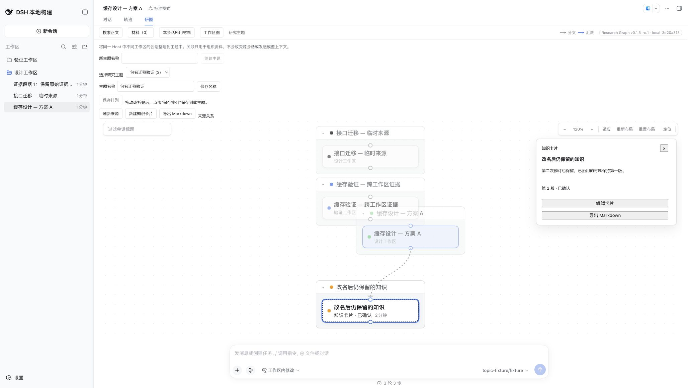

# Research Graph naming and package migration acceptance

Issue: [#19](https://github.com/benz-ai-x/dsh-research-graph/issues/19).

The product is **DSH Research Graph · 研图**, the repository is `benz-ai-x/dsh-research-graph`, and the new package is `@benz-ai-x/dsh-research-graph@0.1.5-rc.1`. It targets official Harness `dsh-v0.1.5-rc.1` (`183f08e9c6dde7e36cd2318eaee70b0da08fb35e`). The existing plugin tag `v0.1.5-rc.1` stays at `e7f1a1dab2b8d97a6f1ceeccb24c3d0d3bcfc3bc` and retains the previous package artifact.

## Identity and compatibility

Package metadata, the lazy browser module, Gateway descriptor ownership, invariant registration, installation commands, and documentation use the new name. The Chinese tab reads **研图**, the English tab reads **Research Graph**, and the version badge is **Research Graph v0.1.5-rc.1 · local-3d20a313**. Version and direct DSH dependencies remain `0.1.5-rc.1`.

`ui-session-graph`, Host storage domains, browser storage keys, RPC namespaces, and the existing Session provenance marker remain stable. The domain term **Session Graph** still describes the scope-bound Session projection. The offline recovery binary is `dsh-research-graph-migrate`, with `dsh-session-graph-migrate` retained as a compatibility alias.

## Validation

- `pnpm run check`: typecheck/build and 20 standalone files, 175 tests passed.
- Matching `pnpm check:harness`: Host/Client source and packed declaration compiler programs passed; 13 integration files, 246 tests passed, including live locale switching.
- Packed-profile acceptance: native add, boot, durable topics/Merge/knowledge, reviewed extraction, accepted reuse, frozen export, read-only digest/history/search, exact history ranges, recovery CLI, and native removal passed. Ten fixed fixture model calls; no paid model route used.
- Same-profile migration: installed the official previous npm archive, saved a topic with three references and an arrangement, saved a sourced card with two revisions, and admitted a new discussion using revision 1. Stopped the Host, removed the previous package, installed the new archive, and restarted with the same profile/data directory. Structural comparisons confirmed unchanged topic, arrangement, card revisions, accepted reuse, target events, and source events. New profile dependencies/config contain only the new package; installed `lib/client.js` matches the verified build byte for byte.
- Chrome: before migration, selected the saved card in the topic and set zoom to 120%. After migration, **研图** mounted, selecting Research Topics restored the card, revision 2, and 120% zoom. The badge and tooltip use the new product/package names. No console errors occurred in the final isolated profile; connection warnings while its old Host was intentionally stopped are expected.

A separate post-browser structural audit retained all pre-existing source events and all topic/card/reuse values, with zero model calls. Opening the restored Viewed Session through native Harness appended one empty `session/end-seed` event. This is the matching Harness Session constructor's seed boundary (`packages/core/session/src/index.ts:608`), not a rewrite of discussion content. The other two sources received no events. An initial plain `JSON.stringify` comparison also differed on object key order; structural comparisons are the authoritative checks.

The browser used synthetic sessions and an isolated profile. The first browser fixture attempt exposed the fixture script's parent package as another client plugin; an independent private fixture manifest fixed that test setup before the successful run.

## Upgrade

Stop the existing web profile, remove `@benz-ai-x/dsh-client-ui-session-graph`, install `@benz-ai-x/dsh-research-graph@0.1.5-rc.1`, then restart. Keep the profile and its data directory; reapply any custom plugin configuration under `ui-session-graph`. Use one package name per profile. Historical Git tags and previously published package versions remain immutable.

First publication of the new npm identity and its trusted-publisher configuration are tracked separately in #19; this acceptance record does not claim they have already completed.
