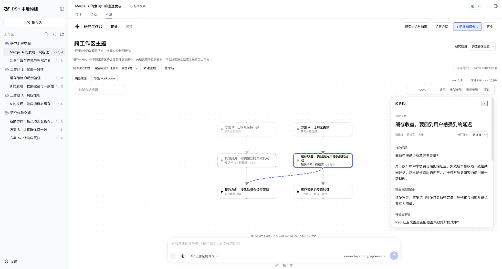
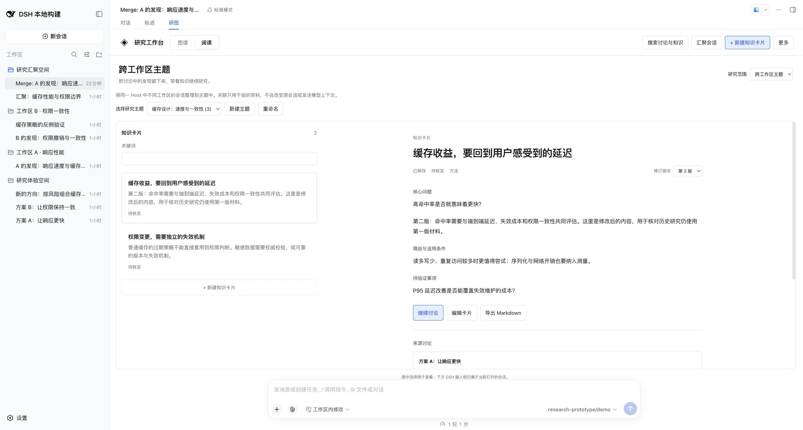
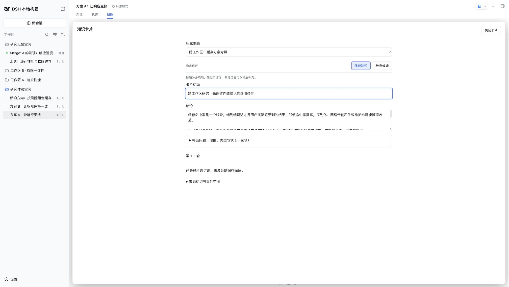
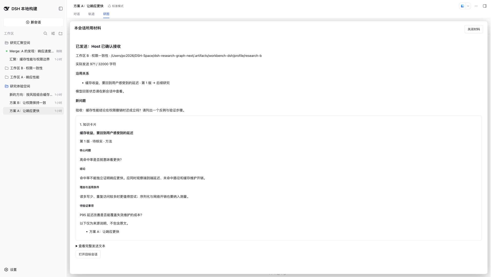
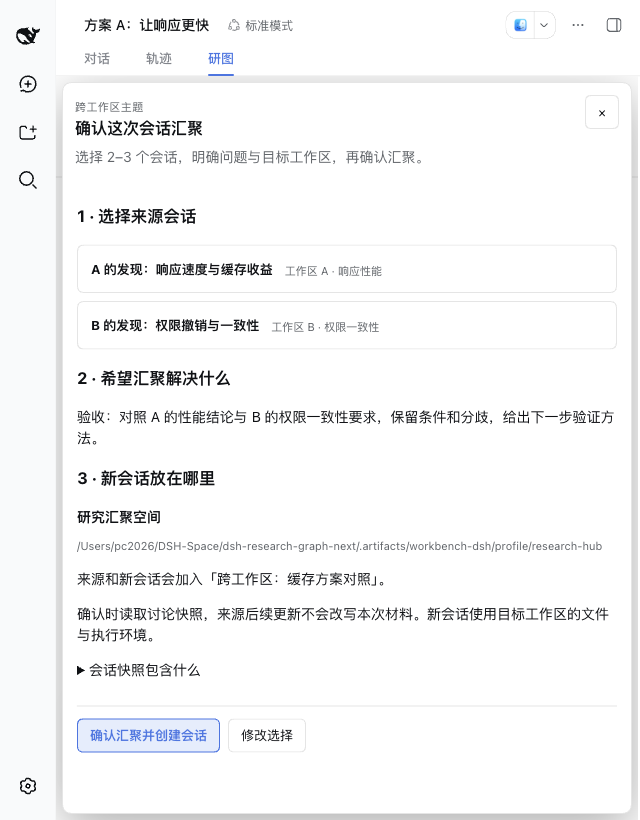
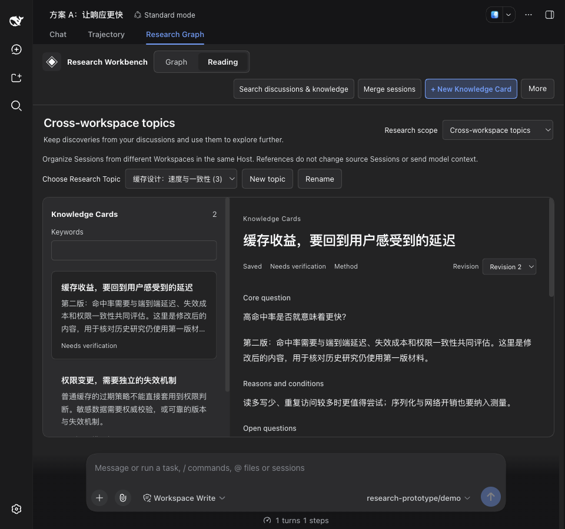
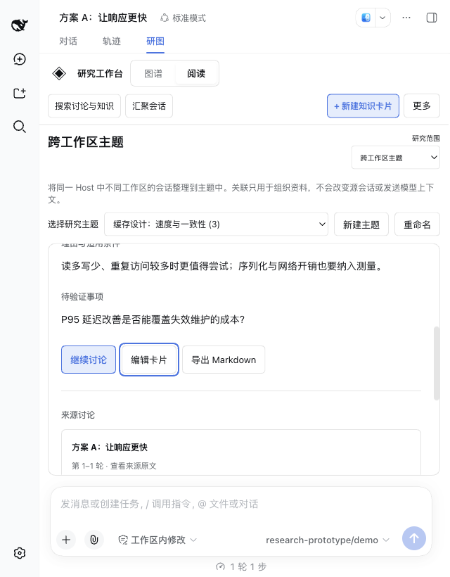

# 研究工作台首轮正式实现验收

日期：2026-09-11。任务及后续范围唯一记录为 [Issue #24](https://github.com/benz-ai-x/dsh-research-graph/issues/24)，原型依据为 [#23](https://github.com/benz-ai-x/dsh-research-graph/issues/23) / `e890247`。本轮从正式主线 `00f6382` 开发，不包含 A/B/C 实验切换器。

用户已确认原型入口与底部布局切换能够正常操作。这项反馈确认控制可用，最终产品体验仍需用户评价。以下是开发验收证据。

## 正式行为

- 工作台提供图谱与知识阅读两种视图。在同一主题中切换时，恢复卡片选择、显示修订、展开来源、阅读滚动位置与画布位置。
- 知识正文完整阅读，保存状态与核实状态分开；来源以标题和轮次展示，技术标识折叠。原文预填可编辑内容，迟到的读取不会覆盖用户已输入或清空的字段。一键编辑当前修订，保存后新增版本。
- 从当前卡片修订直接继续讨论；确认发送后留在研究工作台。后续研究可打开实际目标，并核对当时的固定材料。导出旧版本阅读页时，明确标注其导出行为为最新版本，预览列出实际修订。
- 主题图将来源、知识与后续讨论按依赖关系分层；保留 Branch 簇、人工位置、折叠、拖动和布局保存语义。选中节点突出直接研究关系。循环引用保留为稳定网格，不伪造先后关系；没有声称解决任意规模的图布局优化。
- 已沿用关系仅来自 accepted 记录，包含固定 revision。关系元数据按批查询，不批量传输完整材料；关系读取失败或迟到时不会把尚未恢复的目标误判为已删除。
- 页头的“汇聚会话”支持 A / B 来源，明确选择目标工作区后预览、确认。捕获失败重试同一目标，主题关联失败只重试关联。画布的“汇聚所选会话”继续遵循原有同目录规则。

## 自动验证

匹配插件与 DSH 版本均为 **0.1.5-rc.2**，使用已构建的官方 `dsh-v0.1.5-rc.2` checkout（`fb2c4b9`）。最终 Build ID 为 **local-0b10b795**。

| 验证 | 结果 |
| --- | --- |
| `pnpm run check` | 185 项独立测试通过，包含严格类型检查与构建 |
| `pnpm check:harness` | 源码 / 发布声明的 Host、Client 四个编译面通过；260 项测试通过 |
| `pnpm pack` + `pnpm smoke:harness` | 正式归档安装、真实 Host 启动、读写与移除通过；固定模型调用 10 次 |
| 新增关键回归 | 显式目标工作区校验、真实 Typert Gateway 的取消信号、汇聚与关联重试、accepted 关系及重启后版本、原文预填保护、一键编辑失败恢复、关系恢复前的选择保留、跨阅读视图的版本 / 来源 / 滚动恢复、分层布局与循环 / 折叠 |

归档 `benz-ai-x-dsh-research-graph-0.1.5-rc.2.tgz` 为 410882 bytes，SHA-256：`23ba6bd7307ff746f03db235f9e3021683d2ea5fd274f3611b619ec5eb219695`。这是本地验收归档，不是已发布 RC.2 的 npm 归档。

## 真实 DSH 与浏览器

通过 `pnpm preview:dsh` 安装常规构建，在独立 `.artifacts/workbench-dsh/profile/` 内操作；既有原型和用户日常 DSH profile 保留。演示模型明确标注固定回答，不代表真实推理质量或执行过实验。

1. 在主题阅读卡片，直接展开准确来源；从卡片继续讨论，选择工作区 B、检查固定预览并确认。Host 接收后工作台保留；图中出现尚未加入主题成员的目标，以及实际第 1 版沿用关系。明确打开目标后可见原生对话与演示回答。
2. 将卡片修改为第 2 版。再次打开先前研究的材料，仍为第 1 版内容；Host 日志中的固定修订与知识历史逐字段一致。重新启动预览 Host 后仍能恢复这些记录。
3. 在跨工作区主题中筛选 A、选择来源，再筛选 B、保留前项并选择第二个来源。目标选研究汇聚空间，在 640×820 窗口确认，成功新增独立目标、主题成员与两条真实 Merge 关系。
4. 从汇聚目标直接展开 A 的原讨论，选择完成轮次，原文预填标题 / 问题 / 正文。修改标题后保存为当前主题的新知识卡片。
5. A / B 原来源仍在各自工作区。与种子记录相比，各自只多一个空 `session/end-seed`（Host 恢复生命周期），没有新增应用讨论消息；两个 Merge 投影均保留准确来源与捕获边界。
6. Chrome 检查桌面、960×900 英文深色、640×820 中文阅读与汇聚。返回目录、Enter 选卡、Tab 到编辑操作可用；在第 1 版展开来源，再往返图谱与阅读，版本和来源保持；滚动恢复另有挂载回归测试。确认 / 保存 / 阅读操作可访问，最后恢复中文、跟随系统与原始浏览器尺寸。最终页面 console error 为 0。

本地检查日志和数据核对在 `.artifacts/workbench/`，凭据与 profile 不进入 Git。人工体验命令和数据保留方式见双语 README。

## 截图

图谱中的来源、知识和后续研究：

知识阅读与原文留卡：

卡片修订后核对当时材料：

响应式与双语主题：

## 范围边界

本轮不实现跨 Host 汇聚、原项目文件 / 工具环境合并、自动知识语义关联或跨原生视图替换 / 浏览器重启的未保存正文恢复。知识草稿仍在当前视图内受保护；呈现缓存仅保存身份与位置。历史轮次分支、探索方向和多源综合按 #11、#12、#13 后续推进。
