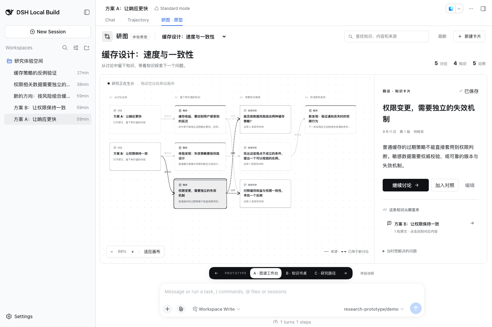
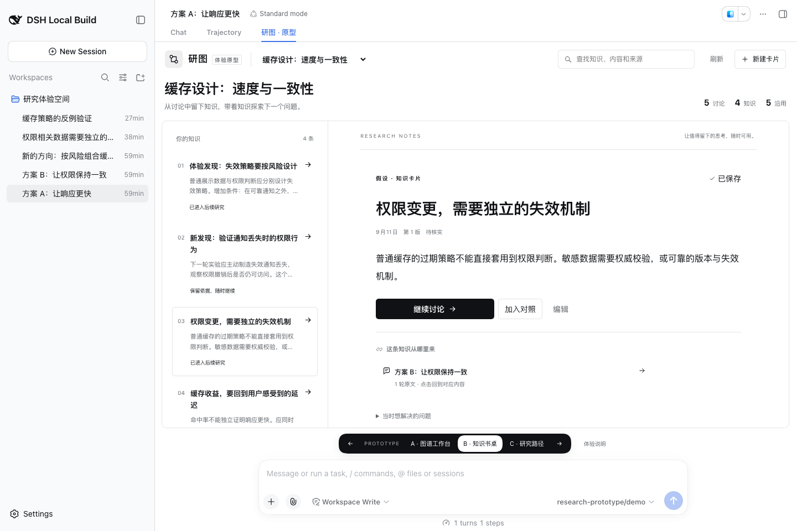
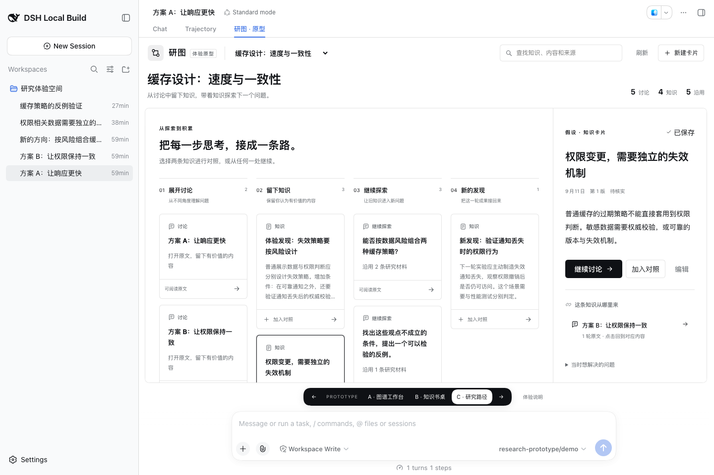

# 下一代研图 · DSH 人工体验原型

产品记录：[已确认的目的与 UI/UX 差距](product-purpose-and-ux-gap.md)。实施记录：[#23](https://github.com/benz-ai-x/dsh-research-graph/issues/23)。代码保存在 `prototype/research-workbench`，基于 `00f6382`；DSH 与插件均为 `0.1.5-rc.2`，本地构建以生成的 Build ID 区分。

## 要回答的设计问题

人在 DSH 中如何自然地完成“读讨论 → 留下知识 → 回看依据 → 继续讨论 → 新结果回到图谱”？本原型比较三种信息结构，最终取舍等待产品负责人体验。

| 布局 | 优先帮助用户做什么 | 需要体验的取舍 |
| --- | --- | --- |
| A 图谱工作台 | 看见来源与后续讨论，沿着关系探索 | 全局关系直观，详细阅读需要右侧区域 |
| B 知识书桌 | 找到并完整阅读知识，回看依据 | 阅读空间更大，关系通过来源与后续讨论呈现 |
| C 研究路径 | 分清讨论、知识、继续探索与新发现，组合材料 | 下一步更明确，阶段很多时需要横向浏览 |

同一研图标签、同一数据、同一草稿。切换布局不会重新发起保存或新建讨论。底部切换器与 URL `variant` 参数保持一致，左右方向键循环切换，输入框内保留正常光标行为。“体验说明”展示当前选择、草稿、材料、准备记录和构建信息。

## 启动

```sh
pnpm install --frozen-lockfile
pnpm prototype:dsh
```

依赖 Node.js `^22.19.0 || >=24.0.0`、pnpm `11.7.0`。DSH 工作树由 `DSH_HARNESS_ROOT` 指定，或放在相邻的 `deepseek-harness-0.1.5-rc.2` 目录；需提前完成 native、lib 和 web 构建。启动器使用 DSH 官方 CLI profile 启动流程，未修改上游源码。

终端打印本地登录链接。打开样例讨论 → **研图 · 原型**。地址可追加 `?variant=A`、`?variant=B` 或 `?variant=C`；也可以直接点击底部切换器。停止命令为 `pnpm prototype:dsh --stop`，重新启动会重新安装当前构建并保留体验数据。

所有数据位于本工作树 `.artifacts/prototype-dsh/profile/`，包括独立的 DSH_HOME、DSH_AGENTS_HOME、工作区和插件存储。`.artifacts/prototype-dsh/state.json` 保存当前进程信息与私有登录链接，文件权限为 `0600`，不进入 Git。第一次种下两条讨论、两张有来源的卡片，以及一次真实提交的材料沿用讨论；跨工作区样例另外建立 A、B、研究汇聚空间，提供两个来源与一个真实汇聚会话。重启不会重复种入。

## 建议连续体验这三件事

1. **留下一个发现。** 选中一条知识，点击来源，阅读准确轮次，点击“存为知识”。原文自动带入可编辑正文；改成自己的表达，在 A/B/C 间切换，确认草稿仍在，再保存。用关键词找回卡片，重新进入来源。
2. **带着知识提出新问题。** 从卡片“继续讨论”，或在 C 中选两条知识对照。填写问题、确认工作区，先预览本次材料，再确认开始。DSH 接收后，后续讨论和沿用线出现在研究中；进入新讨论原文，把新发现再存成卡片。
3. **检查积累是否可信。** 编辑原卡片并保存新版本，回看修订记录，再打开此前沿用它的讨论，确认那里保留原来的材料版本。也可从原文试用“AI 整理”，先核对选中材料，生成后修改，再由自己决定是否保存。

体验时重点观察：能否马上找到下一步；正文是否舒适；是否清楚知识来自哪里；是否理解沿用后的新讨论；在哪种布局下最容易产生进一步的问题。可以组合三种布局的优点，无需整套选择其中之一。

## 跨工作区汇聚会话

工作区 A 的讨论与工作区 B 的讨论可以汇聚到一个新的独立会话中。新会话选择一个明确的目标工作区，研究主题把不同工作区的过程关联起来。

1. 选择主题 **跨工作区：缓存方案对照**，点击顶部 **汇聚会话**。
2. 在“来源工作区”选择 A，勾选“A 的发现：响应速度与缓存收益”；切到 B，勾选“B 的发现：权限撤销与一致性”。已选项不会随筛选切换丢失。最多选择 3 个会话。
3. 填写希望汇聚解决的问题，选择新会话放在 A、B，或 **研究汇聚空间**。
4. 点击“预览汇聚”，核对来源、问题和目标工作区，再点“确认汇聚并创建会话”。A/B/C 布局之间切换保留这份选择与确认内容。
5. 新会话与来源进入当前研究主题；图中的 **汇聚** 关系来自 DSH 实际捕获的快照。打开新会话可查看来源工作区、回到原讨论，再把新结果存为知识。

确认页预览的是来源选择和目标环境。会话快照由 DSH 在确认提交时读取，之后源会话的新消息不会改写已使用的快照；长会话按 DSH 上下文预算处理。快照包含讨论文字和已有压缩摘要，不会把两个工作区的文件、工具结果或执行环境合并。新会话始终使用目标工作区的环境。

跨工作区来源限定在同一已连接 Host。现有正式图谱里的隐式同目录汇聚入口保持原来的规则；原型中的研究汇聚明确提供目标工作区。领域决定见 [ADR 0011](../adr/0011-cross-workspace-research-merges.md)。

## 真实能力与原型边界

- 保存、不可变修订、原文/保留摘录、AI 提炼材料冻结、研究材料准备、新讨论创建与提交均使用已有 Host 接口。只有 `accepted` 记录绘制沿用关系，准备完成不表示讨论已发送。
- 演示模型 `research-prototype/demo` 返回固定示例，原生 DSH Agent 流程照常运行，不调用付费模型。这用于评估交互与关系回流，不用于评估模型推理质量。AI 整理先展示第一条生成草稿，由用户审核保存。
- 默认表单只展开标题和正文，来源自动带上；问题、条件、待验证事项、类型和核实状态仍可编辑。“已保存”与“待核实/你已确认”分开显示。
- 搜索本次已载入的主题知识正文、保存的来源内容及讨论标题；完整历史全文检索、复杂主题管理、导出、历史精确分支、卡片之间的语义关系仍走后续正式设计。本原型不是 #11–#13 的正式交付。
- 四个研究阶段是本轮体验结构，不是任意深度研究过程的最终布局算法。关联线表达来源与真实沿用，不代表知识之间存在因果、支持或冲突关系。
- 草稿保留在当前研图组件中；切换三种布局、回看原文不会清除。重启浏览器、切换 DSH 原生会话或离开研图后不保证恢复未保存草稿，保存的卡片与讨论会保留。
- 原型开关在构建时开启，普通构建保持旧界面。没有发布 npm 版本、合并 main 或改动用户日常使用的 profile。

## 跨工作区汇聚验收

2026-09-11，DSH / 插件 `0.1.5-rc.2`，当前实际安装的原型 **Build ID `local-78f59ccc`**，匹配官方 `dsh-v0.1.5-rc.2`（`fb2c4b9`）。

| 检查 | 结果与证据范围 |
| --- | --- |
| `pnpm run check` | 类型检查、构建、179 项独立测试通过 |
| `DSH_HARNESS_ROOT=… pnpm run check:harness` | 四个编译面通过；258 项 Harness 测试通过 |
| 来源与目标边界 | 显式目标工作区必须与 Host 的实际会话归属匹配；归档、子代理、空白或无工作目录来源被拒绝；旧入口的隐式同目录约束保留 |
| 真实原生汇聚 | 打包安装后，把 A、B 两个实际会话汇聚到研究汇聚空间；来源历史事件数不变，目标目录、独立根会话与捕获来源均核对一致 |
| Chrome 界面验收 | 在 A/B 来源筛选间保留勾选；选择目标 A；跨布局保留预览；显式确认后获得原生回答，回看两个来源与工作区，刷新、重装后实际汇聚关系仍在 |
| 重试 | 界面曾遇到 Host 网关参数绑定错误；修复后原地重试同一目标成功，没有创建第二个目标。集成测试另覆盖捕获失败与主题关联失败，后者重试不重复提交会话 |
| 小屏 | 640×820 下页面没有横向溢出，工具栏两行，汇聚确认按钮完整可见；验收后恢复浏览器原始尺寸 |

网关回归修复：DSH 源码模式按最后参数名 `signal` 注入取消信号；将 Remote 方法的 `callerSignal` 改为 `signal`，并改用实际 Typert Gateway 调用的集成测试覆盖，避免直接调用服务漏检这一边界。

本机当前入口为 `http://127.0.0.1:62593/?variant=A`。原有主题保留 5 条讨论、4 条知识、5 条实际沿用关系；**跨工作区：缓存方案对照** 保留 2 个来源和 2 个汇聚会话，目标分别在研究汇聚空间与工作区 A。这些是工具验收数据，不代表产品负责人已经确认交互或真实模型质量。

| 场景 | 截图 |
| --- | --- |
| 跨工作区选择并指定目标 | [选择会话](../assets/prototype-workbench/cross-workspace-selection.png) |
| 提交前核对来源、问题与环境 | [汇聚预览](../assets/prototype-workbench/cross-workspace-preview.png) |
| 新会话回看两个来源 | [汇聚结果](../assets/prototype-workbench/cross-workspace-result.png) |
| 真实来源与汇聚关系 | [跨工作区图谱](../assets/prototype-workbench/cross-workspace-map.png) |
| 640 像素确认操作 | [小屏汇聚](../assets/prototype-workbench/cross-workspace-narrow.png) |

## 首轮验证记录（7b1ddaa）

2026-09-11，DSH / 插件 `0.1.5-rc.2`，首轮实际安装的原型 **Build ID `local-3f8d380f`**。在匹配的官方 DSH `dsh-v0.1.5-rc.2`（`fb2c4b9`）中使用打包插件验收。

| 检查 | 结果与证据范围 |
| --- | --- |
| `pnpm run check` | 类型检查、构建、175 项独立测试通过 |
| `DSH_HARNESS_ROOT=… pnpm run check:harness` | Host、Client 及两组发布声明与上游匹配；257 项 Harness 测试通过，包含 3 项新增原型流程集成测试 |
| 实际打包安装 | 启动器构建归档、使用官方 CLI 安装到独立 profile，原生 Agent 完成样例及新增讨论 |
| 完整交互 | 原文预填 → 跨布局编辑 → 保存 → 关键词找回 → 准确来源；一张卡片继续讨论、两张卡片对照均先预览再确认；新回答经人工编辑或 AI 草稿审核回存知识 |
| 修订与恢复 | 编辑原卡片为第 2 版，之前的讨论仍使用第 1 版；提交响应丢失后的读取恢复有集成测试覆盖；多次停止、重装、启动后保存的数据仍在 |
| 布局与键盘 | A/B/C 使用同一份数据；URL 重开保持布局，方向键循环切换，编辑框内保留光标行为和草稿 |
| 视觉检查 | 1440×960 桌面、960×900 窄容器、640×820 小屏，深浅主题；页面没有横向溢出，小屏工具栏保持两行，深色主按钮文字与背景区分清晰 |

浏览器验收使用独立的无头 Chromium 连接上述真实 DSH profile，并检查实际截图和控件状态；这不是产品负责人的人工体验反馈。已记录的浏览器流程没有未捕获页面错误。集成测试使用真实 Host 网关与持久化；其中新讨论的原生 Agent 边界由测试适配器替代，原生执行另由实际打包 profile 覆盖。没有据此宣称真实模型质量、大规模图谱性能或完整无障碍认证已通过。

若浏览器尚未登录，运行启动命令取得本地登录链接。首轮验收留下 5 条讨论、4 条知识、5 条沿用关系，方便回看完整研究路径；新建 profile 则从前述初始样例开始。

### 布局截图

**A · 图谱工作台：来源与后续探索在同一画布。**



**B · 知识书桌：目录导航与完整正文。**



**C · 研究路径：展开讨论、留下知识、继续探索、新的发现。**



### 操作与适配截图

| 场景 | 截图 |
| --- | --- |
| 轻量留卡，默认仅标题和正文 | [编辑草稿](../assets/prototype-workbench/capture.png) |
| 两条知识带入新问题，明确预览与确认 | [材料预览](../assets/prototype-workbench/reuse-preview.png) |
| 新讨论保留当时沿用的材料版本 | [讨论与来源材料](../assets/prototype-workbench/reused-discussion.png) |
| 960 像素窄容器 | [图谱](../assets/prototype-workbench/narrow-map.png)、[阅读](../assets/prototype-workbench/narrow-reading.png) |
| 640 像素小屏 | [浅色阅读](../assets/prototype-workbench/compact-reading.png)、[深色阅读](../assets/prototype-workbench/compact-dark.png) |
| 桌面深色主题 | [深色图谱](../assets/prototype-workbench/desktop-dark.png) |

原型代码与体验入口已准备好。接下来由产品负责人连续体验上述三项任务，记录更自然的布局、停顿点和难以理解的关系，再确定正式迭代要保留的交互。
