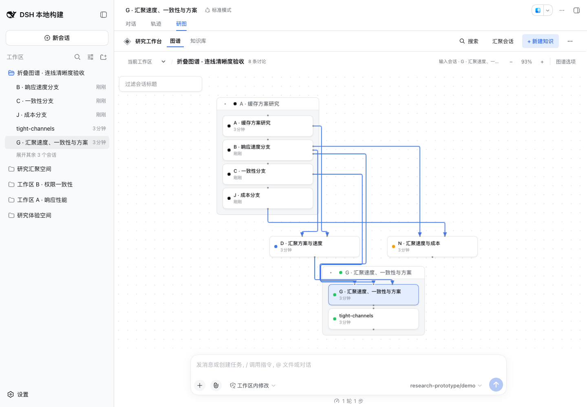
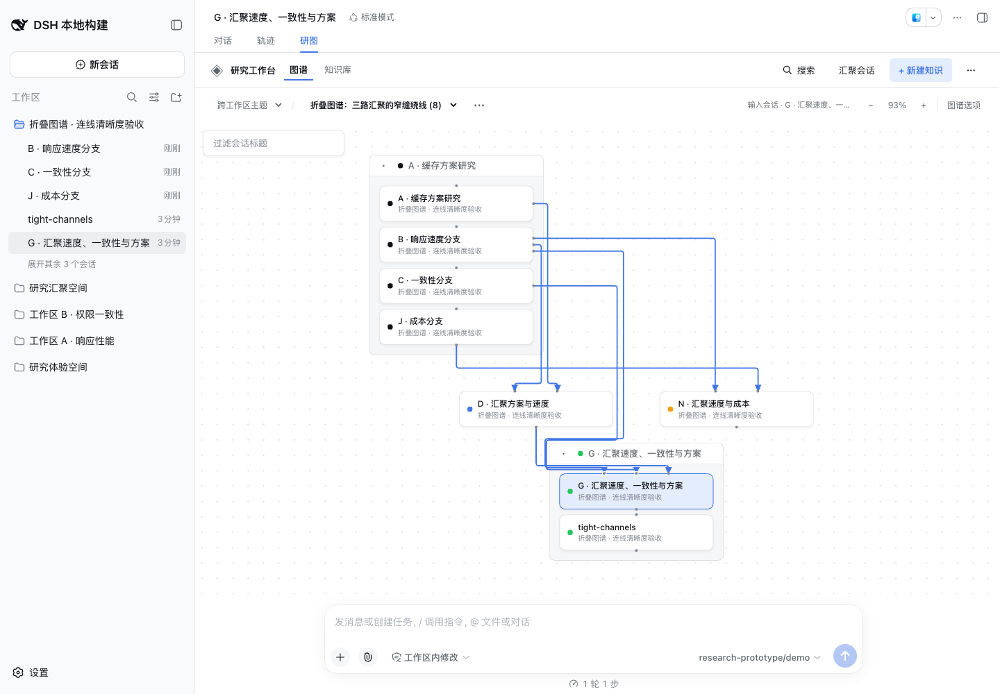

# Narrow routing channels — 2026-09-13

Workspace and Research Topic graphs can retain an overlapping Merge arrival after collapsing Branch clusters. The padded space between a cluster title and its first card is only 6px high. When earlier relations occupy both boundary rows, the ordinary visibility grid has no coordinate inside that space, even though it correctly charges for the shared segment.

The router now retries an overlapping local route with one midpoint added between adjacent coordinates less than the 10px channel spacing apart. Existing obstacle, terminal, and route-cost checks still apply. Clear routes keep their usual grid and path. No package version, public API, runtime dependency, or persistence schema changes; this build is **0.1.5-rc.2.6 · local-a26f5c47**.

## Reproduction and regression

The smallest valid reproduction has eight discussions and eleven relations:

- Branches: A → B, A → C, A → J, G → M.
- Merge results: D from A + B; G from C + D + B; N from J + B.
- Compact member order: A, B, C, J and G, M. Production relation IDs are retained because terminal ties use their ordering.

Before the fix, the G arrivals share 50px of polyline, including 44px of visible straight SVG. The new Workspace and Topic regression tests first failed on that overlap, then passed with zero shared length. The original fourteen-discussion reproduction also passes. Assertions retain all visible Merge facts, check card/title clearance, bounds, terminals and arrow tips, and verify deterministic output. Compact Branch edges remain intentionally hidden.

A fixed-seed diagnostic probe (913626) compared 1,500 valid Branch/Merge DAGs in two collapse states: **3,000 scenarios, 30 improved, none worse**, with no node overlap or card/title penetration. Existing dense cases still contain up to **34px** of shared visible straight segments; this is a targeted repair, not a guarantee that arbitrary graphs have no overlap or crossings.

## Validation

- `pnpm run check`: strict types, build, **216 standalone tests**; the focused routing suite has **18 tests**.
- Matching official `dsh-v0.1.5-rc.2` checkout (`fb2c4b9`), `pnpm check:harness`: **four compiler faces and 337 Harness tests**.
- The actual packed archive passed isolated installation, boot, persistent research operations, historical Branch recovery, and removal with **19 fixed demo-model calls**.
- Chrome **153.0.8010.36**, actual matching DSH, **1440×1000** and **900×820**. The isolated fixture uses native discussion creation, completed turns, four Branch operations and three Merge operations. Both graph scopes display eight discussions and seven visible Merge routes after collapse. Old-router replay of the measured browser geometry gives **44px overlap**; the new rendered SVG gives **zero shared straight segments, card/title penetrations, or terminal/arrow mismatches**.
- Real pointer dragging of the compact result frame, repeated Relayout followed by Undo, explicit Topic arrangement saving, and reopening both views preserved the expected arrangement. Browser page errors: **0**.

Pure-router timings below are local diagnostic observations, not end-to-end interaction guarantees. Each result is the median of fifteen interleaved measurements after three warmups per implementation; the larger fixtures are layered two-source Merge DAGs.

| Fixture | Nodes / visible edges | Previous | Fixed |
| --- | ---: | ---: | ---: |
| Minimal compact reproduction | 8 / 7 | 3.32ms | 4.67ms |
| Original compact reproduction | 14 / 10 | 5.35ms | 6.86ms |
| Layered Merge DAG | 100 / 180 | 14.90ms | 15.04ms |
| Layered Merge DAG | 300 / 580 | 58.32ms | 58.29ms |

No real-provider inference or daily user profile was involved. Disposable probes and browser evidence remain in the implementation worktree's `.artifacts/graph-followup/`. The routing rationale is maintained in [ADR 0016](../adr/0016-route-relations-after-arrangement.md).

