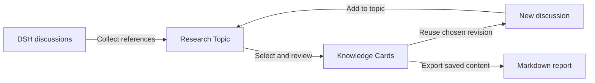

# User guide

[Project overview](../README.md) · [简体中文](user-guide.zh.md) · [Development](development.md)

Detailed installation, research workflows, troubleshooting, and limits for DSH Research Graph.

## Contents

| What you want to do | Read next |
| --- | --- |
| Organize discussions and the canvas | [Workbench](#research-workbench) · [Graph controls](#use-the-graph) · [Research Topics](#organize-research-topics) |
| Read and verify evidence | [Original discussion](#read-original-discussion) · [Body search](#search-discussion-history) · [Session Digests](#generate-a-session-digest) |
| Capture and reuse knowledge | [Knowledge Cards](#knowledge-cards) · [AI extraction](#reviewed-ai-extraction) · [Synthesis](#compare-and-synthesize) · [Follow-up discussions](#start-a-discussion-from-selected-materials) |
| Install, recover, or troubleshoot | [Install](#install) · [History recovery](#recover-historical-merge-sessions) · [Working position](#return-to-your-working-position) · [Troubleshooting](#troubleshooting) |

## Quick start

Requires **DeepSeek Harness 0.1.7-rc.1**, Node.js `^22.19.0 || >=24.0.0`, and `pnpm` on your `PATH`. Research Graph runs as a plugin inside DSH Web; check [Compatibility](#compatibility) before installing on another Host version. These commands assume `dsh` is on your `PATH`; see [Install](#install) for `npx` and source-checkout commands. Stop any running `dsh web` before installing.

```sh
dsh plugin --profile web add @benz-ai-x/dsh-research-graph@0.1.7-rc.1
dsh web
```

Open the one-time authenticated URL printed by the command; do not share its token.

1. Open a non-blank DSH Session and select **Research Graph → Graph** to explore discussion relationships.
2. Select a node, read **Original**, and choose **Save as knowledge** on a completed turn.
3. Open the saved card in **Knowledge**, inspect its sources, and choose **Continue discussion** to preview the materials for another question.

Current plugin **0.1.7-rc.1** uses npm tag `next`; the pinned command avoids installing an incompatible older package. See [Install and upgrade](#install) for local archives and migration from the previous package name.

## Research workflow



For example, compare three product approaches in separate DSH discussions, then collect them in one Research Topic. Use **Merge** when a new discussion needs several source contexts. To retain inspectable conclusions, select original turns and write or generate Knowledge Cards, review them, and save. **Continue discussion** carries the chosen revision; later card edits do not rewrite materials used by earlier research.

Use [historical-turn branching](#explore-from-a-historical-turn) to explore a point in an existing discussion. Use [Compare and synthesize](#compare-and-synthesize) to turn selected materials' agreements, disagreements, and open questions into a new Knowledge Card. These serve different purposes from merging Sessions.

## Use cases

| Research task | How to use the workbench |
| --- | --- |
| Product and market research | Collect discussions about products, business models, or user needs; compare conclusions while retaining sources and unresolved questions |
| Technical research and design comparison | Branch from a completed turn, compare approaches, and retain the discussion and knowledge revision used for each decision |
| Knowledge management and ongoing research | Organize scattered AI conversations into topics and cards, search across workspaces, reuse materials, and export results |

Source discovery and tool execution come from your selected DSH environment. Research Graph organizes those discussions and their research outputs.

## Compatibility

| Package release | DeepSeek Harness | Node.js | Verification |
|---|---|---|---|
| `@benz-ai-x/dsh-research-graph@0.1.7-rc.1` | `0.1.7-rc.1` | `^22.19.0 \|\| >=24.0.0` | Real Host/Client types, integration tests and packed-profile runtime acceptance |

Current prerelease **0.1.7-rc.1** targets **DSH 0.1.7-rc.1**: the first adaptation of this DSH line, it follows three upstream breaking changes without behavior changes — plugin-owned LLM message sources declare their own `MessageSourceMap` kind instead of the removed shared `plugin` kind, subagent catalogs are read through `refreshProjections` and `projectionsBySession`, and the Host now enforces peer-version compatibility at profile boot and install, so the pinned `@deepseek-ai/dsh-llm` peer is a hard gate. The offline history recovery tool targets the historical Session format catalog and leaves evidence-bound V3→V4 migration to Host boot. See the [release acceptance record](reviews/release-0.1.7-rc.1.md) for official-package verification and known limitations.

In the DSH-aligned release line, the first plugin adaptation uses the full target DSH version. Further plugin releases for the same DSH prerelease append one positive revision number: plugin `0.1.5-rc.2.1` targets DSH `0.1.5-rc.2`, followed by plugin `0.1.5-rc.2.2`. Direct DSH dependencies retain the target DSH version. The previous package is `@benz-ai-x/dsh-client-ui-session-graph`; its tags and artifacts keep that name.

<details>
<summary>Earlier releases and legacy Host compatibility</summary>

| Package release | DeepSeek Harness | Node.js | Verification |
|---|---|---|---|
| `@benz-ai-x/dsh-research-graph@0.1.5-rc.2.8` | `0.1.5-rc.2` | `^22.19.0 \|\| >=24.0.0` | Real Host/Client types, integration tests and packed-profile runtime acceptance |
| `@benz-ai-x/dsh-research-graph@0.1.5-rc.2` | `0.1.5-rc.2` | `^22.19.0 \|\| >=24.0.0` | Real Host/Client types, integration tests and packed-profile runtime acceptance |
| `@benz-ai-x/dsh-research-graph@0.1.5-rc.1` | `0.1.5-rc.1` | `^22.19.0 \|\| >=24.0.0` | Real Host/Client types, integration tests, packed-profile runtime and package migration acceptance |
| Previous package: [`v0.1.5-rc.1`](https://github.com/benz-ai-x/dsh-research-graph/releases/tag/v0.1.5-rc.1) | `0.1.5-rc.1` | `^22.19.0 \|\| >=24.0.0` | Real Host/Client types, integration tests, packed-profile runtime acceptance |
| [`v0.1.5-alpha.1`](https://github.com/benz-ai-x/dsh-research-graph/releases/tag/v0.1.5-alpha.1) | `0.1.5-alpha.1` | `^22.19.0 \|\| >=24.0.0` | Real Host/Client types, integration tests, packed-profile runtime acceptance |
| [`v0.1.6`](https://github.com/benz-ai-x/dsh-research-graph/releases/tag/v0.1.6) | `0.1.2-alpha.1`, `0.1.2-alpha.2`, `0.1.2-alpha.3` | `^22.19.0 \|\| >=24.0.0` | CI, real Harness integration, packed-profile add/remove |
| [`v0.1.5`](https://github.com/benz-ai-x/dsh-research-graph/releases/tag/v0.1.5) | `0.1.2-alpha.1`, `0.1.2-alpha.2` | `^22.19.0 \|\| >=24.0.0` | CI, real Harness integration, packed-profile add/remove |

The research workflow shipped in `0.1.5-rc.1`; `0.1.5-rc.2` adds the first UI/UX repair round, including draft protection, direct material selection and search-scope restoration. `0.1.5-rc.2.1` adds the research workbench, full knowledge reading, and cross-workspace merge. `0.1.5-rc.2.2` fixes truncated Session Digests and adds resizable Markdown reading, nearby knowledge capture, and graph controls in the research context bar. `0.1.5-rc.2.3` adds editable Session title suggestions and concise Markdown digests with highlighted key points. `0.1.5-rc.2.4` unifies saved knowledge reading across entry points, preserves extraction-batch reading position after editing, centralizes responsive reading geometry, and makes digest highlights more visible. `0.1.5-rc.2.5` adds historical-turn branching, editable exploration prompts, reviewed synthesis from mixed materials, and working-position restoration, including reliable final drag positions. `0.1.5-rc.2.6` improves Relayout in both graph scopes with dependency rows, obstacle-aware routes, distinct terminals and one-step undo. `0.1.5-rc.2.7` separates overlapping Merge arrivals in narrow gaps around compact cluster titles. `0.1.5-rc.2.8` removes duplicate Branch-inherited Merge lines, adds compact cluster headers, grouped independent discussions, distinct equal-title labels and a visible legend, and opens delegated-task records. The earlier `0.1.5-alpha.1` package retains its original feature set. Historical `v0.1.0`–`v0.1.6` tags remain unchanged. For DSH `0.1.2-alpha.1`–`alpha.3`, keep plugin `0.1.6`; current source does not promise compatibility with those older hosts. Select by the compatibility table, not npm `latest` or plugin version ordering.

</details>

This prerelease uses npm tag `next`; the commands below pin the exact matching version. To install a local build, run `pnpm install --frozen-lockfile` and `pnpm pack --pack-destination .artifacts` in this repository, then use `dsh plugin --profile web add /absolute/path/plugin.tgz`.

## FAQ

### Is Research Graph a standalone AI application?

It is a DeepSeek Harness Web plugin using the chosen DSH profile's Session and model services. Install a compatible version, then open the Research Graph tab in a non-blank Session. A standalone mode is not currently provided.

### Can it act as an Agent preset or launch an Agent Team?

A professional research preset can supply methods, tools, and skills while Research Graph organizes the results. The plugin does not register Agent presets or provide an Agent Team launcher; it inspects existing delegated work and opens native records. See [DSH and Agent presets](#dsh-and-agent-presets).

### Where are research knowledge and original discussions stored?

DSH owns original Sessions. Research Graph stores topics, card revisions, retained sources, and acknowledged material-reuse records on the Host. The browser retains working positions and unsaved arrangements; Topic arrangements synchronize only after **Save arrangement**.

### Does organizing the graph call a model?

Browsing, arranging, searching, and manual knowledge capture make no model call. Title/digest generation, AI extraction, and synthesis use a model; Merge and Continue discussion execute through DSH. See [Data and model behavior](#data-and-model-behavior) for the effects of each action.

### Can I take research results outside DSH?

Export saved knowledge revisions and source excerpts as a standalone Markdown file. Preview the exact included content before downloading; export makes no model call. See [Markdown research export](#export-research-as-markdown).

## DSH and Agent presets

Research Graph provides a research workbench across subjects such as product, technical, or market research. It organizes discussions, retained evidence, and reviewed conclusions; the research method and available execution tools come from the DSH environment and its chosen Agent preset.

| Part | Responsibility |
| --- | --- |
| DSH Agent preset | Reusable composition of tools, prompt sections, and skills for a Session |
| DSH runtime | Session execution, model/tool calls, delegated work, and native history |
| Research Graph | Research Topics, discussion relationships, original reading, reviewed Knowledge Cards, and explicit reuse of frozen materials |

A professional research preset can define a method and specialist tools while using Research Graph to inspect and retain the results. Such a preset is a separate deliverable: installing this package does not register one or add an Agent Team launcher. The inspector's Subagent Summary shows existing delegated tasks and opens their native records; it is not a team roster or scheduling control.

## Research Workbench

Open **Research Graph** and switch between **Graph / Knowledge**. The graph supports arranging relationships and exploring directions; Knowledge offers a catalog, full content, exact sources, and follow-up research. Choose **Research scope → Cross-workspace topics** to collect materials on the same Host. Knowledge can also browse all knowledge on that Host.

Switching Graph and Knowledge within a topic preserves the selected card, displayed revision, expanded source, reading scroll, and canvas position. Selecting a different card starts at the beginning. Saved state is separate from verification status. **Continue discussion** carries the displayed revision; **Edit card** edits that version directly and saves a new revision. When reading an older version, the export action explicitly says **Export latest revision**; the export preview lists the actual versions.

Search results, **View knowledge**, and saved manual or extracted cards use the same reader. It shows the selected revision's saved time and exact sources, plus follow-up discussions across all revisions with their version labels. Follow-up loading and failures are shown explicitly, with retry on failure. Discarding an inline edit returns to the same revision, expanded source, and reading position. Within an extraction batch, canceling also restores the batch's reading position and focus while preserving the other drafts.

Topic graphs arrange source discussions, knowledge, and follow-ups in dependency rows while preserving Branch clusters and manual arrangements. Selecting knowledge emphasizes its immediate sources and follow-ups. Topic graphs connect discussions to knowledge through source edges, and knowledge to follow-up discussions through **Used in discussion** edges. Only Host-acknowledged admissions produce these edges. A new discussion need not be a topic member to remain traceable. Later card edits do not rewrite the version used; select follow-up research to inspect frozen materials and open its target.

Discussion and knowledge bodies use DSH Markdown rendering for headings, lists, quotes, tables, and code. **Expand reading** gives the document more space. Identity, revision or Original tabs, and main actions stay visible while only the body scrolls. Expansion and Original position restore on return; text remains selectable for copying. Scope and workspace/topic selection share one context bar; **Topic options** offers creation, renaming, and scope help. In narrow containers, **More** contains Merge discussions and New Knowledge Card. Zoom, Fit, and Locate sit at the right of the research context bar, alongside the input session. **Relayout** and the available **Undo relayout** action appear directly in the canvas toolbar, with a persistent Branch/Merge legend on the canvas. **Graph options** contains Reset layout, the detailed relationship legend, and topic refresh/export. Save arrangement appears only for an unsaved arrangement. The toolbar remains available when reading is expanded or resized. Fit, Locate, toolbar zoom, and the 100% reset share the visible canvas center; wheel zoom stays anchored to the pointer. Graph options opens downward; in narrower containers, Fit/Locate and then zoom move into the menu. Menu zoom stays open for repeated steps. **Input session · title** identifies the composer's Viewed Session, which does not change when inspecting other content; the full title is available on hover.

See the [workbench acceptance record](reviews/research-workbench-acceptance.md), [reading UX round](reviews/reading-ux-round.md), and [unified reading and geometry acceptance](reviews/reading-geometry.md) for scope, validation, and screenshots.

Drag the reading panel's left edge left to widen it or right to narrow it. The width is remembered locally for the research scope; expanding and collapsing returns to your chosen width. Focus the edge to adjust with Left/Right (Shift for larger steps) or Home/End; Enter or double-click restores the default, and Escape cancels a drag. Small screens retain full-width reading and hide the resize handle.

Panel sizing follows the research container's width. At 760 px or less, the panel overlays the canvas and graph commands use the full canvas center; wider containers reserve the panel's measured width. Opening, expanding, or dragging the panel keeps the canvas position. The next Fit, Locate, or toolbar zoom uses the current available area.

## Knowledge Cards

In **Research Graph → Original**, each completed turn has **Save as knowledge** at its beginning and end. You can also select consecutive turns and choose **Save as Knowledge Card**. The original prefills an editable title, question, and conclusion; a late response preserves fields you have typed or intentionally cleared. Title and conclusion are shown first, with optional details collapsed. Sources use discussion titles and turn numbers. Draft text over 24,000 characters is explicitly marked as an excerpt; the full selected source remains attached. Choose **Save knowledge**; topic assignment is in optional details. Saving a card from Original returns to the same reading position, with the saved title and a **View knowledge** action. Saving does not verify factual correctness. Manual creation does not call a model or modify the source Session. The header offers **New Knowledge Card**, and the save bar remains visible while scrolling.

Cards appear in topic graphs with a distinct Source Relation. Open a card to inspect any saved revision, read its retained excerpt, or check the exact original turns. Unavailable originals remain clearly labelled as retained excerpts. Edits append immutable revisions; a failed save preserves the draft, and retrying it does not create another card. Escape, Close card and Discard edits ask before losing unsaved content, including generated drafts; Keep editing preserves the current form. A pending save stays mounted until it completes. Discarding edits returns to saved content. Drafts are held in the open view, not automatically saved to Host storage.

Open **Knowledge** or **More → Knowledge Cards** from the header, or use **Search discussions & knowledge** and switch the visible content buttons to search card titles and bodies across this Host or the selected topic. Topic membership is independent of source directories. Removing a card from a topic preserves its content, revisions and sources; search can find and reattach it. Cards live in Host storage and survive browser-cache clearing and Host restart. Reset and Relayout only affect presentation. Each save supports up to 32 sources and 4 MB of source text JSON; reduce the selected range if it exceeds that limit.

A change of graph scope restores the new scope's saved search type and conditions, or its defaults. Returning to an earlier scope restores that scope's last choice, even after opening through **Knowledge Cards**.

Starting another card or extraction from a source reader opens a separate editor. Closing it returns to the earlier card or draft with its edits preserved.

See the [first UX repair round and screenshots](reviews/ux-round-1.md) for interaction and responsive acceptance.

## Explore from a historical turn

In a Workspace, directory or topic Original reader, choose **Branch from here** on a completed turn. Preview the compact child title and exact inherited turn range, then confirm. A five-turn discussion branched from turn 2 inherits turns 1–2 and leaves all five source turns intact. The child belongs to the source Workspace and, when opened from a topic, is attached there with its true parent. Inherited pending input is canceled in the child before activation, so continuing it runs only your new question. Unavailable or changed cut points require a new preview. Close and reopen the same cut to recover the same target; naming or topic failures retry that target. **Create another branch** starts a separate attempt. Once the Host confirms that the child exists, you can open it even if Workspace attachment, naming or topic association needs recovery; retrying completes those steps for the same target. Topic refresh keeps the graph mounted so returning restores focus to the original turn.

## Compare and synthesize

Open a topic's **Graph options → Compare and synthesize**. Select 2–3 saved card revisions or continuous ranges of completed original turns, including mixed selections. Preview freezes their complete included content and shows the 32,000-character message budget. Duplicate cards, overlapping ranges, missing/incomplete sources and oversized selections are rejected; adjust the selection before generating. A card contributes its revision text and source labels, with original discussion selected separately.

Generate an editable draft containing agreements, disagreements, conditions/evidence and open questions. Review each claim and exact quotation; invalid generated citations are removed with a warning and uncited claims remain marked for verification. Re-generation appends a draft without replacing earlier edits. Save explicitly as an independent Knowledge Card in the selected topic; draft is the default status. Valid card citations create **Synthesized from** edges; the graph shows the number of source cards, and edge tooltips and source readers identify the frozen revision. Reading, revisions, search, Markdown export and Continue discussion retain the frozen sources after source edits or Host restart. Source-card links open the cited revision; discussion links distinguish the original from its retained excerpt. Frozen original ranges remain readable as saved; **Check current original** opens a separate live reader. If a save succeeded but its response was lost, editing and retrying appends a revision to that same synthesis card. Generated text stays in the current view until saved; closing with unsaved edits asks before discarding them.

## Reviewed AI extraction

Select completed turns in Original and choose **Extract knowledge**. Preview readable source titles, turns and user/assistant text before generating; **View exact message text** expands the unchanged model payload. The material budget includes only whole turns and lists omitted ranges. Confirm the provider/model and generate drafts. Review each card's question, conclusions, conditions and open questions, then correct its text and citations before saving. Invalid citations are excluded; uncited drafts are marked for verification. A valid citation establishes provenance, not correctness, and raw tool evidence is not inspected.

Generation is cancellable. Generating again appends another batch and preserves existing edits. Extraction source snapshots survive Host restart, so an open draft can still save the same cited text. Generated drafts themselves stay in the open view until saved. Each model call allows up to five drafts, with a 4,096-token output limit and the configured timeout.

See the [batch acceptance and browser screenshots](reviews/issues-6-10-acceptance.md) and [real-model qualitative review](reviews/issues-6-10-model-quality.md) for the complete research workflow and its evidence limits.

## Start a discussion from selected materials

Choose **Continue discussion** on a card, or add a saved card revision or a continuous completed-turn range to **More → Materials**. You can also open **Materials → Choose materials** to select saved card revisions or completed discussion turns without leaving your question. Choose 1–3 items, reorder or remove them, enter a new question and explicitly choose the target Workspace. **Preview message** presents the question, readable material content, card revisions and the 32,000-character total budget. **View exact message text** reveals the unchanged text submitted after confirmation. Card selection includes only card content and source labels; original discussion needs a separate selection. Oversized material and embedded Harness Session references must be edited or removed before sending.

The optional **Find counterexamples / Other approaches / Change assumptions / Follow up** prompts fill editable question text. Existing text is preserved until you explicitly replace it or append the prompt. Changing assumptions offers free text for both the old and new premise. Choosing, editing or closing a prompt never starts a Session or model call; the reviewed material preview and explicit confirmation remain required.

If a submission response is lost, materials stay locked while Research Graph checks the Host's recorded target state. **Check target status** or reopening Materials repeats that check; Retry always uses the same submission. Closing the dialog suppresses late navigation.

If target creation succeeds while the reuse log cannot be saved, Research Graph checks the reserved Session directly and keeps its Open and Retry actions. A failed state check keeps materials locked; retrying after storage recovers uses the same target and message.

Confirming creates an independent Session and sends the frozen preview through native Harness admission. Success keeps the workbench open; continue organizing or explicitly choose **Open target session** to read the response. A failed create preserves the materials. If a target exists but sending fails, Open and Retry recover that same target and message identity. **Sent** means the Host acknowledged receipt; inspect the Session for model response status. **Materials used by this Session** reopens the frozen sources, versions and Reuse Relations after later edits, browser-cache clearing or Host restart. Source Workspace ownership and directories remain authoritative in Harness.

## Data and model behavior

| Action | Durable effect | Model use |
|---|---|---|
| Browse or arrange a Workspace/Directory graph | Does not change Session logs; arrangements stay in browser storage | None |
| Organize Research Topics | Saves names, Session references, and explicitly saved arrangements in Host storage; source Sessions remain unchanged | None |
| Read or select discussion | Retains the selection and fallback excerpt only while the reader is open; does not change Session logs | None |
| Search discussion | Uses the Host index and verifies original text; retains temporary result snapshots without changing sources or archive state | None |
| Generate / apply a title | Suggestion is temporary; Apply saves a native user-title event | One auxiliary request only when generating |
| Generate a digest | Keeps a revision-scoped Host-memory cache; does not append a message | One auxiliary request on the Session route or configured fallback; one compression retry if complete output is too long |
| Create a branch | Uses the normal Harness branch operation | No additional request from this plugin |
| Branch from a historical turn | Reserves one native child identity and inherits the selected completed prefix; retries recover that child | None until you continue the new discussion |
| Manually create / edit knowledge | Saves a new card or immutable revision with selected sources | None |
| Reviewed AI extraction | Retains an extraction source snapshot; generated drafts become cards only after explicit reviewed Save | One request per Generate, up to 5 drafts |
| Reuse research materials | Records frozen materials, target Session, and provenance after Host acknowledgment | The target processes the submitted question on its normal route |
| Export Markdown | Downloads the preview's frozen saved revisions and sources; original records remain unchanged | None |
| Compare and synthesize | Freezes 2–3 materials; only explicit Save creates a new card with reviewed citations | One auxiliary request per Generate, up to 8,192 output tokens |
| Merge Sessions | Creates an independent target and durable snapshot provenance; sources remain unchanged | The target processes the queued instruction on its normal route |

## Install

The [DSH plugin manager](https://github.com/deepseek-ai/deepseek-harness/blob/dsh-v0.1.7-rc.1/apps/cli/reference/README.md#plugin-management) invokes `pnpm`, which must be on your `PATH`. Use the launcher for your matching DSH installation throughout the commands below:

- Installed CLI: use `dsh`.
- npm launcher: replace `dsh` with `npx @deepseek-ai/dsh@0.1.7-rc.1`.
- Source checkout: build the `dsh-v0.1.7-rc.1` checkout using the [upstream setup](https://github.com/deepseek-ai/deepseek-harness/blob/dsh-v0.1.7-rc.1/README.md#run-from-source), run from that checkout, and replace `dsh` with `pnpm dsh`.

Install the published npm package into the `web` profile:

```sh
dsh plugin --profile web add @benz-ai-x/dsh-research-graph@0.1.7-rc.1
```

Confirm that the resolved profile contains the bundle:

```sh
dsh --profile web --dump-config
```

The output should contain `name: '@benz-ai-x/dsh-research-graph'`.

### Upgrade from the previous package name

The product is now **DSH Research Graph · 研图**, and the repository is `benz-ai-x/dsh-research-graph`. The npm package is now `@benz-ai-x/dsh-research-graph`. If your web profile has `@benz-ai-x/dsh-client-ui-session-graph` installed, stop that profile, then run:

```sh
dsh plugin --profile web remove @benz-ai-x/dsh-client-ui-session-graph
dsh plugin --profile web add @benz-ai-x/dsh-research-graph@0.1.7-rc.1
dsh web
```

Use the same profile and keep its data directory. The package rename preserves the storage identities for Research Topics, Knowledge Cards, Reuse records and canvas positions. Restore any custom plugin settings under the existing `ui-session-graph` patch ID after reinstalling. Install only one package name in a profile.

The published `v0.1.5-rc.1` Git tag and earlier tags retain their original package names. For this package-name migration, use the npm package above or pack the current source into a local archive.

The package contains both the browser plugin and its `cordis.patch.yml` bundle patch. The dsh plugin manager inserts it after the Session, Workspace, locale, renderer, and conversation plugins already supplied by the `web` profile. No manual `cordis.yml` edit is required.

Remove it with:

```sh
dsh plugin --profile web remove @benz-ai-x/dsh-research-graph
```

Restart the target `web` profile after installation or removal. A running process does not watch its profile dependency list.

Session, LLM, and browser runtime services remain owned by the selected dsh profile. The plugin declares its Typert protocol dependency explicitly, with the matching LLM as a peer dependency. The offline recovery command bundles its format catalog and libraries so it also works before the Host starts. All directly referenced `@deepseek-ai/dsh-*` packages are pinned to the target DSH version (`0.1.7-rc.1` for plugin `0.1.7-rc.1`).

## Use the graph

Open a non-blank session and choose **Research Graph** beside the standard conversation tabs. The Viewed Session resolves a named Workspace Scope when possible and otherwise falls back to a Directory Scope.

- A single click chooses the Selected Session and emphasizes its Branch Lineage together with the sources of its original Merge; the closable detail inspector can open that session or create a Branch, and reports when Harness rejects the request. Click blank canvas space or press Escape to clear selection.
- A double click opens the session in its last-used view.
- Dwell on another Canvas Session for a compact preview without replacing the Selected Session inspector.
- Entering the graph reads each discussion's non-activating Session projections: cards gain the closed-turn count in their existing meta row, hovering a card previews the newest prompt, and the inspector gains a **Session stats** block with the model route, turn/step counts and wall times, cumulative tokens, a context-usage text readout, goal and todo progress, and the newest prompt/response previews. These present Host-retained facts without activating Sessions or calling a model; a failed read leaves the card unchanged. Context usage is a reference readout sampled at different moments, not a quota or alerting signal. Branch discussions never opened natively also recover their durable titles here instead of showing a directory name.
- Drag nodes or complete cluster frames to arrange the canvas. Alignment guides snap nearby card edges. Reopening the graph retains the final released position, including quick drags.
- Session Arrangement persistence fails soft. If browser storage is unavailable, denied, corrupt, or full, the live graph continues with automatic geometry instead of failing to render.
- Small connection dots show relationship anchors; they are not drag handles. Branches are neutral solid directed edges, Merge Relations are branded solid directed edges, and Subagent Derivations are dashed.
- The visible legend distinguishes Branch and Merge lines. Branch clusters share a color and independent discussions use neutral dots; activity is shown separately. Nodes label Merges and Branches, and equal titles receive distinct short identity labels. Full titles remain available in the inspector; short labels and identifiers do not rename native Sessions. Compact cluster headers show the member count and leave an arrival channel for relations. Unconnected discussions pack together separately from connected research components.
- Inherited Merge snapshots remain inspectable under **Inherited Merge sources** on a Branch. They do not create another set of direct Merge lines, including when the parent is outside the graph. Expand the subagent summary to inspect delegated task titles and activity, or open a delegated discussion; subagents remain folded out of the canvas. “Not running” alone does not establish that a task completed.
- Both Workspace and Research Topic graphs keep related sources on the same dependency row, with their shared result below; disconnected collections pack separately. Branch clusters retain their tree and reserve room for collapse. Rounded connections avoid cards and cluster titles, with separate terminals and arrowheads. Blocked terminals move to a clear position or another card side; relations across successive layers try separate departure channels to reduce long shared segments. When crowded routes share the edges of a narrow gap, an extra channel inside the gap can separate their arrivals. Dragging and collapse reroute connections, and Fit includes their outer routes and labels.
- **Relayout**, directly in the canvas toolbar, clears manual positions and cluster offsets while preserving collapse, reading state, and viewport pan/zoom. **Undo relayout** restores the last placement until a later drag, collapse, Reset, or scope switch; repeated Relayout keeps the useful undo. Existing custom arrangements remain intact until this action is chosen. Use **Fit** to bring the resulting graph into view. Topic changes still require **Save arrangement** to share through the Host.
- Use wheel zoom, background-drag panning, fit, 100%, relayout, reset, Viewed Session location, or the minimap. The minimap appears when content leaves the visible surface and is hidden in narrow containers. Resizing preserves the current content center and scale.
- Filter by title; Enter centers the first match and Escape clears the filter.
- Hover a node or edge to emphasize its Branch Lineage.
- Read the header badge to identify the package version and exact local Build ID; hover it for the full package identity.

Keyboard shortcuts work while the canvas is focused: `+` and `-` zoom, `0` restores 100%, and `1` fits the graph.

## Export research as Markdown

Choose **Export Markdown** on a saved card or Research Topic, select 1–50 cards, then **Preview Markdown**. The Host reads the selected cards' latest saved revisions and freezes their content and exact source ranges. **Download Markdown** writes the same preview bytes; later edits only appear after another preview. Unsaved card edits are not exported, and opening or closing export preserves the current card/extraction editor.

The standalone file contains questions, conclusions, reasons, open questions, kind/status, revision identities and times, readable discussion excerpts with Session identities/titles/times, and a source relation list. Missing/unreadable originals, incomplete ranges, and originals differing from saved sources are marked explicitly. Excerpts cover only selected ranges. Chinese text, multiline content, and embedded code fences are retained. Export calls no model and changes no source records. Files are limited to 8 MB; failures preserve the selection for retry.

## Return to your working position

Reopen Research Graph to restore its pan, zoom, arrangement, selected material, and valid Original page/scroll position. Reopening search restores the conditions and queries the Host again; results are never cached as working state. Missing selections are cleared with a dismissible notice while the valid viewport stays in place, including when the last card leaves a topic empty. A missing topic returns to the topic list.

Source nodes contributed by Knowledge Cards also resume their last valid Original position. Reading a long source or rechecking a selected range preserves both boundaries, so reopening does not shorten it to a normal page. Clicking a source inside a card still opens that revision's exact saved range. If restoring a topic's Original fails to connect, its retained excerpt remains available; retry restores the saved scroll only after the original is verified.

Presentation state belongs to the same browser and is isolated by persistent Host identity, Workspace identity (even when directories match) or Directory Scope, and topic identity. A newly Viewed Session still opens its own scope; choose **Research Topics** explicitly to return to a remembered topic. Reset and Relayout retain their existing meaning and do not delete saved knowledge, sources, or reuse receipts. Clearing browser storage loses working positions and unsaved arrangements, while Host records remain available. Older arrangements without a Host identity are left untouched and are not automatically assigned to the current Host.

## Organize Research Topics

Choose **Research scope → Cross-workspace topics** in Research Graph and create a named topic. In a Selected Session's details or a selected discussion search result, choose **Add to Research Topic**, select a topic, and add the source. You can create a topic in that picker too. Topics collect Session references across Workspaces on the same Host; a Session can belong to several topics.

If creation fails, retrying recovers the same topic. If you edit the name before retrying, the revised name must also save before the input clears; another failure keeps that input available for retry.

The topic graph displays source titles and Workspaces, including archived sources and retained references whose source is unavailable. Edges between Sessions require confirmed Branch or Merge facts. Knowledge Cards also show separate Source Relations to their retained discussion sources. Selecting a node shows its source details; **Read original** loads discussion on demand, and **Open Session** explicitly navigates to a listed, non-archived source. Archived sources remain readable here; opening their Session is disabled because the matching Harness does not keep archived Sessions selected. Removing a reference affects that topic alone. It does not delete, move, archive, branch, or merge a source, or send model context.

Drag nodes or clusters and use collapse, relayout, or reset, then choose **Save arrangement**. Each topic has its own Host-persisted arrangement. Reset clears arrangement choices without removing references. Unsaved arrangement edits also survive reopening in the same browser; choose Save arrangement to share them through the Host. Failed saves retain the input and can be retried. Names, membership, and saved arrangements survive a Host restart and are shared by clients connected to that Host. Concurrent edits to the same arrangement use the last successful save.

Topic switching reads Session headers and existing metadata, not all original discussions. A listed source can still fail when its original is opened; the reader reports that failure or unavailability and offers retry. Switching topics, closing the view, or canceling a read prevents late responses from replacing the current result. Ordinary Workspace/Directory Canvas Session eligibility remains unchanged.

See the [Research Topics acceptance record and screenshots](reviews/issue-5-ui-acceptance.md) for cross-Workspace collection, independent arrangements, source recovery, restart persistence, and the 1,000-reference baseline.

The topic toolbar keeps selection and layout sync status together; creation and rename fields open on demand. Workspace arrangements are kept on this device, while **Save arrangement** syncs a topic arrangement to the Host. Singleton clusters show just their node, and long node titles use up to two lines.

## Search discussion history

Choose **Search discussions & knowledge** in the Research Graph header, enter words or a phrase, and select a Workspace, the Viewed Session's directory, or all sessions on this Host. **Include archived** adds archived sources for reading. It does not restore them or add them to the canvas. The existing title filter continues to emphasize Canvas Sessions independently.

Results show the session title, workspace or directory, message time, and a short passage. Each session contributes its latest matching passage from completed direct user/assistant discussion, ordered newest first. Select a result to read its exact turn in the search Inspector; the matching message is marked, and earlier/later discussion remains available. Only **Open session** changes the Viewed Session; native chat scroll positioning is not implied.

The search uses Harness's keyword/phrase index, retaining its punctuation and accent matching: **foo bar** finds **foo-bar**, and **cafe** finds **café**. These rules also apply to Chinese phrases: **修复 foo bar** finds **修复 foo-bar**. Queries containing Chinese characters also check scoped originals for literal substrings, so **知识卡片** can find **通过知识卡片整理研究资料** even when the title differs. Attachments, tools, reasoning, plugin context, and unfinished discussion are excluded. The first index build and Chinese verification across many sessions can take time; cancel or narrow the scope as needed.

Use **Load more results** to continue the same result snapshot. Changing keywords, scope, or archive inclusion clears it and cancels pending work. A failed search or page can be retried; expired results ask you to search again. Result excerpts retain search-time text while the Inspector rechecks the original. Search does not call a model or write source sessions.

If the Viewed Session's graph scope identity changes, such as a directory becoming a named Workspace or the Viewed Workspace disappearing, search restores the new scope's saved conditions or its defaults. The previous scope's keywords remain saved with that scope. If only the explicitly selected search Workspace disappears while the graph scope stays the same, search cancels pending work, clears results and falls back to the available scope while preserving the current keywords.

See the [discussion search browser acceptance record and screenshots](reviews/pr-15-ui-acceptance.md) for Chinese matches, exact turns, archived sources, paging, retry, and cancellation.

<a id="enable-discussion-search"></a>
### Enable discussion search

DSH `0.1.7-rc.1` disables full-text indexing by default. If Research Graph reports **Full-text indexing is not enabled**, add this override to the active profile's `cordis.patch.yml` (for the web profile, `$DSH_HOME/profiles/web/cordis.patch.yml`):

```yaml
- id: session-query-sqlite
  config:
    path: ':memory:'
    openAt: first-search
```

Keep any other profile entries. This replaces that row's whole configuration, so include both keys. Restart the Host and search again. This in-memory index rebuilds after each restart; a durable index requires a writable absolute file path in `path`. To try the same override without changing profile files, save the snippet as `search.patch.yml` and launch `dsh --profile web --patch /absolute/path/search.patch.yml`. Preparing, disabled, failed, and no matches are separate search states.

## Read original discussion

Select a Canvas Session and choose **Original** in the Session Inspector. It opens the latest ten discussion turns. Use **Load earlier discussion** and **Load later discussion** to read adjacent pages; unavailable directions are disabled. Arrow keys and Home/End switch the Inspector tabs.

- Completed turns show direct user and assistant text with their roles. An unfinished turn shows its status and becomes selectable after completion and **Refresh discussion**. Attachments, tool results, reasoning, and plugin-injected context are excluded.
- Select one turn, then another to include the continuous range, including turns on previously loaded pages. If there is a gap, load the intervening turns first. Selecting a checked turn again or **Clear selection** clears the range.
- **Check selected original** reads that exact range again. Session identity and event boundaries identify the source, even when titles or sentences repeat or later turns arrive. Available original text takes precedence over the retained excerpt.
- **Excerpt only** means the original cannot currently be read and only the text retained with this selection is available. The label remains visible while retrying and after a connection failure, until original text is available again. **Source unavailable** means no original or retained excerpt can be shown. Source identity stays visible, and **Retry reading** checks again. An empty readable Session has a separate empty state.
- Reading can be canceled. Closing the Inspector, changing Session, or leaving the reader aborts the pending request; late responses cannot replace a newer selection. Reading never changes the Viewed Session. Choose **Open session** explicitly to continue in Harness; this does not scroll the native chat to a turn.

Reader selections and excerpts are temporary: closing the reader, switching to the digest or another Session, or reloading discards them. Choose **Save as Knowledge Card** explicitly to retain selected sources in a saved revision. Working Position restores the reading location by querying the original again. Reading, selection, refresh, and retry do not call a model or write to the source Session.

Paging limits browser content, but the Host currently inspects one complete Session snapshot for each request. It does not page the underlying log file. Very large individual Sessions can therefore still take time to read.

## Merge Sessions

Choose **Merge sessions** in the workbench header, filter by source Workspace or title, and select 2–3 sessions in order. Changing filters or closing the dialog retains the selection. Enter a question, explicitly choose a destination Workspace, then preview and confirm. Discussions from A and B can be merged into A, B, or a separate research space.

The preview identifies sources, Workspaces, question, and destination. Discussion snapshots are read on confirmation and remain subject to Harness's context budget. Source files, tool results, and runtime environments are not combined. If a topic is selected, successful capture adds sources and the target to it. A failed association retries only that step, without resubmitting the merge.

The canvas retains **Merge selected sessions**, using the numbered selection order and its existing same-Workspace/directory rule.

- Sources must be distinct, non-blank, non-archived, non-Subagent sessions on the same Host. Cross-workspace merges require an explicitly selected, available destination Workspace.
- Merge instructions cannot contain `dsh-session:` references, because Harness reserves them for the exact source snapshot set.
- Harness creates one independent target Session, gives it a source-derived title, and captures each source at an immutable event boundary. The sources and their existing Branch lineages remain unchanged.
- At submission time the Host re-inspects the target and every source instead of trusting browser metadata. It validates canonical destination Workspace membership, directory, and source eligibility, accepting only an unparented blank target or an exact same-source retry target. Calls without an explicit destination keep the same-directory requirement.
- The target's normal agent loop receives the edited instruction plus canonical Harness Session references. This feature does not choose a separate summary model; the target uses its normal configured model route when it processes the queued request.
- A Merge Session remains its own Session Cluster. Branded Merge Relations show provenance from each source cluster without turning those sources into parents.
- The Session Inspector lists the source titles and capture boundaries for a selected Merge Session. Merge provenance is projected from the target log and checkpointed in Harness's durable Projection Cache, so it survives restart and cold log replay.
- If target creation succeeds but naming, snapshot submission, persistence, or opening fails, the target is preserved. **Try again** reuses that target instead of creating a duplicate; a late capture from the prior attempt is accepted only when its ordered source set matches exactly. Once the Host starts committing a matched capture to durable projection storage, closing the view no longer cancels that commit. **Open target session** remains available for recovery.

Source selection can be cancelled before submission. Once submission starts, the controls stay locked until it succeeds or produces a recoverable error; leaving the view still aborts its browser request. Host capture waiting is also bounded, and a timeout is reported as a retryable snapshot-submission failure.

## Recover historical Merge Sessions

DSH `0.1.5-alpha.1` rejects the historical `session-graph-merge` message source during V0/V1/V2 log migration, preventing the affected Session body from loading. New Merges use the standard `plugin` source. Upgrading the plugin does not automatically repair existing files.

After installing dependencies in this checkout, run the recovery tool on an explicitly selected historical file. The first command validates only; the second creates a separate V3 artifact in an existing output directory:

```sh
node scripts/migrate-merge-history.mjs --input /path/session.v2.jsonl.zstd
node scripts/migrate-merge-history.mjs --input /path/session.v2.jsonl.zstd --output /separate/recovered/session.v3.jsonl.zstd
```

The tool supports plain JSONL, `.zst`, and `.zstd`. It converts only recognized legacy plugin markers, runs the official complete DSH format migration, and validates the current-format output. The source remains unchanged and existing outputs are never overwritten. Input and decompressed data default to a 128 MiB limit, configurable with `--max-bytes`; unknown fields, corrupt data, and truncated lines are rejected. Use normal DSH reading/migration for V3 logs or Sessions without a legacy marker.

To let the Host use a recovered artifact, stop DSH first, then place the validated file as `session.v3.jsonl` or `session.v3.jsonl.zstd` in **that Session's original directory**, preserving the source. If a V3 file already exists, investigate the conflict before proceeding. The tool generates files without scanning or replacing live Sessions. The installed package exposes `dsh-research-graph-migrate`; the earlier `dsh-session-graph-migrate` command remains an alias.

## Generate a Session Digest

Select any non-blank Canvas Session and choose **Generate digest** in the Session Inspector. Generation is never automatic and never blocks **Open session** or **New branch**.

- The Host inspects the exact Selected Session, even when it is not the Viewed Session. It keeps direct user messages and final assistant text, but excludes reasoning, tool results, and plugin-injected context.
- Model input is capped at 32 KiB. Long sessions retain the initial user goal, latest compaction checkpoint, and as many recent turns as fit.
- The auxiliary request uses no tools and asks for one overview sentence, up to five key outcomes and three open items. The lists render safe Markdown, with highlighted **key phrases**, inline code, emphasis and source-backed links. Bold key phrases have an amber marker background and a stronger lower edge that follow the DSH light/dark theme and continue across line wraps; saved digests pick up the styling without regeneration. The prompt targets 100–160 English words or 200–350 Chinese characters; complete output is also validated against per-item and 1,000-character total limits. It uses the Session's latest logged provider/model route; an optional configured route is only a fallback.
- A digest generated while the Session is running is labeled **Running snapshot**. New activity marks the visible digest **Session has new content** without hiding it; choose **Update digest** to replace it.
- Successful results are cached in Host memory by Session and source revision. **Regenerate** bypasses that cache. Empty or failed results are not cached as successful digests and can be retried.
- Concurrent requests for the same revision share one model call without sharing caller cancellation. Plugin shutdown stops new digest work, cancels owned work, and waits for admitted requests to settle before removing the service.

Each explicit generation makes an auxiliary model request (two only when a complete digest needs compression) and may incur the selected provider's normal cost. Digest text is a read-only projection: it is not a conversation message, does not enter the Session log, and does not change Session Lineage.

**Generate title** is available beside the Session identity in workspace/directory and available Research Topic inspectors. It reads the selected discussion, proposes a short title, and opens an editable preview. **Apply title** uses DSH's native rename, so the sidebar, graph and Session heading receive the same saved title. Generating, canceling or closing a suggestion does not rename, navigate, open an Agent or append discussion text. Applying writes the native user-title event and pins it against automatic title updates. Empty Sessions make no model call; unavailable/archived Topic references remain read-only. A changed title is checked again before applying. Failed saves keep the edit; an acknowledged Session-feed update can confirm a lost reply. This is a separate, explicitly requested model operation using the same source budget, route fallback, timeout and output budget as digests.

Most sessions need no route configuration because their logs record the model route. For older imported sessions without one, override the installed plugin entry in the profile's `cordis.patch.yml` (`$DSH_HOME/profiles/web/cordis.patch.yml` for the web profile). If the file contains only an empty array `[]`, replace it with the list below; otherwise add this entry to the existing list:

```yaml
- id: ui-session-graph
  config:
    provider: deepseek-official
    model: deepseek-v4-flash
    maxOutputTokens: 4096
    timeoutMs: 60000
```

`provider` and `model` must be supplied together and never override a route recorded by the Session. `maxOutputTokens` defaults to `4096`; `timeoutMs` defaults to `60000`. Plugin activation validates this configuration through its exported Standard Schema and rejects blank routes, incomplete pairs, non-integers, and non-positive limits.

The output cap leaves room for reasoning and the structured digest; providers may count reasoning against this same budget. An explicit lower cap still takes precedence. The plugin keeps the model's reasoning defaults. A complete but overlong digest gets at most one additional compression request; transport failures, invalid JSON and token-limit failures are not automatically retried. If the output limit is reached, the UI explains it; increase `maxOutputTokens` in this override before retrying. Truncated output is not cached, and a failed refresh retains the previous digest.

## Troubleshooting

| Symptom | Check first |
|---|---|
| **Research Graph** tab is missing | Restart `dsh web`, open a non-blank Session, and verify the package appears in `dsh --profile web --dump-config` |
| Host startup fails around a Remote error export | Install the plugin matching DSH in the compatibility table and check the resolved profile version |
| GitHub source install reports `ERR_PNPM_GIT_DEP_PREPARE_NOT_ALLOWED` | Inspect the pinned source, add the exact key printed by dsh to that profile's `allowBuilds`, and retry |
| Digest generation reports no model route | Use a Session with a logged route or configure the `provider` and `model` fallback pair |
| Digest generation reaches its output limit | Increase `maxOutputTokens` in the `ui-session-graph` override in the active profile’s `cordis.patch.yml`, then retry |
| An upgrade still shows the old arrangement | Choose **Relayout** to apply automatic placement, then **Fit** if needed. Relayout has an Undo action; a Topic still needs **Save arrangement** to synchronize |
| After a cold Host restart, a Branch briefly shows a directory title or lacks inherited sources | Open that Session through native DSH, then return to the graph. This restored the retained title and source summary in acceptance; the Host's internal cause remains unlocated. See the [release boundary](reviews/release-0.1.7-rc.1.md#acceptance-boundary) |
| A delegated task cannot be opened | Retry from the inspector so it refreshes the direct parent's native task catalog. A task absent from the refreshed catalog cannot be opened from that entry |
| The Web URL rejects access | Open the complete authenticated URL printed by `dsh web`; do not reuse or share a stripped token |

If the problem persists, include the package version shown in the Research Graph header, the Harness version, and the relevant Host/browser error in a [GitHub issue](https://github.com/benz-ai-x/dsh-research-graph/issues/new).

## Current limitations

- Research Graph is unavailable on the no-session home screen and in a fresh blank session because neither has a conversation view ring.
- The scope graph follows one Workspace or Directory Scope at a time. Research Topics span Workspaces within one Host; discussion search is a separate body-text view.
- Working positions and unsaved Topic arrangements restore in the same browser and Host/scope. Clearing browser storage loses those local choices; Topic arrangements are shared only after **Save arrangement**.
- Session Digests are generated only on demand and cached in Host memory, not persisted as durable artifacts. A Host restart clears the cache.
- A Session without a logged model route needs a configured fallback route before it can be digested.
- A Branch created from a Subagent Session has no Canvas Session parent edge and appears as a Root Session.
- One Merge accepts two or three sources across Workspaces on the same Host; cross-Host merging is not supported.
- Merge captures immutable source snapshots; later source messages do not automatically refresh an existing Merge Session.
- Cold Host startup can temporarily omit an unopened Branch's native title or inherited-source summary; see Troubleshooting. This release preserves the observation rather than claiming its Host cause is fixed.
- Arbitrarily dense graphs or physically overlapping cards may still have crossings or obstructed terminals. The [release acceptance](reviews/release-0.1.7-rc.1.md) describes the verified geometry scenarios.
- Structured exploration-direction and hypothesis fields remain deferred in [Issue #32, P5](https://github.com/benz-ai-x/dsh-research-graph/issues/32); editable question prompts and frozen-material reuse are available.
- Touch uses pointer-event fallbacks and has no dedicated controls.

## License

[MIT](../LICENSE)
